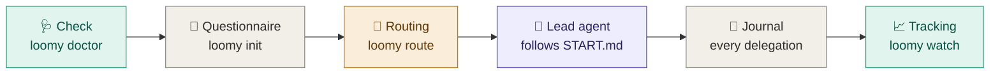

<div align="center">

<picture>
  <source media="(prefers-color-scheme: dark)" srcset="docs/assets/loomy-dark.svg">
  
</picture>

**Weave Codex and Claude Code into one development crew.**
A lead agent on the best model, dedicated roles on just the model they need, and live tracking in your terminal.


[🇫🇷 Français](README.md) · 🇬🇧 English

</div>

> [!NOTE]
> Loomy's interface, questionnaire and generated project files are in French. This page is an English overview.
>
> **Pre-release.** Loomy stays at 0.x until the whole flow has been validated in real conditions. 1.0.0 comes after that validation.

---

## ⚡ Quick start

```bash
HOMEBREW_GITHUB_API_TOKEN="$(gh auth token)" brew install eydenn/tap/loomy   # or npm / bun / install.sh
loomy doctor --fix --live            # once: checks your machine

mkdir my-project && cd my-project
loomy init                           # interactive questionnaire
```

The questionnaire ends by printing:
1. the **command to launch the lead agent**, for example `claude --model claude-opus-5-5 --effort high`;
2. the **start prompt**, already copied to your clipboard;
3. the **tracking command** to run in a second terminal: `loomy watch`.

---

## 📦 Installation

Every method installs the same `loomy` command. The repository is private, so they all use your GitHub credentials (`gh auth login`).

| Method | Install |
|---|---|
| 🍺&nbsp;**Homebrew** | `HOMEBREW_GITHUB_API_TOKEN="$(gh auth token)" brew install eydenn/tap/loomy` |
| 📦&nbsp;**npm** | `npm install -g github:Eydenn/loomy` |
| 🥟&nbsp;**bun** | `gh release download -R Eydenn/loomy -p 'loomy-*.tgz' -D /tmp/loomy && bun add -g /tmp/loomy/loomy-*.tgz` |
| 🐚&nbsp;**Shell&nbsp;script** | `gh repo clone Eydenn/loomy ~/Tools/loomy && ~/Tools/loomy/install.sh` |

**Update**, whatever the method: `loomy update`.

> [!TIP]
> `loomy update` detects how Loomy was installed and runs the right command. Homebrew downloads inside a sandbox that cannot reach the macOS keychain, so the GitHub token is passed through `HOMEBREW_GITHUB_API_TOKEN` for the download only; `loomy update` does this for you. bun cannot read a private GitHub repository, so it installs the release archive, which `gh` downloads with your credentials. With nvm, an npm install is tied to the active Node version: if you switch versions often, prefer Homebrew or the shell script.

---

## 🧭 How it works



1. **Check.** Verifies CLI versions, finds Codex even when it is bundled inside the ChatGPT app, checks model availability, and offers fixes.
2. **Questionnaire.** Twelve questions grouped by theme, each showing the consequence of every option: project type, stage, risk, AI mode, lead tool, budget, Git permissions. The first time, a thirteenth asks for your Claude and ChatGPT subscriptions. ← goes back to the previous question.
3. **Routing.** Turns the brief and the installed tools into a role → model → effort matrix, with automatic fallback when a CLI is missing.
4. **Lead agent.** The main session follows `START.md`:

   <kbd>Discover</kbd> → <kbd>Interview</kbd> → <kbd>Propose</kbd> → <kbd>✋ Approve</kbd> → <kbd>Build</kbd> → <kbd>Verify</kbd> → <kbd>Document</kbd> → <kbd>Commit</kbd> → <kbd>Retire</kbd>

   It delegates the work to dedicated roles and never moves on without your approval.
5. **Journal and tracking.** Every delegation is recorded (model, effort, duration, tokens, cost) as soon as it starts. You follow it live in the terminal.

---

## 📈 Live tracking

Everything happens in the terminal, with no dependency. **Nothing starts on its own**: you start tracking when you want, in a second terminal.

| Command | View |
|---|---|
| `loomy status` | Snapshot: phases, running delegations, activity, cost per model, subscriptions, Git |
| `loomy watch [N]` | 🖥️ The same screen refreshed every N seconds (2 by default), Ctrl-C to quit |
| `loomy log [-n N] [-f]` | Raw journal, optionally streamed |

A delegation shows as "en cours" (running), with its timer, as soon as it starts. If it is interrupted, it disappears on its own.

The journal (`.loomy/logs/events.jsonl`) stays on your machine and is excluded from Git automatically. `LOOMY_JOURNAL=0` disables it, `LOOMY_JOURNAL_TASKS=0` leaves task text out of it.

### 💳 Claude and ChatGPT subscriptions

Loomy knows whether you pay per use (API) or by subscription:

| Plan | What Loomy shows |
|---|---|
| API | the real **cost** (Claude) or an estimate from tokens (Codex) |
| Claude Pro · Max 5x · Max 20x | the **API value consumed this month**, against $20, $100 or $200 per month |
| ChatGPT Plus · Pro · Business | the same, against $20, $100, $200 or $25 per month |

```bash
loomy config set plan_claude max20      # api, pro, max5, max20, team, enterprise
loomy config set plan_codex pro200      # api, plus, pro100, pro200, business, enterprise
loomy config set plan_claude_price 180  # custom price, if needed
```

> [!NOTE]
> Anthropic and OpenAI do not publish the exact quotas of their plans, so Loomy does not pretend to show a quota percentage. It tells you whether your subscription pays for itself. Only journaled delegations are counted, not the work the lead agent does itself.

---

## 🎯 The lead agent and its roles

The main session, the **lead agent**, keeps the best reasoning to plan, delegate, decide and verify. The rest of the work goes to dedicated roles.

| Role | 🟠 Full Claude | 🔵 Full Codex | 🟣 Hybrid, Claude lead | 🟣 Hybrid, Codex lead |
|---|---|---|---|---|
| 🎯&nbsp;**Lead&nbsp;agent** | Opus 5.5 · high | Astra · high | **Opus 5.5 · high** | Astra · high |
| 🏛️&nbsp;Architect | Opus 5.5 · high | Astra · high | Opus 5.5 · high | Opus 5.5 · high ⇄ |
| 🐞&nbsp;Debugger | Opus 5.5 · high | Sol · xhigh | Opus 5.5 · high | Opus 5.5 · high ⇄ |
| 🔒&nbsp;Security | Opus 5.5 · high | Astra · high | Opus 5.5 · high | Opus 5.5 · high ⇄ |
| 🔍&nbsp;Reviewer | Sonnet 5 · high | Sol · high | Sol · high ⇄ | Sonnet 5 · high ⇄ |
| 🛠️&nbsp;Developer | Sonnet 5 · medium | Sol · high | Sonnet 5 · medium | Sol · high |
| ⚙️&nbsp;Executor | Sonnet 5 · medium | **Luna · max** | **Luna · max** ⇄ | **Luna · max** |
| 🔎&nbsp;Explorer | Haiku 4.5 · low | Luna · low | Haiku 4.5 · low | Luna · low |
| 📚&nbsp;Documenter | Sonnet 5 · low | Sol · low | Sonnet 5 · low | Sol · low |

<sub>Balanced profile. ⇄ = role run by the other tool, through a bridge.</sub>

**Budget profiles.** The lead agent always stays on the top model; only role efforts and models change:
- **Économe (thrifty):** lead agent and specialists at `medium`, execution on fast models;
- **Équilibré (balanced, default):** the matrix above;
- **Qualité max (max quality):** lead agent and specialists at `xhigh`, reviews on the top model, execution on Sol or Sonnet `high`.

**Fallbacks.** If the mode asks for both tools and one CLI is missing, routing falls back to the full matrix of the available tool. If the lead tool is missing, the other one leads.

---

## 📊 Why this split

<sub>Analysis of 2026-09-23. "AA" = independent measurements by Artificial Analysis. Details, caveats and sources (in French): <a href="docs/MODEL_CATALOG.md">docs/MODEL_CATALOG.md</a>.</sub>

| Model | 💵 Price ($ per million tokens, in / out) | Cost per AA task | AA Coding Agent Index | Terminal-Bench 4.0 | 🏷️ Role |
|---|---|---|---|---|---|
| GPT&#8209;6&#8209;Luna | **0.10 / 0.50** | **$0.07** | 41 | 🔻 13 % | executor, explorer |
| GPT&#8209;6&#8209;Sol | 2 / 10 | $0.13 → $1.06 | 57 | 43 % | developer, reviewer (Codex) |
| GPT&#8209;6&#8209;Astra | 10 / 50 | $0.82 → $3.26 | **62** | 59 % | lead agent when Codex only |
| Claude&nbsp;Sonnet&nbsp;5 | 2 / 10 | — | — | — | developer, reviewer (Claude) |
| Claude&nbsp;Opus&nbsp;5.5 | 4 / 20 | $0.55 → $5.98 | not published | **59.6 %** | 🏆 lead agent and specialists |
| Claude&nbsp;Fable&nbsp;5.1 | 10 / 50 | $7.63 | 62 | 55.8 % | ❌ superseded by Opus 5.5 |

- 🥇 **Opus 5.5 is the best lead agent.** It ranks first on the AA Intelligence Index and leads agentic work. At high effort it costs less per task than Astra at max, for a better score.
- ⚙️ **GPT-6-Luna max is the best-value executor, not an autonomous agent.**
  - It scores 66.6 % on bounded fixes for $0.22, against $2.74 for Sol.
  - On long autonomous terminal work it drops to 13 %.
  - So it executes precise tickets under the lead agent, nothing more.
- 🐎 **GPT-6-Sol is the Codex workhorse.** It matches Opus 5.5 medium on workflow automation for about 40 % of the cost.

---

## ✅ Prerequisites

| | 🟢 Minimum | ⭐ Ideal |
|---|---|---|
| **System** | macOS or Linux, bash ≥ 3.2 (the macOS one works), `git` | + `gh` logged in |
| **AI** | **one** CLI: Claude Code ≥ 2.1.280 **or** Codex ≥ 0.155, logged in | **both**, for hybrid mode |
| **Models** | those of your tool | all answer `loomy doctor --live` |
| **Comfort** | none (built-in questionnaire, no dependency) | clipboard, to copy the start prompt |

---

## 🛠️ Commands

| Command | Purpose |
|---|---|
| `loomy init [dir]` | installs Loomy in a project and runs the questionnaire |
| `loomy brief` | reruns the questionnaire for the current project |
| `loomy doctor [--fix] [--live]` | checks prerequisites and models |
| `loomy route [lead \| get <role> \| markdown \| all …]` | role → model → effort matrix |
| `loomy delegate <claude\|codex> <role> "task"` | hands a role to Claude or Codex through the bridges |
| `loomy status` · `loomy watch` · `loomy log` | tracking |
| `loomy config [list \| get \| set]` | preferences: `plan_claude`, `plan_codex`, `plan_claude_price`, `plan_codex_price` |
| `loomy worktrees <task>` | two separate worktrees for parallel mode |
| `loomy update` · `loomy version` | update and version |

Tests: `tests/run.sh` runs every command in real conditions (bash, git, a pseudo-terminal for the questionnaire) with stubbed `claude` and `codex` CLIs, so no network and no tokens.

---

## 🔮 Roadmap

| Status | Feature |
|---|---|
| ✅ 0.1 | `loomy` command, questionnaire, doctor, lead + roles routing, bridges, journal, live terminal tracking, subscriptions, Homebrew, npm, bun and shell installs, test suite |
| 🎯 1.0 | Full validation in real conditions |
| 🔜 | Journaling of native Claude sub-agents (`SubagentStop` hook) and Codex turns (turn-end notification) |
| 🔜 | Cross-project comparison and CSV cost export |
| 💡 | Real subscription quota tracking, once Claude Code or Codex expose it |
