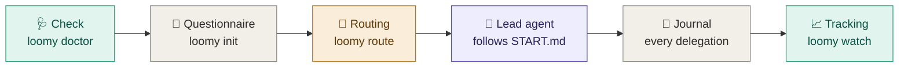

<div align="center">

<picture>
  <source media="(prefers-color-scheme: dark)" srcset="docs/assets/loomy-dark.svg">
  
</picture>

**Start and structure your projects with Codex and Claude Code.**
A questionnaire to frame the project, a repository structure ready for agents, a lead agent on the best model that delegates to dedicated roles, and live tracking in your terminal.


[🇫🇷 Français](README.md) · 🇬🇧 English

</div>

> [!NOTE]
> Loomy's interface, questionnaire and generated project files are in French. This page is an English overview.
>
> **Pre-release.** Loomy stays at 0.x until the whole flow has been validated in real conditions. 1.0.0 comes after that validation.

---

## ⚡ Quick start

**1. Install Loomy** (once; npm, bun or script: see "Installation")

```bash
HOMEBREW_GITHUB_API_TOKEN="$(gh auth token)" brew install eydenn/tap/loomy
```

**2. Check your machine** (once)

```bash
loomy doctor --fix --live
```

**3. Create the project and answer the questionnaire**, from any folder

```bash
loomy init
```

`loomy init` offers to create a folder named after the project (name editable), to use the current folder, or another location. `loomy init my-project` creates the folder directly. At the end, it offers to open the lead agent session.

**4. Reopen the lead agent session** later, from the project folder

```bash
loomy start
```

**5. Follow live**, in a second terminal

```bash
loomy watch
```

> [!TIP]
> Session closed, terminal quit, back the next day: **`loomy start`**, in the project folder, resumes the lead agent's last session or opens a new one at the right point of the project.

---

## 📦 Installation

Every method installs the same `loomy` command. The repository is private, so they all use your GitHub credentials (`gh auth login`).

🍺 **Homebrew** (recommended on macOS)

```bash
HOMEBREW_GITHUB_API_TOKEN="$(gh auth token)" brew install eydenn/tap/loomy
```

📦 **npm**

```bash
npm install -g github:Eydenn/loomy
```

🥟 **bun**

```bash
gh release download -R Eydenn/loomy -p 'loomy-*.tgz' -D /tmp/loomy && bun add -g /tmp/loomy/loomy-*.tgz
```

🐚 **Shell script**

```bash
gh repo clone Eydenn/loomy ~/Tools/loomy && ~/Tools/loomy/install.sh
```

**Update**, whatever the method:

```bash
loomy update
```

Several installs on the same machine (for example Homebrew and npm)? To see which one is used and how to remove the others:

```bash
loomy version --all
```

> [!TIP]
> `loomy update` detects how Loomy was installed and runs the right command. Homebrew downloads inside a sandbox that cannot reach the macOS keychain, so the GitHub token is passed through `HOMEBREW_GITHUB_API_TOKEN` for the download only; `loomy update` does this for you. bun cannot read a private GitHub repository, so it installs the release archive, which `gh` downloads with your credentials. For npm, the update goes into the same folder as the original install, even if you switched Node versions (nvm) since.

---

## 🧭 How it works



1. **Check.** Verifies CLI versions, finds Codex even when it is bundled inside the ChatGPT app, checks model availability, and offers fixes.
2. **Questionnaire.** Twelve questions grouped by theme, each showing the consequence of every option: project type, stage, risk, AI mode, lead tool, budget, Git permissions. The first time, a thirteenth asks for your Claude and ChatGPT subscriptions. ← goes back to the previous question.
3. **Routing.** Turns the brief and the installed tools into a role → model → effort matrix, with automatic fallback when a CLI is missing.
4. **Lead agent.** The main session follows `START.md`:

   <kbd>Discover</kbd> → <kbd>Interview</kbd> → <kbd>Propose</kbd> → <kbd>✋ Approve</kbd> → <kbd>Build</kbd> → <kbd>Verify</kbd> → <kbd>Document</kbd> → <kbd>Commit</kbd> → <kbd>Retire</kbd>

   It delegates the work to dedicated roles and never moves on without your approval.
5. **Journal and tracking.** Every delegation is recorded (model, effort, duration, tokens, cost) as soon as it starts. You follow it live in the terminal.

---

## 🚀 Moving your project forward

Once `loomy init` is done, everything goes through the **lead agent**: a Claude Code or Codex session on the best model, which follows `START.md` and then the project rules. It delegates to the dedicated roles.

### 1. Open or resume its session

| Where | How |
|---|---|
| 🖥️&nbsp;**Terminal,&nbsp;with&nbsp;Loomy** | `loomy start`: a menu to **resume** this folder's last session (with its history) or open a **new** one with the prompt that fits the project phase. `--resume` and `--new` go straight there. |
| ⌨️&nbsp;**Terminal,&nbsp;by&nbsp;hand** | Claude Code: `claude --continue` to resume; Codex: `codex resume --last`. For a new session, `loomy start --print` shows the exact command (model and effort) and copies the prompt. |
| 🪟&nbsp;**Desktop&nbsp;apps** | In the Claude app (Code tab) or the Codex app: open the **project folder**, pick the model and effort shown by `loomy start --print`, paste the prompt it copied. To resume, reopen the project conversation in the app. |

> [!NOTE]
> Sessions stay on the machine where they were opened. On another machine, `loomy start` opens a new session: the lead agent rereads `START.md`, the brief and the recorded phase, and picks up where the project is. In an app, allow the lead agent to run the `.loomy/scripts/` scripts: that is how it delegates to the other tool and records phases.

### 2. Follow the phases, and know when it is your turn

`loomy watch`, in a second terminal, shows the current phase, **what the agent is doing** and **what you need to do**: answer its questions (Interview), approve its proposal (Approval), review the diffs and the commit.

### 3. Then: day-to-day development

After the bootstrap, `START.md` is gone and the lead agent follows `AGENTS.md` and `CLAUDE.md`. For each change: `loomy start`, describe the request, let it propose and delegate, follow with `loomy watch`, review the diff, approve the commit. One clear request per session; ask for a proposal before any large change; ask for a security review on sensitive topics.

### 4. Update, resume or reset

| Need | Command |
|---|---|
| Update&nbsp;Loomy | `loomy update`, then `loomy init --update` in each project (keeps brief, phase and journal) |
| Project&nbsp;already&nbsp;initialized | `loomy init` offers: resume, update, redo the questionnaire, reset |
| Redo&nbsp;the&nbsp;questionnaire | `loomy brief` |
| Restart&nbsp;the&nbsp;bootstrap | `loomy init --reset`: START.md copied again, phase reset, questionnaire rerun with your previous answers |

---

## 🔒 AI files: versioned, local or private

The files that guide the agents (`AGENTS.md`, `CLAUDE.md`, `.ai/`, `.claude/`, `.loomy/`, `START.md`) are your working rules. GitHub sets visibility **per repository**, not per file: a public repository shows everything in it. The questionnaire asks where to keep them, with a default based on your repository.

| Mode | For | What happens |
|---|---|---|
| **Versioned** | private repository *(default)* | they live in the repository: available everywhere, read by online agents |
| **Local** | public repository, no backup | excluded through `.git/info/exclude` (invisible in the repository); lost if you change machines |
| **Separate private repository** | public repository *(recommended)* | excluded from the project and backed up in a private GitHub repository `<project>-ai` that tracks only these files |

See the mode and the backup state:

```bash
loomy privacy
```

Switch mode (one of the three):

```bash
loomy privacy versioned
```

```bash
loomy privacy local
```

```bash
loomy privacy private
```

Back up the AI files to the private repository (the lead agent also does it at the end of each step):

```bash
loomy privacy sync
```

On another machine, after cloning the project, get its AI files back:

```bash
loomy privacy restore <your-account>/<project>-ai
```

> [!WARNING]
> A file already pushed to a public repository stays in its history. When you switch to local or private, `loomy privacy` lists the files still tracked and gives the command to stop tracking them without deleting them from your disk. `--remote <URL>` lets you use another host than GitHub for the private repository.

---

## 📈 Live tracking

Everything happens in the terminal, with no dependency. **Nothing starts on its own**: you start tracking when you want, in a second terminal.

| Command | View |
|---|---|
| <code>loomy&nbsp;status</code> | Snapshot: phases, running delegations, activity, cost per model, subscriptions, Git |
| <code>loomy&nbsp;watch&nbsp;[N]</code> | 🖥️ The same screen refreshed every N seconds (2 by default), Ctrl-C to quit |
| <code>loomy&nbsp;log&nbsp;[-n&nbsp;N]&nbsp;[-f]</code> | Raw journal, optionally streamed |

**What is live.** The screen rereads the project every 2 seconds. Delegations to Claude or Codex appear as soon as they start, with their timer, then their cost; an interrupted one disappears on its own. The phase changes when the lead agent records it (`START.md` asks it to at each step). Work the lead agent does itself, in its session, is not journaled: you follow it in its session.

The journal (`.loomy/logs/events.jsonl`) stays on your machine and is excluded from Git automatically. `LOOMY_JOURNAL=0` disables it, `LOOMY_JOURNAL_TASKS=0` leaves task text out of it.

### 💳 Claude and ChatGPT subscriptions

Loomy knows whether you pay per use (API) or by subscription:

| Plan | What Loomy shows |
|---|---|
| API | the real **cost** (Claude) or an estimate from tokens (Codex) |
| Claude&nbsp;Pro&nbsp;·&nbsp;Max&nbsp;5x&nbsp;·&nbsp;Max&nbsp;20x | the **API value consumed this month**, against $20, $100 or $200 per month |
| ChatGPT&nbsp;Plus&nbsp;·&nbsp;Pro&nbsp;·&nbsp;Business | the same, against $20, $100, $200 or $25 per month |

Claude plan: `api`, `pro`, `max5`, `max20`, `team` or `enterprise`

```bash
loomy config set plan_claude max20
```

ChatGPT / Codex plan: `api`, `plus`, `pro100`, `pro200`, `business` or `enterprise`

```bash
loomy config set plan_codex pro200
```

Custom price, if needed ($ per month)

```bash
loomy config set plan_claude_price 180
```

> [!NOTE]
> Anthropic and OpenAI do not publish the exact quotas of their plans, so Loomy does not pretend to show a quota percentage. It tells you whether your subscription pays for itself. Only journaled delegations are counted, not the work the lead agent does itself.

---

## 🎯 The lead agent and its roles

The main session, the **lead agent**, keeps the best reasoning to plan, delegate, decide and verify. The rest of the work goes to dedicated roles.

| Role | 🟠 Full Claude | 🔵 Full Codex | 🟣 Hybrid, Claude lead | 🟣 Hybrid, Codex lead |
|---|---|---|---|---|
| 🎯&nbsp;**Lead&nbsp;agent** | Opus 5.5 · high | Astra · high | **Opus 5.5 · high** | Astra · high |
| 🏛️&nbsp;Architect | Opus 5.5 · high | Astra · high | Opus 5.5 · high | Opus 5.5 · high ⇄ |
| 🐞&nbsp;Debugger | Opus 5.5 · high | Sol · xhigh | Opus 5.5 · high | Opus 5.5 · high ⇄ |
| 🔒&nbsp;Security | Opus 5.5 · high | Astra · high | Opus 5.5 · high | Opus 5.5 · high ⇄ |
| 🔍&nbsp;Reviewer | Sonnet 5 · high | Sol · high | Sol · high ⇄ | Sonnet 5 · high ⇄ |
| 🛠️&nbsp;Developer | Sonnet 5 · medium | Sol · high | Sonnet 5 · medium | Sol · high |
| ⚙️&nbsp;Executor | Sonnet 5 · medium | **Luna · max** | **Luna · max** ⇄ | **Luna · max** |
| 🔎&nbsp;Explorer | Haiku 4.5 · low | Luna · low | Haiku 4.5 · low | Luna · low |
| 📚&nbsp;Documenter | Sonnet 5 · low | Sol · low | Sonnet 5 · low | Sol · low |

<sub>Balanced profile. ⇄ = role run by the other tool, through a bridge.</sub>

**Budget profiles.** The lead agent always stays on the top model; only role efforts and models change:
- **Économe (thrifty):** lead agent and specialists at `medium`, execution on fast models;
- **Équilibré (balanced, default):** the matrix above;
- **Qualité max (max quality):** lead agent and specialists at `xhigh`, reviews on the top model, execution on Sol or Sonnet `high`.

**Fallbacks.** If the mode asks for both tools and one CLI is missing, routing falls back to the full matrix of the available tool. If the lead tool is missing, the other one leads.

---

## 📊 Why this split

<sub>Analysis of 2026-09-23. "AA" = independent measurements by Artificial Analysis. Details, caveats and sources (in French): <a href="docs/MODEL_CATALOG.md">docs/MODEL_CATALOG.md</a>.</sub>

| Model | 💵 Price ($ per million tokens, in / out) | Cost per AA task | AA Coding Agent Index | Terminal-Bench 4.0 | 🏷️ Role |
|---|---|---|---|---|---|
| GPT&#8209;6&#8209;Luna | **0.10 / 0.50** | **$0.07** | 41 | 🔻 13 % | executor, explorer |
| GPT&#8209;6&#8209;Sol | 2 / 10 | $0.13 → $1.06 | 57 | 43 % | developer, reviewer (Codex) |
| GPT&#8209;6&#8209;Astra | 10 / 50 | $0.82 → $3.26 | **62** | 59 % | lead agent when Codex only |
| Claude&nbsp;Sonnet&nbsp;5 | 2 / 10 | — | — | — | developer, reviewer (Claude) |
| Claude&nbsp;Opus&nbsp;5.5 | 4 / 20 | $0.55 → $5.98 | not published | **59.6 %** | 🏆 lead agent and specialists |
| Claude&nbsp;Fable&nbsp;5.1 | 10 / 50 | $7.63 | 62 | 55.8 % | ❌ superseded by Opus 5.5 |

- 🥇 **Opus 5.5 is the best lead agent.** It ranks first on the AA Intelligence Index and leads agentic work. At high effort it costs less per task than Astra at max, for a better score.
- ⚙️ **GPT-6-Luna max is the best-value executor, not an autonomous agent.**
  - It scores 66.6 % on bounded fixes for $0.22, against $2.74 for Sol.
  - On long autonomous terminal work it drops to 13 %.
  - So it executes precise tickets under the lead agent, nothing more.
- 🐎 **GPT-6-Sol is the Codex workhorse.** It matches Opus 5.5 medium on workflow automation for about 40 % of the cost.

---

## ✅ Prerequisites

| | 🟢 Minimum | ⭐ Ideal |
|---|---|---|
| **System** | macOS or Linux, bash ≥ 3.2 (the macOS one works), `git` | + `gh` logged in |
| **AI** | **one** CLI: Claude Code ≥ 2.1.280 **or** Codex ≥ 0.155, logged in | **both**, installed in the terminal and detected by `loomy doctor`: hybrid mode |
| **Models** | those of your tool | all answer `loomy doctor --live` |
| **Comfort** | none (built-in questionnaire, no dependency) | clipboard, to copy the start prompt |

**Install Claude Code and Codex in the terminal.** `loomy doctor` shows what it detects and prints these commands for a missing CLI; `loomy doctor --fix` offers to run them for you.

**Claude Code** (official installer)

```bash
curl -fsSL https://claude.ai/install.sh | bash
```

or with Homebrew

```bash
brew install --cask claude-code
```

**Codex** (official installer)

```bash
curl -fsSL https://chatgpt.com/codex/install.sh | sh
```

or with Homebrew

```bash
brew install --cask codex
```

Then run `claude`, then `codex`, once each to log in (Claude Pro, Max, Team plan or Console account; ChatGPT account for Codex), and check with `loomy doctor --live`.

---

## 🛠️ Commands

| Command | Purpose |
|---|---|
| 📦&nbsp;<code>loomy&nbsp;init&nbsp;[dir]</code> | creates the folder if needed (or offers to create it from the project name), then initializes the project, new or existing: questionnaire, then structure set up by the lead agent; on an initialized project: resume, `--update`, `--reset` (`--no-wizard`, `--yes`, `--answers`) |
| 📝&nbsp;<code>loomy&nbsp;brief</code> | reruns the questionnaire for the current project |
| 🔒&nbsp;<code>loomy&nbsp;privacy</code> | AI files visibility: `versioned`, `local`, `private`; `sync`, `restore` for the private repository |
| ▶️&nbsp;<code>loomy&nbsp;start</code> | starts or resumes the lead agent session (`--resume`, `--new`, `--print`) |
| 🩺&nbsp;<code>loomy&nbsp;doctor</code> | checks prerequisites (`--fix` fixes, `--live` tests every model) |
| 🧭&nbsp;<code>loomy&nbsp;route</code> | role → model → effort matrix · `lead` · `get <role>` · `markdown` · `all` · `claude-agents` · `codex-profiles` |
| 🔀&nbsp;<code>loomy&nbsp;delegate&nbsp;codex&nbsp;&lt;role&gt;&nbsp;"…"</code> | hands a role to Codex (executor, developer, documenter can write; the others are read-only) |
| 🔀&nbsp;<code>loomy&nbsp;delegate&nbsp;claude&nbsp;&lt;role&gt;&nbsp;"…"</code> | hands a role to Claude, read-only (architect, debugger, security, reviewer, explorer) |
| 📈&nbsp;<code>loomy&nbsp;status</code>&nbsp;·&nbsp;<code>loomy&nbsp;watch</code>&nbsp;·&nbsp;<code>loomy&nbsp;log</code> | tracking (see above) |
| ⚙️&nbsp;<code>loomy&nbsp;config</code> | preferences (`list`, `get`, `set`): `plan_claude`, `plan_codex`, `plan_claude_price`, `plan_codex_price` |
| 🌳&nbsp;<code>loomy&nbsp;worktrees&nbsp;&lt;task&gt;</code> | two separate worktrees for parallel mode |
| 🔄&nbsp;<code>loomy&nbsp;update</code>&nbsp;·&nbsp;<code>loomy&nbsp;version</code> | updates Loomy (then `loomy init --update` in each project) and version; `version --all` lists every install |
| 🗑️&nbsp;<code>loomy&nbsp;uninstall</code> | shows how to uninstall Loomy for your install method, and how to remove it from a project |
| ❓&nbsp;<code>loomy&nbsp;help&nbsp;[command]</code> | general help, or help for one command |

Tests: `tests/run.sh` runs every command in real conditions (bash, git, a pseudo-terminal for the questionnaire) with stubbed `claude` and `codex` CLIs, so no network and no tokens.

---

## 🔮 Roadmap

| Status | Feature |
|---|---|
| ✅&nbsp;0.1 | `loomy` command, questionnaire, doctor, lead + roles routing, bridges, journal, live terminal tracking, subscriptions, Homebrew, npm, bun and shell installs, test suite |
| 🎯&nbsp;1.0 | Full validation in real conditions |
| 🔜 | Journaling of native Claude sub-agents (`SubagentStop` hook) and Codex turns (turn-end notification) |
| 🔜 | Cross-project comparison and CSV cost export |
| 💡 | Real subscription quota tracking, once Claude Code or Codex expose it |
