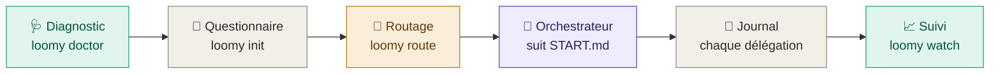
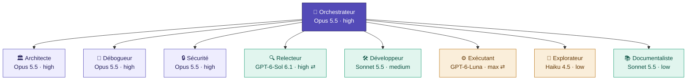

<div align="center">

<picture>
  <source media="(prefers-color-scheme: dark)" srcset="docs/assets/loomy-dark.svg">
  
</picture>

**Démarre et structure tes projets avec Codex et Claude Code.**
Un questionnaire pour cadrer le projet, une structure de dépôt prête pour les agents, un orchestrateur sur le meilleur modèle qui délègue à des rôles dédiés, et un suivi en direct dans le terminal.


[🇬🇧 English](README.md) · 🇫🇷 Français

</div>

> [!NOTE]
> **Pré-version.** Loomy reste en 0.x tant que l'ensemble n'a pas été validé en conditions réelles. La version stable viendra après une phase de « release candidate » validée par les testeurs.

---

## ⚡ Démarrage rapide

**1. Installer Loomy** (une fois ; npm, bun ou script : voir « Installation »)

```bash
HOMEBREW_GITHUB_API_TOKEN="$(gh auth token)" brew install eydenn/tap/loomy
```

**2. Vérifier la machine** (une fois)

```bash
loomy doctor --fix --live
```

**3. Créer le projet et répondre au questionnaire**, depuis n'importe quel dossier

```bash
loomy init
```

`loomy init` propose de créer un dossier nommé d'après le projet (nom modifiable), d'utiliser le dossier courant, ou un autre emplacement. `loomy init mon-projet` crée directement le dossier. À la fin, il propose d'ouvrir la session de l'orchestrateur.

**4. Rouvrir la session de l'orchestrateur** plus tard, depuis le dossier du projet

```bash
loomy start
```

**5. Suivre en direct**, dans un second terminal

```bash
loomy watch
```

> [!TIP]
> Pour la suite, tape simplement **`loomy`** dans le dossier du projet : il affiche où en est le projet, ce qui est attendu de toi, et propose d'ouvrir ou reprendre la session, de suivre en direct ou de voir le statut.

---

## 📦 Installation

Toutes les méthodes installent la même commande `loomy`. Le dépôt étant privé, elles utilisent tes identifiants GitHub (`gh auth login`).

🍺 **Homebrew** (recommandé sur macOS)

```bash
HOMEBREW_GITHUB_API_TOKEN="$(gh auth token)" brew install eydenn/tap/loomy
```

📦 **npm**

```bash
npm install -g github:Eydenn/loomy
```

🥟 **bun**

```bash
gh release download -R Eydenn/loomy -p 'loomy-*.tgz' -D /tmp/loomy && bun add -g /tmp/loomy/loomy-*.tgz
```

🐚 **Script shell**

```bash
gh repo clone Eydenn/loomy ~/Tools/loomy && ~/Tools/loomy/install.sh
```

**Mise à jour**, quelle que soit la méthode :

```bash
loomy update
```

Plusieurs installations sur la même machine (par exemple Homebrew et npm) ? Pour voir celle qui est utilisée et comment retirer les autres :

```bash
loomy version --all
```

> [!TIP]
> `loomy update` détecte la méthode d'installation et utilise la bonne commande. Homebrew télécharge dans un bac à sable qui n'a pas accès au trousseau macOS : le jeton GitHub lui est transmis par `HOMEBREW_GITHUB_API_TOKEN`, le temps du téléchargement seulement, et `loomy update` s'en charge. bun ne sait pas lire un dépôt GitHub privé : il installe l'archive de la release, que `gh` télécharge avec tes identifiants. Pour npm, la mise à jour se fait dans le même dossier que l'installation d'origine, même si tu as changé de version de Node (nvm) entre-temps.

---

## 🧭 Comment ça marche



1. **Diagnostic.** Vérifie les versions des CLI, trouve Codex même caché dans l'app ChatGPT, contrôle les modèles disponibles, et propose les corrections.
2. **Questionnaire.** Treize questions en français, groupées par thème, chacune avec la conséquence de chaque choix : type de projet, stade, risque, mode IA, outil principal, budget, autorisations Git. La première fois, une quatorzième demande tes forfaits Claude et ChatGPT. Pour un nouveau projet, un modèle (application SaaS, landing page, API REST, CLI, modèles d'e-mails) pré-remplit les réponses et donne à l'orchestrateur une structure de départ. ← revient à la question précédente ; dans un champ texte, Tab reprend la suggestion pour la modifier (nom du projet, nom du dépôt…).
3. **Routage.** Transforme le brief et les outils installés en une matrice rôle → modèle → effort, avec repli automatique si une CLI manque.
4. **Orchestrateur.** La session principale suit `START.md` :

   <kbd>Découverte</kbd> → <kbd>Entretien</kbd> → <kbd>Proposition</kbd> → <kbd>✋ Validation</kbd> → <kbd>Construction</kbd> → <kbd>Vérification</kbd> → <kbd>Documentation</kbd> → <kbd>Commit</kbd> → <kbd>Clôture</kbd>

   Elle délègue le travail aux rôles dédiés et n'avance jamais sans ta validation.
5. **Journal et suivi.** Chaque délégation est enregistrée (modèle, effort, durée, tokens, coût) dès son lancement. Tu la suis en direct dans le terminal.

---

## 🚀 Avancer dans ton projet

Une fois `loomy init` terminé, tout passe par **l'orchestrateur** : une session Claude Code ou Codex, sur le meilleur modèle, qui suit `START.md` puis les règles du projet. Tu lui parles en français, il délègue aux rôles dédiés.

### 1. Ouvrir ou reprendre sa session

Le plus simple : **`loomy`** dans le dossier du projet, puis « Ouvrir ou reprendre la session ».

| Où | Comment |
|---|---|
| 🖥️&nbsp;**Terminal,&nbsp;avec&nbsp;Loomy** | `loomy start` : un menu propose de **reprendre** la dernière session de ce dossier (avec son historique) ou d'en ouvrir une **nouvelle** avec le prompt adapté à la phase du projet. `--resume` et `--new` y vont directement. |
| ⌨️&nbsp;**Terminal,&nbsp;à&nbsp;la&nbsp;main** | Claude Code : `claude --continue` pour reprendre ; Codex : `codex resume --last`. Pour une nouvelle session, `loomy start --print` affiche la commande exacte (modèle et effort) et copie le prompt. |
| 🪟&nbsp;**Apps&nbsp;de&nbsp;bureau** | Dans l'app Claude (onglet Code) ou l'app Codex : ouvre le **dossier du projet**, choisis le modèle et l'effort indiqués par `loomy start --print`, colle le prompt qu'il a copié. Pour reprendre, rouvre la conversation du projet dans l'app. |

> [!NOTE]
> Les sessions restent sur la machine où elles ont été ouvertes. Sur une autre machine, `loomy start` ouvre une nouvelle session : l'orchestrateur relit `START.md`, le brief et la phase enregistrée, et reprend là où le projet en est.
>
> Dans une app, autorise l'orchestrateur à lancer les scripts `.loomy/scripts/` : c'est par eux qu'il délègue à l'autre outil et qu'il enregistre les phases.

**La reprise est automatique.**
- **Claude Code :** à chaque ouverture de session dans le projet (terminal, app, `claude` tapé à la main), un hook installé par `loomy init` lui transmet d'office le contexte : phase, ce que tu dois faire, dernières délégations. Il commence par te dire où en est le projet. À la fermeture, la session est notée ; en mode dépôt privé, les fichiers IA sont sauvegardés.
- **Codex :** même mécanisme, via `.codex/hooks.json`. Au premier lancement dans le projet, Codex te demande de faire confiance au dossier, puis d'approuver les hooks Loomy : accepte les deux, c'est ce qui active la reprise automatique. Tant que ce n'est pas fait, `AGENTS.md` et le prompt de `loomy start` lui demandent de lire le contexte lui-même (`.loomy/scripts/ai-context.sh`).
- **Suivi :** `loomy watch` et `loomy` indiquent si la session de l'orchestrateur est ouverte, et depuis quand.

### 2. Suivre les phases, et savoir quand c'est à toi

`loomy watch`, dans un second terminal, affiche la phase en cours, **ce que fait l'agent** et **ce que tu dois faire**.

| Phase | L'orchestrateur… | À toi |
|---|---|---|
| 1&nbsp;·&nbsp;Brief | attend d'être lancé | `loomy start` |
| 2&nbsp;·&nbsp;Découverte | lit le brief et explore le dossier | rien, garde sa session ouverte |
| 3&nbsp;·&nbsp;Entretien | pose les questions qui manquent | réponds dans sa session |
| 4&nbsp;·&nbsp;Proposition | présente stack, structure et plan | lis, questionne |
| 5&nbsp;·&nbsp;Validation | attend ton feu vert | **valide** ou demande des changements |
| 6&nbsp;·&nbsp;Construction | met en place le projet et délègue | suis les délégations |
| 7&nbsp;·&nbsp;Vérification | tests, relecture croisée, sécurité | regarde les constats remontés |
| 8&nbsp;·&nbsp;Documentation | écrit PROJECT.md, ARCHITECTURE.md, `.ai/` | relis |
| 9&nbsp;·&nbsp;Commit | commit initial, si autorisé | vérifie le commit |
| 10&nbsp;·&nbsp;Clôture | archive ou supprime START.md | rien |

### 3. Ensuite : le développement au quotidien

Le bootstrap terminé, `START.md` disparaît et l'orchestrateur suit `AGENTS.md` et `CLAUDE.md`.

- **`loomy task "…"`** : une tâche nommée (une fonctionnalité, un bug, un refactor).
  - Ses phases sont plan → validation → construction → vérification → commit, suivies dans `loomy watch` avec la durée, les délégations et le coût.
  - L'orchestrateur tient le plan et une liste d'avancement dans `.loomy/tasks/<n>-<nom>.md` : une longue tâche se reprend avec `loomy task --resume`.
  - `.loomy/TASKS.md` liste toutes les tâches, et `loomy task` seul affiche la liste.
- **`loomy review`** : une relecture croisée à la demande de la branche en cours, ou des modifications non commitées. En mode hybride, elle est faite par l'autre famille de modèles, en lecture seule, et enregistrée dans `.loomy/reviews/`.
- **`loomy report`** : les chiffres du projet (démarrage, tâches, délégations par rôle et par modèle, tokens, coût).
  - `--md` l'écrit en Markdown dans `docs/reports/`, à garder dans le dépôt.
  - `--all` compare tous les projets Loomy de la machine.
- **`loomy models`** : les chaînes de modèles utilisées et les nouveaux modèles à évaluer. Tu peux placer un nouveau modèle en tête de sa chaîne avec deux replis au plus, passer en mode économe (`--thrifty on` : les replis d'abord), ou le suggérer sur GitHub (`--issue`, un ticket par modèle, sans doublon).

`loomy start` ouvre toujours une session libre.

> [!TIP]
> **Recommandations.** Une demande claire par session, avec le résultat attendu. Demande une proposition avant tout changement large. Relis chaque diff avant de committer. Pour les sujets sensibles (authentification, paiements, données personnelles), demande explicitement une revue du rôle sécurité.

### Tenu à jour tout seul

- **Au lancement.** `loomy`, `loomy start`, `loomy init`, `loomy task`, `loomy audit` et `loomy review` vérifient ce qui suit, sans rien ralentir (les versions en ligne sont mises en cache une fois par jour) :
  - existe-t-il un Loomy plus récent ?
  - Claude Code ou Codex est-il trop ancien pour les modèles routés, ou ne démarre-t-il plus ?
- **Une seule question.** S'il faut agir, une seule question, puis tout est fait d'un coup et la commande continue. Loomy se relance après sa propre mise à jour.
- **Le catalogue de modèles** se met à jour sans rien demander.
- **Les anciens projets** reçoivent automatiquement les relais des nouvelles commandes.
- **Pour désactiver :** `loomy config set auto_update no`.

**Une réparation qui insiste.** `loomy doctor --fix` (et la question au lancement) amènent Claude Code et Codex à une version qui fonctionne, quelle que soit la méthode d'installation (installateur officiel, npm, Homebrew, app de bureau). Les étapes sont essayées dans l'ordre, chacune vérifiée avant de passer à la suivante :
1. mise à jour sur place, avec la méthode de l'installation ;
2. réinstallation avec cette méthode ;
3. suppression d'une ancienne copie qui en cache une récente dans le PATH (le classique « la mise à jour n'a rien changé ») ;
4. réinstallation propre : toutes les copies supprimables, puis l'installateur officiel.

Les réglages, connexions et conversations (`~/.claude`, `~/.codex`) ne sont jamais touchés. Chaque étape est journalisée dans `~/.config/loomy/logs/repair-<outil>.log`. `loomy doctor` liste toutes les copies trouvées dans le PATH, avec leur méthode et leur version.

### 4. Mettre à jour, reprendre ou réinitialiser

| Besoin | Commande |
|---|---|
| Mettre&nbsp;à&nbsp;jour&nbsp;Loomy | `loomy update` : tous tes projets en profitent aussitôt (leurs scripts sont des relais vers le Loomy installé). `loomy init --update` ne sert plus qu'aux nouveaux modèles de documents, et une fois pour les projets d'avant la 0.3 (garde brief, phase et journal) |
| Projet&nbsp;déjà&nbsp;initialisé | `loomy init` propose : reprendre, mettre à jour, refaire le questionnaire, réinitialiser |
| Refaire&nbsp;le&nbsp;questionnaire | `loomy brief` |
| Recommencer&nbsp;le&nbsp;bootstrap | `loomy init --reset` : START.md recopié, phase remise à zéro, questionnaire relancé avec tes anciennes réponses |

---

## 🔒 Fichiers IA : versionnés, locaux ou privés

Les fichiers qui guident les agents (`AGENTS.md`, `CLAUDE.md`, `.ai/`, `.claude/`, `.codex/`, `.loomy/`, `START.md`) sont tes règles de travail. GitHub règle la visibilité **par dépôt**, pas par fichier : un dépôt public montre tout ce qu'il contient. Le questionnaire te demande où les garder, avec une valeur par défaut qui dépend de ton dépôt.

Le questionnaire propose aussi de **créer le dépôt GitHub** du projet, privé ou public. Son nom, tiré du nom du projet, est à valider ou à modifier. En mode dépôt privé séparé, le nom du dépôt des fichiers IA (`<dépôt>-ai`) l'est aussi, et les deux sont confirmés ensemble. Un dépôt existant qui porte un autre nom est signalé, avec la commande pour le renommer ; Loomy ne renomme rien lui-même.

| Mode | Pour qui | Ce qui se passe |
|---|---|---|
| **Versionnés** | dépôt privé *(défaut)* | ils sont dans le dépôt : tu les retrouves partout, les agents en ligne les lisent |
| **Locaux** | dépôt public, sans sauvegarde | exclus via `.git/info/exclude` (invisible dans le dépôt) ; perdus si tu changes de machine |
| **Dépôt privé séparé** | dépôt public *(recommandé)* | exclus du projet et sauvegardés dans un dépôt GitHub privé `<projet>-ai`, qui ne suit que ces fichiers |

Voir le mode et l'état de la sauvegarde :

```bash
loomy privacy
```

Changer de mode (un seul des trois) :

```bash
loomy privacy versioned
```

```bash
loomy privacy local
```

```bash
loomy privacy private
```

Sauvegarder les fichiers IA dans le dépôt privé (l'orchestrateur le fait aussi en fin d'étape) :

```bash
loomy privacy sync
```

Sur une autre machine, après avoir cloné le projet, récupérer ses fichiers IA :

```bash
loomy privacy restore <ton-compte>/<projet>-ai
```

> [!WARNING]
> Un fichier déjà envoyé sur un dépôt public reste dans son historique. Quand tu passes en mode local ou privé, `loomy privacy` liste les fichiers encore suivis et donne la commande pour arrêter de les suivre sans les supprimer de ton disque. `--remote <URL>` permet d'utiliser un autre hébergeur que GitHub pour le dépôt privé.

---

## 📈 Suivi en direct

Tout se passe dans le terminal, sans dépendance. **Rien ne démarre tout seul** : tu lances le suivi quand tu veux, dans un second terminal.

| Commande | Vue |
|---|---|
| <code>loomy&nbsp;status</code> | Instantané : phases, délégations en cours, activité, coûts par modèle, forfaits, Git |
| <code>loomy&nbsp;watch&nbsp;[N]</code> | 🖥️ Le même écran rafraîchi chaque seconde (ou toutes les N secondes) : délégation en cours avec toupie, chrono et avancement estimé, nouveautés mises en évidence, notification (macOS) et bip à chaque phase, échec ou fin de bootstrap. Un journal de session en bas défile au fil des événements, le plus récent mis en évidence. Touches : `q` quitter, `c` vue resserrée ou complète, `l` journal, `t` arbre des agents, `s` ouvrir la session. Vue resserrée d'office dans un petit terminal |
| <code>loomy&nbsp;tree</code> | 🌳 Arbre des agents : l'orchestrateur avec son modèle, son effort, sa session et sa phase ; son conseiller et ses consultations ; chaque rôle avec son modèle, son effort et son état en direct (une impulsion parcourt la branche d'un rôle en cours, puis terminé, durée, tokens) ; le journal de session ; une ligne d'état. Aussi touche `t` de `loomy watch`. Dans une grande fenêtre (124 × 56), il est dessiné en diagramme (boîtes et liaisons animées), sinon en liste ; `v` bascule, `loomy config set tree_view auto\|diagram\|list` choisit |
| <code>loomy&nbsp;start&nbsp;--watch</code> | 🪟 La session de l'orchestrateur et le suivi en direct côte à côte (ou l'un au-dessus de l'autre si le terminal est étroit), via tmux ou iTerm2 ; le suivi se ferme avec la session |
| <code>loomy&nbsp;log&nbsp;[-n&nbsp;N]&nbsp;[-f]</code> | Journal lisible, à l'heure locale, éventuellement en continu (`--raw` : JSON brut) ; `--since AAAA-MM-JJ` remonte dans les archives mensuelles ; `--csv` exporte les coûts |

**Ce qui est en direct.** L'écran relit le projet toutes les 2 secondes :
- les **délégations** à Claude ou Codex s'affichent dès leur lancement, avec leur chrono, puis leur coût à la fin ; une délégation interrompue disparaît d'elle-même ;
- la **phase** change quand l'orchestrateur l'enregistre (`START.md` le lui demande à chaque étape) ;
- le travail que l'orchestrateur fait lui-même, dans sa session, n'est pas journalisé : c'est dans sa session que tu le suis.

Le journal (`.loomy/logs/events.jsonl`) reste sur ta machine : il est exclu de Git automatiquement. `LOOMY_JOURNAL=0` le désactive, `LOOMY_JOURNAL_TASKS=0` n'y enregistre pas le texte des tâches.

### 💳 Forfaits Claude et ChatGPT

Loomy sait si tu paies à l'usage (API) ou par abonnement, outil par outil :

| Forfait | Ce que Loomy affiche |
|---|---|
| API | le **coût** réel (Claude) ou estimé à partir des tokens (Codex), par tâche et par mois |
| Claude&nbsp;Pro&nbsp;·&nbsp;Max&nbsp;5x&nbsp;·&nbsp;Max&nbsp;20x&nbsp;·&nbsp;Team | la **part de ton quota utilisée** : fenêtres de 5 heures et de la semaine, avec leur heure de remise à zéro ; des **tokens** par tâche plutôt que des dollars |
| ChatGPT&nbsp;Plus&nbsp;·&nbsp;Pro&nbsp;·&nbsp;Business | idem, d'après les fenêtres que rapporte Codex |

```text
◇  FORFAITS  quota pour les abonnements, coût pour l'API
│  Claude          Claude Pro · 5 h 42 % (remise à zéro 12:57) · semaine 86 % (remise à zéro jeu. 23:17)
│  Codex           ChatGPT Business · semaine 12 % (remise à zéro mer. 19:30)
```

`loomy watch` te prévient quand un quota dépasse 80 %, puis 95 %.

**Bascule automatique en fin de quota.** À partir de 95 % d'un quota d'abonnement (ou quand l'outil signale sa limite atteinte), le travail passe à l'autre outil, s'il est installé et a encore de la marge :
- une délégation à Codex (exécutant, relecteur…) est faite par Claude, avec le modèle et l'effort que le routage prévoit pour ce rôle côté Claude, et inversement ;
- un rôle qui écrit, basculé vers Claude, a ses modifications acceptées et ses commandes limitées au bac à sable de Claude Code (dossier du projet, pas de réseau), comme le bac à sable `workspace-write` de Codex ; les rôles en lecture seule le restent ;
- l'orchestrateur reçoit le même type de réponse que d'habitude ; la bascule est annoncée, journalisée (⇄ dans `status`, `log` et `stats`) et indiquée dans la section forfaits ;
- `loomy start` ouvre la session de l'orchestrateur sur l'autre outil quand le sien est presque épuisé (`LOOMY_NO_SWITCH=1 loomy start` pour le garder) ;
- pas d'aller-retour : une délégation basculée ne rebascule jamais, et rien ne bouge quand les deux outils sont épuisés.

Seuil : `loomy config set quota_switch 90` (un pourcentage), ou `off` pour ne jamais basculer.

D'où viennent les chiffres, sans réseau ni identifiants :
- **Codex** écrit son quota dans ses propres journaux de session (`~/.codex/sessions`) ; Loomy lit le dernier relevé.
- **Claude Code** transmet à sa commande de barre d'état un champ documenté `rate_limits`. `loomy init` ajoute au projet une petite barre d'état Loomy (`.claude/settings.json`) qui l'enregistre, puis affiche **ta propre barre d'état** si tu en as une (une barre d'état déjà définie dans le projet n'est jamais remplacée). Le quota Claude apparaît dès qu'une session a répondu dans un projet Loomy.

Forfait Claude : `api`, `pro`, `max5`, `max20`, `team` ou `enterprise`

```bash
loomy config set plan_claude max20
```

Forfait ChatGPT / Codex : `api`, `plus`, `pro100`, `pro200`, `business` ou `enterprise`

```bash
loomy config set plan_codex pro200
```

Prix personnalisé du forfait (en $ par mois), utilisé par `loomy stats` pour le comparer à la valeur API de ton travail

```bash
loomy config set plan_claude_price 180
```

### 📊 Statistiques détaillées

```bash
loomy stats
```

Délégations et taux de réussite, durées totale et moyenne, tokens (entrée, cache, sortie) et travail propre de Claude Code (orchestrateur, sous-agents), puis par rôle, par modèle (avec la part du cache) et par jour, et tes forfaits. Avec un abonnement, les montants s'affichent en `≈$…` : ce que le travail coûterait via l'API, couvert par le forfait, à côté de son prix mensuel. `--days 7` ou `--since AAAA-MM-JJ` pour une période ; `loomy log --csv` pour les chiffres bruts.

---

## 🎯 L'orchestrateur et ses rôles

La session principale, l'**orchestrateur**, garde le meilleur raisonnement pour planifier, déléguer, décider et vérifier. Le reste du travail est confié à des rôles dédiés.



<sub>Mode hybride avec Claude Code en lead, profil Équilibré. ⇄ = rôle exécuté par l'autre outil, via un bridge. 🟪 pointe · 🟩 standard · 🟧 rapide.</sub>

### 🗺️ Matrice complète (profil Équilibré)

| Rôle | 🟠 Full Claude | 🔵 Full Codex | 🟣 Hybride, lead Claude | 🟣 Hybride, lead Codex |
|---|---|---|---|---|
| 🎯&nbsp;**Orchestrateur** | Opus 5.5 · high | Sol 6.1 · high | **Opus 5.5 · high** | Sol 6.1 · high |
| 🏛️&nbsp;Architecte | Opus 5.5 · high | Sol 6.1 · high | Opus 5.5 · high | Opus 5.5 · high ⇄ |
| 🐞&nbsp;Débogueur | Opus 5.5 · high | Sol 6.1 · xhigh | Opus 5.5 · high | Opus 5.5 · high ⇄ |
| 🔒&nbsp;Sécurité | Opus 5.5 · high | Sol 6.1 · high | Opus 5.5 · high | Opus 5.5 · high ⇄ |
| 🔍&nbsp;Relecteur | Sonnet 5.5 · high | Sol 6.1 · high | Sol 6.1 · high ⇄ | Sonnet 5.5 · high ⇄ |
| 🛠️&nbsp;Développeur | Sonnet 5.5 · medium | Sol 6.1 · high | Sonnet 5.5 · medium | Sol 6.1 · high |
| ⚙️&nbsp;Exécutant | Sonnet 5.5 · medium | **Luna · max** | **Luna · max** ⇄ | **Luna · max** |
| 🔎&nbsp;Explorateur | Haiku 4.5 · low | Luna · low | Haiku 4.5 · low | Luna · low |
| 📚&nbsp;Documentaliste | Sonnet 5.5 · low | Sol 6.1 · low | Sonnet 5.5 · low | Sol 6.1 · low |

**Profils de budget.** L'orchestrateur reste toujours sur le meilleur modèle ; seuls les efforts et les modèles des rôles changent.

| Profil | Effet |
|---|---|
| 💚&nbsp;Économe | orchestrateur Claude sur Sonnet 5.5 `medium` (Codex sur Sol 6.1 `medium`), spécialistes en `medium`, exécution sur les modèles rapides |
| 💛&nbsp;Équilibré&nbsp;*(défaut)* | la matrice ci-dessus |
| ❤️&nbsp;Qualité&nbsp;max | orchestrateur et spécialistes en `xhigh`, revues sur le modèle de pointe, exécution sur Sol ou Sonnet `high` |

> [!NOTE]
> **Replis automatiques.** Si le mode demande les deux outils mais qu'une CLI manque, le routage bascule sur la matrice complète de l'outil disponible. Si l'outil principal manque, c'est l'autre qui orchestre.
>
> **En hybride :**
> - la revue vient toujours de l'autre famille de modèles ;
> - l'architecture, la sécurité et le debug passent toujours par Opus 5.5 ;
> - l'exécution passe toujours par GPT-6-Luna.
>
> Choisis **Claude Code comme outil principal** pour avoir Opus 5.5 en orchestrateur. C'est le choix par défaut du questionnaire.

---

### 🧭 Le conseiller

Claude Code peut donner à la session un **conseiller** plus fort ([documentation Claude Code](https://code.claude.com/docs/en/advisor)). Le conseiller lit toute la session et est consulté aux moments clés : avant un plan, quand une erreur se répète, avant de déclarer une tâche terminée. Loomy lance l'orchestrateur Claude avec lui selon le profil :

| Profil | Orchestrateur | Conseiller |
|---|---|---|
| Économe | Sonnet 5.5 medium | **Opus 5.5** : du jugement aux moments clés sans payer Opus à chaque tour |
| Équilibré | Opus 5.5 high | aucun (en option) |
| Qualité max | Opus 5.5 | **un second Opus**, pour une vérification indépendante |

- **Réglage :** `loomy config set advisor auto|off|opus|sonnet|fable`. Fable demande un accès Fable et se facture en crédits d'usage sur certains forfaits.
- **Associations :** seules celles que Claude Code accepte sont utilisées ; un orchestrateur Codex n'a jamais de conseiller.
- **Mesuré :** chaque consultation est journalisée avec son modèle, ses tokens et son coût, et apparaît dans `status`, `report` et l'arbre des agents. Une consultation lit toute la session, environ 35 000 tokens dans notre test.
- **Vérifications :** `loomy doctor` prévient quand une variable (`DISABLE_TELEMETRY`…) empêche le conseiller de fonctionner.
- **Nécessite Claude Code 2.1.286 ou plus récent** ; Loomy le met à jour au lancement.

### 🧾 Délégations structurées

Les agents s'échangent normalement tâches et résultats en prose. Avec les **délégations structurées** (un choix du questionnaire, recommandé), ils utilisent des champs fixes : moins de tokens, rien de perdu dans la formulation, et des résultats que l'orchestrateur et les bridges peuvent vérifier.

```text
GOAL / SCOPE / FILES / ACCEPTANCE                          ← la tâche de l'orchestrateur
STATUS: done | partial | blocked                           ← la réponse de chaque rôle
SUMMARY · FINDINGS (chemin:ligne, preuve) · FILES · CHECKS · RISKS · NEXT
```

Les bridges ajoutent ce contrat à leur prompt, les sous-agents Claude générés le portent, et l'orchestrateur a pour consigne d'agir selon `STATUS`. Le journal enregistre le résultat : `loomy status` et `loomy log` marquent ◐ les résultats partiels et ■ les résultats bloqués, `loomy stats` indique combien de réponses ont respecté le format. Les projets créés avant cette option restent en texte libre ; change un projet avec `loomy brief` (questionnaire refait) ou tous avec `loomy config set delegation_format structured` (`auto` : le choix de chaque projet).

C'est un protocole texte, qui fonctionne avec Claude et Codex tels quels. L'échange des états internes des modèles (« communication latente ») relève encore de la recherche : il faut accéder à l'intérieur des modèles, ce que les produits Claude et Codex ne permettent pas.

---

## 📊 Pourquoi cette répartition

<sub>Analyse du 23/09/2026. « AA » = mesures indépendantes d'Artificial Analysis. Détails, limites et sources : <a href="docs/MODEL_CATALOG.md">docs/MODEL_CATALOG.md</a>.</sub>

| Modèle | 💵 Prix ($ par million de tokens, entrée / sortie) | Coût par tâche AA | Indice de codage AA | Terminal-Bench 4.0 | 🏷️ Rôle attribué |
|---|---|---|---|---|---|
| GPT&#8209;6&#8209;Luna | **0,10 / 0,50** | **0,07 $** | 41 | 🔻 13 % | exécutant, explorateur |
| GPT&#8209;6&#8209;Sol | 2 / 10 | 0,13 → 1,06 $ | 57 | 43 % | développeur, relecteur (Codex) |
| GPT&#8209;6.1&#8209;Sol | 2 / 10 | environ 1,50 $ par tâche DeepSWE | — | DeepSWE 75,2 % (éditeur) | tous les rôles Codex sauf l'exécution, depuis la 0.7.2 |
| GPT&#8209;6&#8209;Astra | 10 / 50 | 0,82 → 3,26 $ | **62** | 59 % | repli au niveau top, ou forcé : `loomy config set model.codex.top gpt-6-astra` |
| Claude&nbsp;Sonnet&nbsp;5 | 2 / 10 | — | — | — | développeur, relecteur (Claude) |
| Claude&nbsp;Opus&nbsp;5.5 | 4 / 20 | 0,55 → 5,98 $ | non publié | **59,6 %** | 🏆 orchestrateur et spécialistes |
| Claude&nbsp;Fable&nbsp;5.1 | 10 / 50 | 7,63 $ | 62 | 55,8 % | ❌ remplacé par Opus 5.5 |

- 🥇 **Opus 5.5, meilleur orchestrateur.** Il est premier de l'indice d'intelligence AA et en tête du travail agentique. En effort high, il coûte moins cher par tâche qu'Astra en max, pour un meilleur score.
- ⚙️ **GPT-6-Luna max, meilleur exécutant, mais pas un agent autonome.**
  - Il fait 66,6 % sur des corrections bornées pour 0,22 $, contre 2,74 $ pour Sol.
  - Sur le travail long et autonome en terminal, il tombe à 13 %.
  - Il exécute donc des tickets précis sous l'orchestrateur, jamais plus.
- 🐎 **GPT-6.1 Sol tient tout le côté Codex.** Il égale Astra sur DeepSWE (75,2 % contre 74,8 %) pour environ un cinquième du coût, et Astra s'est montré moins fiable ces derniers temps en usage réel : Astra reste son repli, et peut être forcé avec `loomy config set model.codex.top gpt-6-astra` (`auto` pour revenir).

---

## ✅ Prérequis

| | 🟢 Minimum | ⭐ Idéal |
|---|---|---|
| **Système** | macOS, bash ≥ 3.2 (celui de macOS convient), `git` ; Linux : testé automatiquement (intégration continue), pas encore validé en usage réel | + `gh` connecté |
| **IA** | **une** CLI : Claude Code ≥ 2.1.280 **ou** Codex ≥ 0.155, connectée | **les deux**, installées dans le terminal et détectées par `loomy doctor` : mode hybride |
| **Modèles** | ceux de ton outil | tous répondent à `loomy doctor --live` |
| **Confort** | aucun (questionnaire intégré, sans dépendance) | presse-papiers, pour copier le prompt de démarrage |

**Installer Claude Code et Codex dans le terminal.** `loomy doctor` indique ce qui est détecté et affiche ces commandes pour une CLI absente ; `loomy doctor --fix` propose de les lancer pour toi.

**Claude Code** (installateur officiel)

```bash
curl -fsSL https://claude.ai/install.sh | bash
```

ou avec Homebrew

```bash
brew install --cask claude-code
```

**Codex** (installateur officiel)

```bash
curl -fsSL https://chatgpt.com/codex/install.sh | sh
```

ou avec Homebrew

```bash
brew install --cask codex
```

Lance ensuite `claude`, puis `codex`, une fois chacun pour te connecter (forfait Claude Pro, Max, Team ou compte Console ; compte ChatGPT pour Codex), et vérifie avec `loomy doctor --live`.

> [!IMPORTANT]
> - **Codex livré avec les apps ChatGPT et Codex.** `loomy doctor --fix` le rend accessible sous le nom `codex` grâce à un petit script dans `~/.local/bin`. Un lien symbolique ne marcherait pas : la CLI cherche ses programmes auxiliaires à côté du chemin par lequel on l'appelle.
> - **Claude Code trop ancien.** Les versions antérieures refusent `claude-opus-5-5`. Le diagnostic propose `claude update`.
> - **Session en bac à sable.** Si l'orchestrateur Claude Code tourne dans un bac à sable, autorise `delegate-to-codex.sh` à s'exécuter hors de ce bac à sable quand il le demande.

---

## 🛠️ Commandes

| Commande | Rôle |
|---|---|
| 🏠&nbsp;<code>loomy</code> | accueil : où en est le projet, ce qui est attendu, et la suite en un choix (hors projet : créer un projet) |
| 📦&nbsp;<code>loomy&nbsp;init&nbsp;[dossier]</code> | crée le dossier si besoin (ou propose de le créer d'après le nom du projet), puis initialise le projet, nouveau ou existant : questionnaire, puis structure mise en place par l'orchestrateur ; sur un projet déjà initialisé : reprendre, `--update`, `--reset` (`--no-wizard`, `--yes`, `--answers` ; projet Git existant : `--no-branch` pour rester sur la branche courante) |
| 📝&nbsp;<code>loomy&nbsp;brief</code> | relance le questionnaire du projet courant |
| 🔒&nbsp;<code>loomy&nbsp;privacy</code> | visibilité des fichiers IA : `versioned`, `local`, `private` ; `sync`, `restore` pour le dépôt privé |
| ▶️&nbsp;<code>loomy&nbsp;start</code> | démarre ou reprend la session de l'orchestrateur (`--resume`, `--new`, `--print`, `--watch`) |
| 🩺&nbsp;<code>loomy&nbsp;doctor</code> | vérifie les prérequis (`--fix` corrige, y compris GitHub : installation de `gh`, connexion, accès de git au dépôt Loomy ; `--live` teste chaque modèle) |
| 💬&nbsp;<code>loomy&nbsp;feedback</code> | signale un bug ou une idée : issue GitHub pré-remplie (versions, état du projet anonymisé, sans nom, objectif ni texte des tâches), envoyée seulement après ton accord ; `--print` pour voir le texte |
| 🧭&nbsp;<code>loomy&nbsp;route</code> | matrice du projet · `lead` · `get <rôle>` · `markdown` · `all` · `claude-agents` · `codex-profiles` |
| 🔀&nbsp;<code>loomy&nbsp;delegate&nbsp;codex&nbsp;&lt;rôle&gt;&nbsp;"…"</code> | confie un rôle à Codex (exécutant, développeur, documentaliste en écriture ; les autres en lecture seule) |
| 🔀&nbsp;<code>loomy&nbsp;delegate&nbsp;claude&nbsp;&lt;rôle&gt;&nbsp;"…"</code> | confie un rôle à Claude en lecture seule (architecte, débogueur, sécurité, relecteur, explorateur) |
| ✅&nbsp;<code>loomy&nbsp;task&nbsp;"…"</code> | une tâche nommée pour l'orchestrateur : plan, validation, construction, vérification, commit, suivie dans `watch` ; sans argument, la liste ; `--resume`, `--print` |
| 🔍&nbsp;<code>loomy&nbsp;review</code> | relecture croisée à la demande de la branche en cours (`[base]`) ou des modifications non commitées (`--working`, `--staged`), en lecture seule, enregistrée dans `.loomy/reviews/` |
| 🧾&nbsp;<code>loomy&nbsp;report</code> | chiffres du projet : démarrage, tâches, délégations par rôle et par modèle, tokens, coût ; `--md [dossier]` en Markdown dans `docs/reports/` ; `--all` tous les projets |
| 🧬&nbsp;<code>loomy&nbsp;models</code> | chaînes de modèles et nouveaux modèles à évaluer ; tête de chaîne avec deux replis (cette machine), `--thrifty on\|off`, `--issue` (suggestion GitHub) |
| 🛡️&nbsp;<code>loomy&nbsp;audit</code> | audit de sécurité d'un dépôt Git existant, une mission plutôt qu'un projet (voir plus bas) : `--resume`, `--print`, `--yes`, `--scope`, `--depth quick\|standard\|deep`, `--fixes report\|plan\|branch` |
| 🔬&nbsp;<code>loomy&nbsp;assess</code> | état des lieux d'un projet existant, sans IA : stack, commandes, tests, CI, conventions, historique Git, zones sensibles, dette (`.loomy/assessment.md` ; `--print` pour seulement l'afficher) |
| 📈&nbsp;<code>loomy&nbsp;status</code>&nbsp;·&nbsp;<code>loomy&nbsp;watch</code>&nbsp;·&nbsp;<code>loomy&nbsp;log</code> | suivi (voir ci-dessus) |
| 📊&nbsp;<code>loomy&nbsp;stats</code> | statistiques détaillées : par rôle, modèle et jour, durées, tokens, coût ou quota (`--days N`, `--since AAAA-MM-JJ`) |
| 🎚️&nbsp;<code>loomy&nbsp;effort</code> | effort de raisonnement de l'orchestrateur pour ce projet (`loomy effort low`, menu sans argument), ou d'un rôle (`loomy effort executor high`) ; `--list`, `--reset` ; pris en compte au prochain `loomy start` |
| ⚙️&nbsp;<code>loomy&nbsp;config</code> | préférences : `plan_claude`, `plan_codex`, `plan_claude_price`, `plan_codex_price`, `start_watch` (`yes` : `loomy start` ouvre toujours le suivi à côté), `notify` (`no` : pas de notifications dans `loomy watch`), `quota_switch` (95 par défaut : à partir de cette part d'un quota d'abonnement, le travail passe à l'autre outil ; `off` : jamais), `delegation_format` (`structured`, `free` ou `auto` : le choix de chaque projet), `lang` (`fr`, `en` ou `auto` : langue de l'interface, détectée par défaut) |
| 🌳&nbsp;<code>loomy&nbsp;worktrees&nbsp;&lt;tâche&gt;</code> | deux worktrees séparés pour le mode parallèle |
| 🔄&nbsp;<code>loomy&nbsp;update</code>&nbsp;·&nbsp;<code>loomy&nbsp;version</code> | mise à jour de Loomy, valable pour tous les projets ; `update --catalog` : seulement le catalogue des modèles et des prix ; `version --all` liste toutes les installations |
| 🗑️&nbsp;<code>loomy&nbsp;uninstall</code> | montre comment désinstaller Loomy selon l'installation, et comment le retirer d'un projet |
| ❓&nbsp;<code>loomy&nbsp;help&nbsp;[commande]</code> | aide générale, ou aide d'une commande |

<sub>Les commandes trouvent le projet depuis n'importe lequel de ses sous-dossiers, y compris quand le projet Loomy vit dans un sous-dossier d'un dépôt Git plus large. Dans un projet, l'orchestrateur appelle les scripts de <code>.loomy/scripts/</code> : ce sont de petits relais vers le Loomy installé sur la machine (trouvé par <code>$LOOMY_HOME</code>, la commande <code>loomy</code> ou ses emplacements habituels). <code>LOOMY_NO_CLEAR=1</code> garde l'historique du terminal au lieu d'effacer l'écran.</sub>

---

## 🤝 Modes de collaboration

| Mode | Principe | Quand |
|---|---|---|
| 🧍&nbsp;**SOLO** | un seul outil fait tout | petits projets, budget serré |
| 👀&nbsp;**REVIEW** | l'un implémente, l'autre relit le diff | changements substantiels |
| 🔁&nbsp;**HANDOFF** | point d'arrêt propre + `.ai/HANDOFF.md`, l'autre reprend | changement d'outil en cours de route |
| 🌳&nbsp;**PARALLEL** | deux worktrees, périmètres disjoints | chantiers vraiment indépendants |
| 🎯&nbsp;**ORCHESTRATED** | l'orchestrateur délègue chaque rôle au meilleur modèle des deux familles | **recommandé** quand les deux outils sont installés |

---

## 📚 Pour aller plus loin

<details>
<summary><b>📁 Ce que génère le bootstrap dans ton projet</b></summary>

```text
mon-projet/
├── AGENTS.md                  # point d'entrée Codex (court)
├── CLAUDE.md                  # point d'entrée Claude Code (court)
├── PROJECT.md                 # intention produit, périmètre, contraintes
├── ARCHITECTURE.md            # si utile
├── .ai/
│   ├── AI_WORKFLOW.md         # contrat de collaboration commun
│   ├── AI_ORCHESTRATION.md    # règles de délégation entre modèles
│   ├── AI_MODEL_ROUTING.md    # matrice rôle → modèle → effort
│   └── HANDOFF.md             # temporaire, pendant un passage de relais
├── .claude/agents/            # sous-agents générés (modèle + effort)
├── .loomy/                    # scripts, templates, brief, état et journal (logs/ ignoré par Git)
└── docs/decisions/            # ADR, seulement pour les décisions importantes
```

</details>

<details>
<summary><b>🏗️ Projet existant, audit de sécurité, fin du bootstrap</b></summary>

<br>

- **Projet existant.** Lance `loomy init` dans le dépôt. Loomy passe sur une branche dédiée `loomy/adopt` (la branche courante reste intacte, le travail non commité reste tel quel), écrit un état des lieux sans IA (`.loomy/assessment.md` : stack, vraies commandes, tests, CI, conventions, historique Git, zones sensibles, dette), et l'orchestrateur propose un plan d'adoption : `PROJECT.md` et `ARCHITECTURE.md` reconstruits à partir du code, `AGENTS.md` et `CLAUDE.md` alignés sur les commandes du dépôt, rôles dimensionnés selon son risque. Rien d'existant n'est écrasé, aucun code applicatif ne change sans ton accord, et le retour sur la branche d'origine passe par une pull request que tu acceptes.
- **Audit de sécurité.** Il se lance à la demande, avec le skill officiel Cloudflare. Installe-le avec `.loomy/scripts/install-security-audit.sh --global`, puis demande un audit complet sans modification du code.
- **Fin du bootstrap.** `START.md` est archivé dans `.ai/bootstrap/` ou supprimé, selon ton choix. Il n'a plus aucune autorité ensuite.

</details>

<details>
<summary><b>🔄 Mettre à jour le catalogue de modèles</b></summary>

<br>

Tout le catalogue tient dans `scripts/lib/models.sh` : six variables `AI_MODEL_*`, les prix, et les versions minimales des CLI. Quand de nouveaux modèles sortent :

1. mets à jour ces valeurs, et le classement dans `_ai_base` si nécessaire ;
2. lance `loomy doctor --live` ;
3. mets à jour `docs/MODEL_CATALOG.md` et `CHANGELOG.md`.

Pour essayer un autre modèle sur une seule machine, sans rien modifier : `AI_MODEL_CODEX_FAST=gpt-6-sol loomy route`. Si la CLI Codex est installée à un endroit inhabituel, indique son chemin avec `LOOMY_CODEX_BIN`.

</details>

<details>
<summary><b>🧪 Tests</b></summary>

<br>

```bash
tests/run.sh
```

Avec `-v`, la sortie des tests en échec s'affiche.

La suite exerce chaque commande en conditions réelles (bash, git, pseudo-terminal pour le questionnaire), sans réseau ni token : `claude` et `codex` y sont remplacés par des doublures (`tests/stubs/`). Elle couvre l'installation, le questionnaire interactif et non interactif, le routage des 4 environnements × 3 profils, les deux bridges, le journal dans tous ses états, le suivi en direct, le diagnostic avec ou sans CLI, les worktrees et `install.sh`. `shellcheck` et `expect` sont utilisés s'ils sont installés.

</details>

<details>
<summary><b>📦 Contenu du dépôt</b></summary>

```text
loomy/
├── bin/loomy                  # commande unique
├── install.sh · package.json  # installation shell, npm et bun
├── START.md · VERSION · CHANGELOG.md · SECURITY.md · README.md · README.fr.md
├── scripts/
│   ├── install-into-project.sh · init-wizard.sh · ai-doctor.sh · ai-route.sh · ai-status.sh
│   ├── delegate-to-claude.sh · delegate-to-codex.sh · detect-ai-tools.sh
│   ├── create-hybrid-worktrees.sh · install-security-audit.sh
│   └── lib/                   # ui.sh · models.sh · journal.sh · config.sh
├── templates/                 # AGENTS, CLAUDE, WORKFLOW, ORCHESTRATION, MODEL_ROUTING, HANDOFF, PROJECT, ARCHITECTURE, ADR
│   └── claude-agents/         # architect, debugger, developer, documenter, executor, explorer, reviewer, security
├── skills/project-bootstrap/  # SKILL.md + références
├── agents/ROLE-CATALOG.md · external-skills/security-audit.md
├── docs/DESIGN.md · docs/MODEL_CATALOG.md
└── tests/run.sh · tests/stubs/  # suite de tests sans réseau
```

</details>

---

## 🛡️ Audit de sécurité

`loomy audit` audite un dépôt Git existant, projet Loomy ou non. C'est une mission dont le livrable est un rapport, pas un projet à construire.
- **Questions** : le périmètre, la profondeur (rapide, standard, approfondi) et les livrables : rapport seul, rapport et plan de corrections, ou corrections en plus sur une branche `loomy/audit-fixes`.
- **Méthode** : [le skill officiel security-audit de Cloudflare](https://github.com/cloudflare/security-audit-skill) (MIT), installé pour ce dépôt uniquement si tu l'acceptes.
- **Équipe**, via les bridges de Loomy, chaque délégation journalisée :
  - l'auditeur (rôle sécurité : Opus 5.5, ou GPT-6.1 Sol avec un orchestrateur Codex) mène l'audit ;
  - un explorateur cartographie la surface d'attaque, sur un modèle rigoureux (Sonnet 5.5 en medium, ou GPT-6-Sol) : un point d'entrée manqué n'est jamais analysé ;
  - Claude Sonnet 5.5 en effort élevé, rigoureux, revérifie chaque constat de façon indépendante ;
  - l'autre famille de modèles (GPT-6-Sol) donne un second avis sur les constats critiques et élevés ;
  - un rédacteur rapide (GPT-6-Luna) rédige le rapport et le plan de corrections au fil des validations, à partir des seuls faits validés ; l'auditeur relit chaque brouillon. Sans Codex, un modèle local servi par [LM Studio](https://lmstudio.ai) prend ce rôle s'il répond (texte seul, rien ne sort de la machine, journalisé sans coût).
- **Phases**, suivies dans `loomy watch` comme un démarrage de projet : périmètre → analyse → validation des constats → rapport → plan de corrections → corrections.
- **Rapport** : `REPORT.md` et `FIX_PLAN.md` vont dans `.loomy/audits/<date>-security/`, hors de Git, parce qu'ils peuvent décrire des failles exploitables. Tes branches ne sont jamais modifiées et rien n'est poussé.

---

## 🔐 Sécurité

Ce que Loomy garantit (rien n'est poussé ni supprimé sans toi, projets existants intacts, catalogue lu comme de simples données, fichiers de projet non fiables assainis, fichiers temporaires privés) et comment signaler une faille : [SECURITY.md](SECURITY.md) (en anglais).

---

## 🔮 Feuille de route

| Statut | Fonctionnalité |
|---|---|
| ✅&nbsp;0.1 | Commande `loomy`, questionnaire, diagnostic, routage orchestrateur + rôles, bridges, journal, suivi terminal en direct (plein écran, `start --watch`, notifications), effort réglable par projet, forfaits, installation Homebrew, npm, bun et shell, suite de tests |
| ✅&nbsp;0.2 | **Consolider, avant l'arrivée des testeurs** : fait |
| ✅ | `loomy start --watch` rejoint une session déjà ouverte au lieu de la fermer ; nettoyage des scripts temporaires ; plateformes annoncées au plus juste (macOS, Linux testé automatiquement) |
| ✅ | Tests macOS et Linux à chaque push (GitHub Actions) |
| ✅ | `loomy feedback` : issue GitHub pré-remplie (version, diagnostic, fin du journal, brief anonymisé) |
| ✅ | Installation des testeurs simplifiée : `loomy doctor --fix` enchaîne les étapes `gh` |
| ✅&nbsp;0.3 | **Fiabiliser** : fait |
| ✅ | Plus de copie des scripts dans chaque projet : un lien vers le Loomy installé ; `loomy init --update` réservé aux changements de templates |
| ✅ | Catalogue de modèles et de prix mis à jour sans nouvelle version (`loomy update --catalog`), alerte si un modèle routé disparaît |
| ✅ | Coûts réels : orchestrateur Claude Code (hook `Stop`) et sous-agents (hook `SubagentStop`), mesurés dans la transcription au prix public ; export CSV |
| ✅ | Journal archivé chaque mois, `loomy log --since` |
| ✅&nbsp;0.3.5 | **Interface à cadre fixe** : en-tête (logo, projet, contexte), corps qui seul change, pied (touches, version) ; l'accueil ouvre statut, journal, visibilité et aide dans le cadre ; rien ne s'empile dans le terminal |
| ✅&nbsp;0.3.7 | **Autonomie et points d'arrêt** dans les instructions générées (`AGENTS.md`, `CLAUDE.md`) : l'agent avance seul sur une tâche bornée et s'arrête avant toute opération destructive, selon les recommandations Anthropic pour Opus 5.5 |
| ✅&nbsp;0.3.8 | **Modèles qui changent souvent** : chaînes de repli par niveau dans le catalogue (le plus récent d'abord, repli automatique pour qui n'y a pas accès), disponibilité apprise sur chaque machine (`doctor --live`, refus d'une délégation), modèle épinglable (`loomy config set model.claude.mid …`), répartition des rôles modifiable par le catalogue, nouveau catalogue signalé ; protocole dans `docs/MODEL_CATALOG.md` |
| ✅&nbsp;0.4 | **Interface en anglais et en français** |
| ✅ | Langue détectée automatiquement (`LC_ALL`, `LC_MESSAGES`, `LANG`, puis langue du système sous macOS) : français si elle commence par `fr`, **anglais par défaut** sinon ou si rien n'est détectable (macOS comme Linux) ; réglage `loomy config set lang fr\|en\|auto` |
| ✅ | Tous les textes de l'interface passent par un dictionnaire, migrés écran par écran : cadre et accueil, `watch` et `status`, `start` et `effort`, questionnaire et mise en place, diagnostic, aide et messages |
| ✅ | Langue des documents du projet proposée d'après la langue détectée ; test de couverture des deux langues |
| ✅&nbsp;0.4.1 | **L'anglais d'abord** : code, aide, documents des agents (`START.md`, templates, rôles, skills), brief de démarrage, prompts de délégation, README et journal des modifications en anglais ; le français est une traduction (`scripts/lib/i18n/fr.tsv`, `fr/`), utilisée quand le français est détecté |
| ✅&nbsp;0.5 | **Adopter un projet existant** |
| ✅ | `loomy init` sur un projet déjà développé et versionné (Git, dépôt distant, branches) : rien n'est écrasé, tout passe par une branche dédiée et une validation |
| ✅ | État des lieux (`loomy assess`) : langages, frameworks, structure, dépendances, tests, CI, conventions de code, documentation existante, historique Git (activité, zones sensibles, auteurs), dette et risques repérés |
| ✅ | Adaptation initiale d'après cet état des lieux : `PROJECT.md`, `ARCHITECTURE.md` et décisions reconstitués à partir du code, `AGENTS.md` et `CLAUDE.md` alignés sur les conventions du dépôt (commandes de test, de lint, de build), rôles, routage et effort ajustés à la taille et au risque du projet |
| ✅ | Plan d'adoption relu avant tout commit : ce qui a été compris, ce qui reste à confirmer, recommandations priorisées |
| ✅&nbsp;0.5.1 | Vérification écran par écran de toutes les commandes, en anglais et en français |
| ✅&nbsp;0.5.2 | Revue de sécurité et de robustesse ([SECURITY.md](SECURITY.md)) |
| ✅&nbsp;0.5.3 | **Quotas réels des abonnements** : part des quotas Claude et Codex utilisée (fenêtres de 5 heures et de la semaine) au lieu des dollars avec un abonnement, tokens par tâche, alertes à 80 % et 95 % ; `loomy stats` pour des statistiques détaillées |
| ✅&nbsp;0.5.4 | **Bascule automatique en fin de quota** : à partir de 95 % d'un quota d'abonnement, les rôles (et une nouvelle session de l'orchestrateur) passent à l'autre outil avec un modèle adapté, les rôles qui écrivent dans le bac à sable de Claude Code ; réglage `quota_switch` |
| ✅&nbsp;0.5.5 | **délégations structurées** (option du questionnaire) : tâches et résultats en champs fixes, vérifiés par les bridges, résultats dans status, log et stats ; CLI Codex retrouvée après une mise à jour de l'app ChatGPT |
| ✅&nbsp;0.5.6 | **dépôt GitHub existant** : nom déjà pris détecté dans le questionnaire ; autre nom, ou dépôt relié (son contenu récupéré, mise en place sur une branche `loomy/setup` à réconcilier par pull request), jamais écrasé |
| ✅&nbsp;0.5.7 | **Tab reprend une suggestion** pour la modifier dans les champs texte (nom du projet, nom du dépôt…) ; nom de dépôt déjà pris : `<nom>-loomy` proposé |
| ✅&nbsp;0.5.8 | **Claude Sonnet 5.5** en tête du travail courant côté Claude (Sonnet 5 en repli) ; orchestrateurs inchangés |
| ✅&nbsp;0.5.9 | **Profil Économe : Sonnet 5.5 orchestrateur côté Claude** (`medium`), Opus gardé pour les rôles difficiles ; vérifié par un test d'orchestration réel |
| ✅&nbsp;0.6.0 | **Audit de sécurité** (`loomy audit`) : une mission avec ses propres phases suivies dans `loomy watch`, le skill security-audit de Cloudflare, une équipe multi-agents (auditeur, explorateur, validateur Sonnet 5.5 en effort élevé, relecture croisée), rapport et plan de corrections hors de Git, corrections sur une branche si autorisé |
| ✅&nbsp;0.6.1 | équipe d'audit entièrement sur des modèles rigoureux (explorateur sur Sonnet 5.5 ou GPT-6-Sol) |
| ✅&nbsp;0.6.2 | premier usage d'un modèle local : le rédacteur de l'audit passe sur LM Studio quand Codex n'est pas disponible (texte seul, rien ne sort de la machine) |
| ✅&nbsp;0.7.0 | **Le quotidien après le bootstrap** |
| ✅ | `loomy task "…"` : une tâche nommée, confiée à l'orchestrateur, suivie dans `watch` (phases, coût, durée), jusqu'à la validation et au commit ; un fichier d'avancement par tâche (`.loomy/tasks/`, index dans `.loomy/TASKS.md`) tenu par l'agent pendant les tâches longues |
| ✅ | `loomy models` : repère les nouveaux modèles à évaluer (liste des modèles de Codex, API des éditeurs si une clé est configurée, catalogue publié), en place un en tête de sa chaîne avec deux replis au plus, un mode économe qui préfère les replis ; un ticket GitHub de suggestion par nouveau modèle (étiquette `models`, sans doublon) |
| ✅ | `loomy review` : revue croisée à la demande sur la branche ou le diff en cours |
| ✅ | Modèles de projet (application SaaS, landing page, API REST, CLI, modèles d'e-mails) qui pré-remplissent le brief et donnent une structure de départ |
| ✅ | `loomy report` : bilan d'un projet (tâches, coûts, délégations), comparaison entre projets, fichier Markdown à garder dans le dépôt |
| ✅&nbsp;0.7.1 | **GPT-6.1 Sol** en tête du travail courant côté Codex (GPT-6 Sol en repli) |
| ✅&nbsp;0.7.2 | **GPT-6.1 Sol pour tous les rôles Codex** sauf l'exécution ; Astra en repli, ou forcé avec `loomy config set model.codex.top gpt-6-astra` |
| ✅&nbsp;0.7.3 | **tenu à jour tout seul** : une question au lancement met à jour Loomy, Claude Code et Codex ; une réparation qui insiste, jusqu'à la réinstallation propre |
| ✅&nbsp;0.7.4 | **prise en charge anticipée des modèles annoncés** : Claude Haiku 5.5 est testé chaque jour et passe en tête de la chaîne rapide dès qu'il répond sur ton compte (Haiku 4.5 en repli) |
| ✅&nbsp;0.8.0 | **conseiller et arbre des agents** : Opus conseille l'orchestrateur Sonnet en Économe (le conseiller de Claude Code, consultations mesurées) ; `loomy tree` et la touche `t` de `watch` montrent l'orchestrateur, son conseiller et chaque rôle en direct |
| ✅&nbsp;0.8.1 | **journal de session qui défile** dans `loomy watch` et l'arbre des agents : une ligne colorée et alignée par événement, les arrivées défilent une à une, la plus récente mise en évidence |
| ✅&nbsp;0.8.2 | **Version actuelle** · **arbre des agents en diagramme** (boîtes, liaisons, couche de routage, colonne du conseiller, journal encadré, animé) ; `tree_view auto\|diagram\|list`, touche `v`, la fenêtre s'agrandit si besoin |
| 🔜 | **Claude Haiku 5.5** (annoncé, les premiers retours le disent rapide et peu cher) : déjà pris en compte dès qu'il répond (0.7.4). À sa sortie, un test mesuré, comme pour Sonnet 5.5, décidera s'il prend aussi l'exécutant en full Claude, le documentaliste Claude et le rédacteur de l'audit sans Codex ; et une comparaison avec GPT-6-Luna comme exécutant en hybride |
| 🎯&nbsp;RC | **Release candidate : validation en conditions réelles** |
| | Retours des testeurs (`loomy feedback`) traités |
| | Questionnaire et interface découpés en modules plus petits, tests répartis par thème |
| | Thème de couleurs réglable (`loomy config`), pour les terminaux qui n'affichent pas le gras |
| | README court (« 5 minutes pour démarrer »), référence complète à part |
| | Dépôt public et Homebrew sans jeton, sur décision |
| 💡 | **Type de projet « jeu 3D (Three.js) »**, validé par un test ([notes du test](docs/THREEJS_GAME_TEST.md), en anglais) : le questionnaire propose [threejs-game-skills](https://github.com/majidmanzarpour/threejs-game-skills) (MIT, Majid Manzarpour), installé pour le projet ; gameplay par Sonnet 5.5 et Luna, passe graphique par Opus avec son skill graphique AAA ; le skill directeur reste un outil de l'orchestrateur ; API payantes de génération signalées |
| 💡 | Intégration de [Jev](https://github.com/WXK-AI/jev-opus) : effort d'Opus 5.5 réajusté à chaque étape pendant les délégations Claude, quand Jev est installé |
| 💡 | Modèle local via [LM Studio](https://lmstudio.ai) (à déterminer) : un rôle confié à un modèle local, pour du code confidentiel ou pour économiser sur les tâches mécaniques (coût API, ou quota d'abonnement), son travail relu par l'orchestrateur ; plutôt en réutilisant un profil Codex pointé vers LM Studio qu'avec une troisième famille de modèles. Testé le 28/09/2026 avec `qwen/qwen3.8-27b` sur un M3 Max de 48 Go : faisable via Codex et Claude Code (petite tâche faite en 2 min 30 environ quand la délégation est allégée) — [notes du test](docs/LOCAL_MODEL_TEST.md) (en anglais) . Pas pour juger le code dans les audits de sécurité, qui restent sur les modèles les plus rigoureux (Opus 5.5, Sonnet 5.5, GPT-6-Sol). Premier usage livré en 0.6.2 : le rédacteur de l'audit passe sur le modèle local quand Codex n'est pas disponible |
