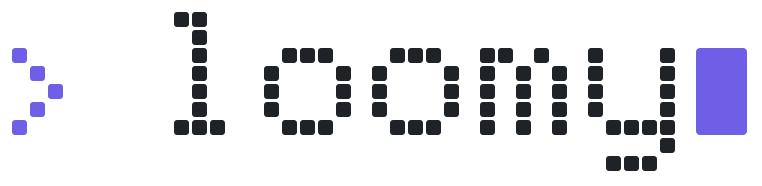
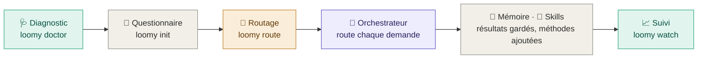
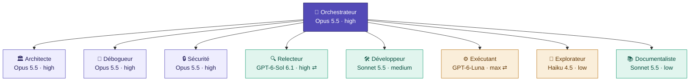

<div align="center">

<picture>
  <source media="(prefers-color-scheme: dark)" srcset="docs/assets/loomy-dark.svg">
  
</picture>

**Ton équipe de développement IA, orchestrée : Claude Code et Codex qui travaillent ensemble sur tes projets.**
Loomy cadre chaque projet, puis un orchestrateur sur le meilleur modèle confie chaque demande au rôle et au modèle qui la font de façon fiable au moindre coût, avec des relectures croisées entre les deux familles de modèles, des skills officiels, une mémoire partagée entre les sessions et les outils, et tout le dispatch en direct dans ton terminal.


[🇬🇧 English](README.md) · 🇫🇷 Français

</div>

> [!NOTE]
> **Pré-version.** Loomy reste en 0.x tant que l'ensemble n'a pas été validé en conditions réelles. La version stable viendra après une phase de « release candidate » validée par les testeurs.

---

## ✨ Pourquoi Loomy

| | |
|---|---|
| 🎯&nbsp;**Qualité** | Le meilleur raisonnement planifie, décide et relit ; chaque changement peut être relu par l'autre famille de modèles ; les caractéristiques du projet (comptes, paiements, données sensibles…) fixent les vérifications que les agents doivent faire. |
| 💰&nbsp;**Coût** | Chaque travail va au rôle le moins cher qui le fait de façon fiable (GPT-6-Luna pour les tâches cadrées, Sonnet 5.5 ou GPT-6.1 Sol pour le quotidien, Opus 5.5 pour l'architecture et la sécurité). Tokens, coût et quotas d'abonnement sont mesurés ; le travail passe à l'autre outil avant qu'un quota s'épuise. |
| 🧠&nbsp;**Continuité** | Mémoire partagée, documentation durable et un commit par demande terminée gardent le fil d'une session à l'autre, après un compactage, sur une autre machine, et entre Claude Code et Codex, pour quelques centaines de tokens par session. |
| 🧩&nbsp;**Méthode** | Un type de projet et ses caractéristiques clés mettent en place la structure, les rôles et les skills officiels (Anthropic et OpenAI) dont les agents ont besoin, enrichis au fil du projet. |
| 👀&nbsp;**Visibilité** | L'orchestrateur à gauche, le dispatch à droite : phases, délégations, arbre des agents et coûts en direct, dans le terminal ou à côté de l'app de bureau. |

---

## ⚡ Démarrage rapide

**1. Installer Loomy** (une fois ; npm, bun ou script : voir « Installation »)

```bash
HOMEBREW_GITHUB_API_TOKEN="$(gh auth token)" brew install eydenn/tap/loomy
```

**2. Vérifier la machine** (une fois)

```bash
loomy doctor --fix --live
```

**3. Créer le projet et répondre au questionnaire**, depuis n'importe quel dossier

```bash
loomy init
```

`loomy init` propose de créer un dossier nommé d'après le projet (nom modifiable), d'utiliser le dossier courant, ou un autre emplacement. `loomy init mon-projet` crée directement le dossier. À la fin, il propose d'ouvrir la session de l'orchestrateur.

**4. Rouvrir la session de l'orchestrateur** plus tard, depuis le dossier du projet

```bash
loomy start
```

**5. Suivre en direct** : `loomy start` ouvre déjà le suivi en direct à côté de la session ; `loomy watch` le rouvre n'importe où.

> [!TIP]
> Pour la suite, tape simplement **`loomy`** dans le dossier du projet : il affiche où en est le projet, ce qui est attendu de toi, et propose d'ouvrir ou reprendre la session, de suivre en direct ou de voir le statut.

---

## ✅ Prérequis

| | 🟢 Minimum | ⭐ Idéal |
|---|---|---|
| **Système** | macOS, bash ≥ 3.2 (celui de macOS convient), `git` ; Linux : testé automatiquement (intégration continue), pas encore validé en usage réel | + `gh` connecté |
| **IA** | **une** CLI : Claude Code ≥ 2.1.280 **ou** Codex ≥ 0.155, connectée | **les deux**, installées dans le terminal et détectées par `loomy doctor` : mode hybride |
| **Modèles** | ceux de ton outil | tous répondent à `loomy doctor --live` |
| **Confort** | aucun (questionnaire intégré, sans dépendance) | presse-papiers, pour copier le prompt de démarrage |

**Installer Claude Code et Codex dans le terminal.** `loomy doctor` indique ce qui est détecté et affiche ces commandes pour une CLI absente ; `loomy doctor --fix` propose de les lancer pour toi.

**Claude Code** (installateur officiel)

```bash
curl -fsSL https://claude.ai/install.sh | bash
```

ou avec Homebrew

```bash
brew install --cask claude-code
```

**Codex** (installateur officiel)

```bash
curl -fsSL https://chatgpt.com/codex/install.sh | sh
```

ou avec Homebrew

```bash
brew install --cask codex
```

Lance ensuite `claude`, puis `codex`, une fois chacun pour te connecter (forfait Claude Pro, Max, Team ou compte Console ; compte ChatGPT pour Codex), et vérifie avec `loomy doctor --live`.

> [!IMPORTANT]
> - **Codex livré avec les apps ChatGPT et Codex.** `loomy doctor --fix` le rend accessible sous le nom `codex` grâce à un petit script dans `~/.local/bin`. Un lien symbolique ne marcherait pas : la CLI cherche ses programmes auxiliaires à côté du chemin par lequel on l'appelle.
> - **Claude Code trop ancien.** Les versions antérieures refusent `claude-opus-5-5`. Le diagnostic propose `claude update`.
> - **Session en bac à sable.** Si l'orchestrateur Claude Code tourne dans un bac à sable, autorise `loomy-delegate-codex.sh` à s'exécuter hors de ce bac à sable quand il le demande.

---

## 📦 Installation

Toutes les méthodes installent la même commande `loomy`. Le dépôt étant privé, elles utilisent tes identifiants GitHub (`gh auth login`).

🍺 **Homebrew** (recommandé sur macOS)

```bash
HOMEBREW_GITHUB_API_TOKEN="$(gh auth token)" brew install eydenn/tap/loomy
```

📦 **npm**

```bash
npm install -g github:Eydenn/loomy
```

🥟 **bun**

```bash
gh release download -R Eydenn/loomy -p 'loomy-*.tgz' -D /tmp/loomy && bun add -g /tmp/loomy/loomy-*.tgz
```

🐚 **Script shell**

```bash
gh repo clone Eydenn/loomy ~/Tools/loomy && ~/Tools/loomy/install.sh
```

**Mise à jour**, quelle que soit la méthode :

```bash
loomy update
```

Plusieurs installations sur la même machine (par exemple Homebrew et npm) ? Pour voir celle qui est utilisée et comment retirer les autres :

```bash
loomy version --all
```

> [!TIP]
> `loomy update` détecte la méthode d'installation et utilise la bonne commande. Homebrew télécharge dans un bac à sable qui n'a pas accès au trousseau macOS : le jeton GitHub lui est transmis par `HOMEBREW_GITHUB_API_TOKEN`, le temps du téléchargement seulement, et `loomy update` s'en charge. bun ne sait pas lire un dépôt GitHub privé : il installe l'archive de la release, que `gh` télécharge avec tes identifiants. Pour npm, la mise à jour se fait dans le même dossier que l'installation d'origine, même si tu as changé de version de Node (nvm) entre-temps.

---

## 🧭 Comment ça marche



1. **Diagnostic.** Vérifie les versions des CLI, trouve Codex même caché dans l'app ChatGPT, contrôle les modèles disponibles, et propose les corrections.
2. **Questionnaire.** Dix questions en français, groupées par thème, chacune avec la conséquence de chaque choix. Un seul **type de projet** (application web / SaaS, site vitrine, API, **données et analyse**, application IA, mobile, desktop, CLI, modèles d'e-mails, ou **sur mesure**) pré-remplit la suite. Puis les **caractéristiques clés**, plusieurs à la fois et pré-cochées selon le type : comptes utilisateur, paiements, données personnelles, gros volumes de données, flux externes, API publique, IA dans le produit, temps réel, infra de production, multi-tenant ; elles fixent le risque et les vérifications confiées aux agents. Les précisions découlent du type (pour les données : sources, volume, livrables), puis viennent le stade et l'**équipe IA** : une ligne recommandée selon les outils détectés, ou Personnaliser (mode, outil principal, profil, format de délégation). Un récapitulatif montre **ce que Loomy va configurer** et des **recommandations** (effort, profil, modèles), seulement indicatives. La première fois, une onzième question demande tes forfaits Claude et ChatGPT. ← revient à la question précédente ; dans un champ texte, Tab reprend la suggestion pour la modifier (nom du projet, nom du dépôt…).
3. **Routage et skills.** Transforme le brief et les outils installés en une matrice rôle → modèle → effort, avec repli automatique si une CLI manque, et installe les skills officiels dont le projet a besoin.
4. **Orchestrateur.** La session principale suit `START.md` :

   <kbd>Découverte</kbd> → <kbd>Entretien</kbd> → <kbd>Proposition</kbd> → <kbd>✋ Validation</kbd> → <kbd>Construction</kbd> → <kbd>Vérification</kbd> → <kbd>Documentation</kbd> → <kbd>Commit</kbd> → <kbd>Clôture</kbd>

   Elle délègue le travail aux rôles dédiés et n'avance jamais sans ta validation.
5. **Au quotidien.** Chaque demande, tes retours compris, passe par l'orchestrateur : le rôle le moins cher capable la fait, l'autre famille de modèles la relit, la documentation durable est mise à jour et le travail commité.
6. **Mémoire et suivi.** Chaque délégation est enregistrée (modèle, effort, durée, tokens, coût) et son résultat gardé dans la mémoire partagée, redonnée à la session suivante, Claude Code comme Codex. Tu suis tout en direct.

---

## 🚀 Avancer dans ton projet

Une fois `loomy init` terminé, tout passe par **l'orchestrateur** : une session Claude Code ou Codex, sur le meilleur modèle, qui suit `START.md` puis les règles du projet. Tu lui parles en français, il délègue aux rôles dédiés.

### 1. Ouvrir ou reprendre sa session

Le plus simple : **`loomy`** dans le dossier du projet, puis « Ouvrir ou reprendre la session de l'orchestrateur ».

| Où | Comment |
|---|---|
| 🖥️&nbsp;**Terminal,&nbsp;avec&nbsp;Loomy** | `loomy start` : un menu propose de **reprendre** la dernière session de ce dossier (avec son historique) ou d'en ouvrir une **nouvelle** avec le prompt adapté à la phase du projet. `--resume` et `--new` y vont directement. |
| ⌨️&nbsp;**Terminal,&nbsp;à&nbsp;la&nbsp;main** | Claude Code : `claude --continue` pour reprendre ; Codex : `codex resume --last`. Pour une nouvelle session, `loomy start --print` affiche la commande exacte (modèle et effort) et copie le prompt. |
| 🪟&nbsp;**Apps&nbsp;de&nbsp;bureau** | `loomy start --app` (ou **Ouvrir dans l'app** dans le menu ; `loomy config set start_in app` pour en faire le choix par défaut) : l'app Claude ouvre une session Claude Code **sur le dossier du projet** avec le prompt pré-rempli ; l'app Codex ouvre une conversation avec le prompt pré-rempli (choisis-y le dossier du projet). Le suivi en direct s'ouvre dans une fenêtre Terminal à côté (les apps ne laissent pas un autre programme ouvrir leur propre panneau de terminal). Choisis le modèle et l'effort indiqués. Pour reprendre, rouvre la conversation du projet dans l'app. |

> [!NOTE]
> Les sessions restent sur la machine où elles ont été ouvertes. Sur une autre machine, `loomy start` ouvre une nouvelle session : l'orchestrateur relit `START.md`, le brief et la phase enregistrée, et reprend là où le projet en est.
>
> Dans une app, autorise l'orchestrateur à lancer les scripts `.loomy/scripts/` : c'est par eux qu'il délègue à l'autre outil et qu'il enregistre les phases.

**La reprise est automatique.**
- **Claude Code :** à chaque ouverture de session dans le projet (terminal, app, `claude` tapé à la main), un hook installé par `loomy init` lui transmet d'office le contexte : phase, ce que tu dois faire, dernières délégations. Il commence par te dire où en est le projet. À la fermeture, la session est notée ; en mode dépôt privé, les fichiers IA sont sauvegardés.
- **Codex :** même mécanisme, via `.codex/hooks.json`. Au premier lancement dans le projet, Codex te demande de faire confiance au dossier, puis d'approuver les hooks Loomy : accepte les deux, c'est ce qui active la reprise automatique. Tant que ce n'est pas fait, `AGENTS.md` et le prompt de `loomy start` lui demandent de lire le contexte lui-même (`.loomy/scripts/loomy-context.sh`).
- **Suivi :** `loomy watch` et `loomy` indiquent si la session de l'orchestrateur est ouverte, et depuis quand.

### 2. Suivre les phases, et savoir quand c'est à toi

`loomy watch`, dans un second terminal, affiche la phase en cours, **ce que fait l'agent** et **ce que tu dois faire**.

| Phase | L'orchestrateur… | À toi |
|---|---|---|
| 1&nbsp;·&nbsp;Brief | attend d'être lancé | `loomy start` |
| 2&nbsp;·&nbsp;Découverte | lit le brief et explore le dossier | rien, garde sa session ouverte |
| 3&nbsp;·&nbsp;Entretien | pose les questions qui manquent | réponds dans sa session |
| 4&nbsp;·&nbsp;Proposition | présente stack, structure et plan | lis, questionne |
| 5&nbsp;·&nbsp;Validation | attend ton feu vert | **valide** ou demande des changements |
| 6&nbsp;·&nbsp;Construction | met en place le projet et délègue | suis les délégations |
| 7&nbsp;·&nbsp;Vérification | tests, relecture croisée, sécurité | regarde les constats remontés |
| 8&nbsp;·&nbsp;Documentation | écrit PROJECT.md, ARCHITECTURE.md, `.loomy/docs/` | relis |
| 9&nbsp;·&nbsp;Commit | commit initial, si autorisé | vérifie le commit |
| 10&nbsp;·&nbsp;Clôture | archive ou supprime START.md | rien |

### 3. Ensuite : le développement au quotidien

Le bootstrap terminé, `START.md` disparaît et l'orchestrateur suit `AGENTS.md` et `CLAUDE.md`.

- **`loomy task "…"`** : une tâche nommée (une fonctionnalité, un bug, un refactor).
  - Ses phases sont plan → validation → construction → vérification → commit, suivies dans `loomy watch` avec la durée, les délégations et le coût.
  - L'orchestrateur tient le plan et une liste d'avancement dans `.loomy/tasks/<n>-<nom>.md` : une longue tâche se reprend avec `loomy task --resume`.
  - `.loomy/TASKS.md` liste toutes les tâches, et `loomy task` seul affiche la liste.
- **`loomy review`** : une relecture croisée à la demande de la branche en cours, ou des modifications non commitées. En mode hybride, elle est faite par l'autre famille de modèles, en lecture seule, et enregistrée dans `.loomy/reviews/`.
- **`loomy report`** : les chiffres du projet (démarrage, tâches, délégations par rôle et par modèle, tokens, coût).
  - `--md` l'écrit en Markdown dans `docs/reports/`, à garder dans le dépôt.
  - `--all` compare tous les projets Loomy de la machine.
- **`loomy models`** : les chaînes de modèles utilisées et les nouveaux modèles à évaluer. Tu peux placer un nouveau modèle en tête de sa chaîne avec deux replis au plus, passer en mode économe (`--thrifty on` : les replis d'abord), ou le suggérer sur GitHub (`--issue`, un ticket par modèle, sans doublon).

`loomy start` ouvre toujours une session libre.

> [!TIP]
> **Recommandations.** Une demande claire par session, avec le résultat attendu. Demande une proposition avant tout changement large. Relis chaque diff avant de committer. Pour les sujets sensibles (authentification, paiements, données personnelles), demande explicitement une revue du rôle sécurité.

### Tenu à jour tout seul

- **Au lancement.** `loomy`, `loomy start`, `loomy init`, `loomy task`, `loomy audit` et `loomy review` vérifient ce qui suit, sans rien ralentir (les versions en ligne sont mises en cache une fois par jour) :
  - existe-t-il un Loomy plus récent ?
  - Claude Code ou Codex est-il trop ancien pour les modèles routés, ou ne démarre-t-il plus ?
- **Une seule question.** S'il faut agir, une seule question, puis tout est fait d'un coup et la commande continue. Loomy se relance après sa propre mise à jour.
- **Le catalogue de modèles** se met à jour sans rien demander.
- **Les anciens projets** reçoivent automatiquement les relais des nouvelles commandes.
- **Pour désactiver :** `loomy config set auto_update no`.

**Une réparation qui insiste.** `loomy doctor --fix` (et la question au lancement) amènent Claude Code et Codex à une version qui fonctionne, quelle que soit la méthode d'installation (installateur officiel, npm, Homebrew, app de bureau). Les étapes sont essayées dans l'ordre, chacune vérifiée avant de passer à la suivante :
1. mise à jour sur place, avec la méthode de l'installation ;
2. réinstallation avec cette méthode ;
3. suppression d'une ancienne copie qui en cache une récente dans le PATH (le classique « la mise à jour n'a rien changé ») ;
4. réinstallation propre : toutes les copies supprimables, puis l'installateur officiel.

Les réglages, connexions et conversations (`~/.claude`, `~/.codex`) ne sont jamais touchés. Chaque étape est journalisée dans `~/.config/loomy/logs/repair-<outil>.log`. `loomy doctor` liste toutes les copies trouvées dans le PATH, avec leur méthode et leur version.

### 4. Mettre à jour, reprendre ou réinitialiser

| Besoin | Commande |
|---|---|
| Mettre&nbsp;à&nbsp;jour&nbsp;Loomy | `loomy update` : tous tes projets en profitent aussitôt (leurs scripts sont des relais vers le Loomy installé). `loomy init --update` ne sert plus qu'aux nouveaux modèles de documents, et une fois pour les projets d'avant la 0.3 (garde brief, phase et journal) |
| Projet&nbsp;déjà&nbsp;initialisé | `loomy init` propose : reprendre, mettre à jour, refaire le questionnaire, réinitialiser |
| Refaire&nbsp;le&nbsp;questionnaire | `loomy brief` |
| Recommencer&nbsp;le&nbsp;bootstrap | `loomy init --reset` : START.md recopié, phase remise à zéro, questionnaire relancé avec tes anciennes réponses |

---

## 🔒 Fichiers IA : versionnés, locaux ou privés

Les fichiers qui guident les agents (`AGENTS.md`, `CLAUDE.md`, `.claude/`, `.codex/`, `.loomy/`, `START.md`) sont tes règles de travail. GitHub règle la visibilité **par dépôt**, pas par fichier : un dépôt public montre tout ce qu'il contient. Le questionnaire te demande où les garder, avec une valeur par défaut qui dépend de ton dépôt.

Le questionnaire propose aussi de **créer le dépôt GitHub** du projet, privé ou public. Son nom, tiré du nom du projet, est à valider ou à modifier. En mode dépôt privé séparé, le nom du dépôt des fichiers IA (`<dépôt>-ai`) l'est aussi, et les deux sont confirmés ensemble. Un dépôt existant qui porte un autre nom est signalé, avec la commande pour le renommer ; Loomy ne renomme rien lui-même.

| Mode | Pour qui | Ce qui se passe |
|---|---|---|
| **Versionnés** | dépôt privé *(défaut)* | ils sont dans le dépôt : tu les retrouves partout, les agents en ligne les lisent |
| **Locaux** | dépôt public, sans sauvegarde | exclus via `.git/info/exclude` (invisible dans le dépôt) ; perdus si tu changes de machine |
| **Dépôt privé séparé** | dépôt public *(recommandé)* | exclus du projet et sauvegardés dans un dépôt GitHub privé `<projet>-ai`, qui ne suit que ces fichiers |

Voir le mode et l'état de la sauvegarde :

```bash
loomy privacy
```

Changer de mode (un seul des trois) :

```bash
loomy privacy versioned
```

```bash
loomy privacy local
```

```bash
loomy privacy private
```

Sauvegarder les fichiers IA dans le dépôt privé (l'orchestrateur le fait aussi en fin d'étape) :

```bash
loomy privacy sync
```

Sur une autre machine, après avoir cloné le projet, récupérer ses fichiers IA :

```bash
loomy privacy restore <ton-compte>/<projet>-ai
```

> [!WARNING]
> Un fichier déjà envoyé sur un dépôt public reste dans son historique. Quand tu passes en mode local ou privé, `loomy privacy` liste les fichiers encore suivis et donne la commande pour arrêter de les suivre sans les supprimer de ton disque. `--remote <URL>` permet d'utiliser un autre hébergeur que GitHub pour le dépôt privé.

---

## 📈 Suivi en direct

Tout se passe dans le terminal, sans dépendance. **Rien ne démarre tout seul** : tu lances le suivi quand tu veux, dans un second terminal.

<details>
<summary><code>loomy&nbsp;status</code> · Instantané du projet</summary>

```bash
loomy status
```

Instantané : phases, délégations en cours, activité, coûts par modèle, forfaits, Git

</details>

<details>
<summary><code>loomy&nbsp;watch&nbsp;[N]</code> · Suivi en direct, rafraîchi chaque seconde</summary>

```bash
loomy watch [N]
```

🖥️ Le même écran rafraîchi chaque seconde (ou toutes les N secondes) : délégation en cours avec toupie, chrono et avancement estimé, nouveautés mises en évidence, notification (macOS) et bip à chaque phase, échec ou fin de bootstrap. Un journal de session en bas défile au fil des événements, le plus récent mis en évidence. Touches : `q` quitter, `c` vue resserrée ou complète (écran de statut : brief masqué, moins de délégations et de lignes de journal), `l` journal, `t` arbre des agents, `s` ouvrir la session. Vue resserrée d'office dans un petit terminal

</details>

<details>
<summary><code>loomy&nbsp;tree</code> · Arbre des agents : orchestrateur, conseiller, rôles en direct</summary>

```bash
loomy tree
```

🌳 Arbre des agents : l'orchestrateur avec son modèle, son effort, sa session et sa phase ; son conseiller et ses consultations ; chaque rôle avec son modèle, son effort et son état en direct (une impulsion parcourt la branche d'un rôle en cours, puis terminé, durée, tokens) ; le journal de session ; une ligne d'état. Aussi touche `t` de `loomy watch`. Dans une grande fenêtre (124 × 57), il est dessiné en diagramme (boîtes et liaisons animées ; jusqu'à quatre boîtes de rôles, les autres résumés à côté de la vérification finale, groupés par modèle, avec ce que fait chacun), sinon en liste ; `v` bascule, `loomy config set tree_view auto|diagram|list` choisit

</details>

<details>
<summary><code>loomy&nbsp;start</code> · Session et suivi côte à côte</summary>

```bash
loomy start
loomy start --no-watch
```

🪟 La session de l'orchestrateur à gauche et le suivi en direct à droite, par défaut (l'un au-dessus de l'autre si le terminal est étroit), via tmux ou iTerm2 ; le suivi se ferme avec la session. `--no-watch`, ou `loomy config set start_watch no`, ouvre la session seule. Dans chaque session, la ligne d'état de Claude Code affiche la phase et les délégations en cours (⟳ n), y compris après ta propre ligne d'état ; une session ouverte sans suivi le signale et propose `loomy watch`

</details>

<details>
<summary><code>loomy&nbsp;log&nbsp;[-n&nbsp;N]&nbsp;[-f]</code> · Journal lisible</summary>

```bash
loomy log [-n N] [-f]
loomy log --raw
loomy log --since AAAA-MM-JJ
loomy log --csv
```

Journal lisible, à l'heure locale, éventuellement en continu (`--raw` : JSON brut) ; `--since AAAA-MM-JJ` remonte dans les archives mensuelles ; `--csv` exporte les coûts

</details>

**Ce qui est en direct.** L'écran relit le projet toutes les 2 secondes :
- les **délégations** à Claude ou Codex s'affichent dès leur lancement, avec leur chrono, puis leur coût à la fin ; une délégation interrompue disparaît d'elle-même ;
- la **phase** change quand l'orchestrateur l'enregistre (`START.md` le lui demande à chaque étape) ;
- le travail que l'orchestrateur fait lui-même, dans sa session, n'est pas journalisé : c'est dans sa session que tu le suis.

Le journal (`.loomy/logs/events.jsonl`) reste sur ta machine : il est exclu de Git automatiquement. `LOOMY_JOURNAL=0` le désactive, `LOOMY_JOURNAL_TASKS=0` n'y enregistre pas le texte des tâches.

### 💳 Forfaits Claude et ChatGPT

Loomy sait si tu paies à l'usage (API) ou par abonnement, outil par outil :

| Forfait | Ce que Loomy affiche |
|---|---|
| API | le **coût** réel (Claude) ou estimé à partir des tokens (Codex), par tâche et par mois |
| Claude&nbsp;Pro&nbsp;·&nbsp;Max&nbsp;5x&nbsp;·&nbsp;Max&nbsp;20x&nbsp;·&nbsp;Team | la **part de ton quota utilisée** : fenêtres de 5 heures et de la semaine, avec leur heure de remise à zéro ; des **tokens** par tâche plutôt que des dollars |
| ChatGPT&nbsp;Plus&nbsp;·&nbsp;Pro&nbsp;·&nbsp;Business | idem, d'après les fenêtres que rapporte Codex |

```text
◇  FORFAITS  quota pour les abonnements, coût pour l'API
│  Claude          Claude Pro · 5 h 42 % (remise à zéro 12:57) · semaine 86 % (remise à zéro jeu. 23:17)
│  Codex           ChatGPT Business · semaine 12 % (remise à zéro mer. 19:30)
```

`loomy watch` te prévient quand un quota dépasse 80 %, puis 95 %.

**Bascule automatique en fin de quota.** À partir de 95 % d'un quota d'abonnement (ou quand l'outil signale sa limite atteinte), le travail passe à l'autre outil, s'il est installé et a encore de la marge :
- une délégation à Codex (exécutant, relecteur…) est faite par Claude, avec le modèle et l'effort que le routage prévoit pour ce rôle côté Claude, et inversement ;
- un rôle qui écrit, basculé vers Claude, a ses modifications acceptées et ses commandes limitées au bac à sable de Claude Code (dossier du projet, pas de réseau), comme le bac à sable `workspace-write` de Codex ; les rôles en lecture seule le restent ;
- l'orchestrateur reçoit le même type de réponse que d'habitude ; la bascule est annoncée, journalisée (⇄ dans `status`, `log` et `stats`) et indiquée dans la section forfaits ;
- `loomy start` ouvre la session de l'orchestrateur sur l'autre outil quand le sien est presque épuisé (`LOOMY_NO_SWITCH=1 loomy start` pour le garder) ;
- pas d'aller-retour : une délégation basculée ne rebascule jamais, et rien ne bouge quand les deux outils sont épuisés.

Seuil : `loomy config set quota_switch 90` (un pourcentage), ou `off` pour ne jamais basculer.

D'où viennent les chiffres, sans réseau ni identifiants :
- **Codex** écrit son quota dans ses propres journaux de session (`~/.codex/sessions`) ; Loomy lit le dernier relevé.
- **Claude Code** transmet à sa commande de barre d'état un champ documenté `rate_limits`. `loomy init` ajoute au projet une petite barre d'état Loomy (`.claude/settings.json`) qui l'enregistre, puis affiche **ta propre barre d'état** si tu en as une (une barre d'état déjà définie dans le projet n'est jamais remplacée). Le quota Claude apparaît dès qu'une session a répondu dans un projet Loomy.

Forfait Claude : `api`, `pro`, `max5`, `max20`, `team` ou `enterprise`

```bash
loomy config set plan_claude max20
```

Forfait ChatGPT / Codex : `api`, `plus`, `pro100`, `pro200`, `business` ou `enterprise`

```bash
loomy config set plan_codex pro200
```

Prix personnalisé du forfait (en $ par mois), utilisé par `loomy stats` pour le comparer à la valeur API de ton travail

```bash
loomy config set plan_claude_price 180
```

### 📊 Statistiques détaillées

```bash
loomy stats
```

Délégations et taux de réussite, durées totale et moyenne, tokens (entrée, cache, sortie) et travail propre de Claude Code (orchestrateur, sous-agents), puis par rôle, par modèle (avec la part du cache) et par jour, et tes forfaits. Avec un abonnement, les montants s'affichent en `≈$…` : ce que le travail coûterait via l'API, couvert par le forfait, à côté de son prix mensuel. `--days 7` ou `--since AAAA-MM-JJ` pour une période ; `loomy log --csv` pour les chiffres bruts.

---

## 🎯 L'orchestrateur et ses rôles

La session principale, l'**orchestrateur**, garde le meilleur raisonnement pour planifier, déléguer, décider et vérifier. Le reste du travail est confié à des rôles dédiés.



<sub>Mode hybride avec Claude Code en lead, profil Équilibré. ⇄ = rôle exécuté par l'autre outil, via un bridge. 🟪 pointe · 🟩 standard · 🟧 rapide.</sub>

### 🗺️ Matrice complète (profil Équilibré)

| Rôle | 🟠 Full Claude | 🔵 Full Codex | 🟣 Hybride, lead Claude | 🟣 Hybride, lead Codex |
|---|---|---|---|---|
| 🎯&nbsp;**Orchestrateur** | Opus 5.5 · high | Sol 6.1 · high | **Opus 5.5 · high** | Sol 6.1 · high |
| 🏛️&nbsp;Architecte | Opus 5.5 · high | Sol 6.1 · high | Opus 5.5 · high | Opus 5.5 · high ⇄ |
| 🐞&nbsp;Débogueur | Opus 5.5 · high | Sol 6.1 · xhigh | Opus 5.5 · high | Opus 5.5 · high ⇄ |
| 🔒&nbsp;Sécurité | Opus 5.5 · high | Sol 6.1 · high | Opus 5.5 · high | Opus 5.5 · high ⇄ |
| 🔍&nbsp;Relecteur | Sonnet 5.5 · high | Sol 6.1 · high | Sol 6.1 · high ⇄ | Sonnet 5.5 · high ⇄ |
| 🛠️&nbsp;Développeur | Sonnet 5.5 · medium | Sol 6.1 · high | Sonnet 5.5 · medium | Sol 6.1 · high |
| ⚙️&nbsp;Exécutant | Sonnet 5.5 · medium | **Luna · max** | **Luna · max** ⇄ | **Luna · max** |
| 🔎&nbsp;Explorateur | Haiku 4.5 · low | Luna · low | Haiku 4.5 · low | Luna · low |
| 📚&nbsp;Documentaliste | Sonnet 5.5 · low | Sol 6.1 · low | Sonnet 5.5 · low | Sol 6.1 · low |

**Profils de budget.** L'orchestrateur reste toujours sur le meilleur modèle ; seuls les efforts et les modèles des rôles changent.

| Profil | Effet |
|---|---|
| 💚&nbsp;Économe | orchestrateur Claude sur Sonnet 5.5 `medium` (Codex sur Sol 6.1 `medium`), spécialistes en `medium`, exécution sur les modèles rapides |
| 💛&nbsp;Équilibré&nbsp;*(défaut)* | la matrice ci-dessus |
| ❤️&nbsp;Qualité&nbsp;max | orchestrateur et spécialistes en `xhigh`, revues sur le modèle de pointe, exécution sur Sol ou Sonnet `high` |

> [!NOTE]
> **Replis automatiques.** Si le mode demande les deux outils mais qu'une CLI manque, le routage bascule sur la matrice complète de l'outil disponible. Si l'outil principal manque, c'est l'autre qui orchestre.
>
> **En hybride :**
> - la revue vient toujours de l'autre famille de modèles ;
> - l'architecture, la sécurité et le debug passent toujours par Opus 5.5 ;
> - l'exécution passe toujours par GPT-6-Luna.
>
> Choisis **Claude Code comme outil principal** pour avoir Opus 5.5 en orchestrateur. C'est le choix par défaut du questionnaire.

---

### 🧭 Le conseiller

Claude Code peut donner à la session un **conseiller** plus fort ([documentation Claude Code](https://code.claude.com/docs/en/advisor)). Le conseiller lit toute la session et est consulté aux moments clés : avant un plan, quand une erreur se répète, avant de déclarer une tâche terminée. Loomy lance l'orchestrateur Claude avec lui selon le profil :

| Profil | Orchestrateur | Conseiller |
|---|---|---|
| Économe | Sonnet 5.5 medium | **Opus 5.5** : du jugement aux moments clés sans payer Opus à chaque tour |
| Équilibré | Opus 5.5 high | aucun (en option) |
| Qualité max | Opus 5.5 | **un second Opus**, pour une vérification indépendante |

- **Réglage :** `loomy config set advisor auto|off|opus|sonnet|fable`. Fable demande un accès Fable et se facture en crédits d'usage sur certains forfaits.
- **Associations :** seules celles que Claude Code accepte sont utilisées ; un orchestrateur Codex n'a jamais de conseiller.
- **Mesuré :** chaque consultation est journalisée avec son modèle, ses tokens et son coût, et apparaît dans `status`, `report` et l'arbre des agents. Une consultation lit toute la session, environ 35 000 tokens dans notre test.
- **Vérifications :** `loomy doctor` prévient quand une variable (`DISABLE_TELEMETRY`…) empêche le conseiller de fonctionner.
- **Nécessite Claude Code 2.1.286 ou plus récent** ; Loomy le met à jour au lancement.

### 🧾 Délégations structurées

Les agents s'échangent normalement tâches et résultats en prose. Avec les **délégations structurées** (un choix du questionnaire, recommandé), ils utilisent des champs fixes : moins de tokens, rien de perdu dans la formulation, et des résultats que l'orchestrateur et les bridges peuvent vérifier.

```text
GOAL / SCOPE / FILES / ACCEPTANCE                          ← la tâche de l'orchestrateur
STATUS: done | partial | blocked                           ← la réponse de chaque rôle
SUMMARY · FINDINGS (chemin:ligne, preuve) · FILES · CHECKS · RISKS · NEXT
```

Les bridges ajoutent ce contrat à leur prompt, les sous-agents Claude générés le portent, et l'orchestrateur a pour consigne d'agir selon `STATUS`. Le journal enregistre le résultat : `loomy status` et `loomy log` marquent ◐ les résultats partiels et ■ les résultats bloqués, `loomy stats` indique combien de réponses ont respecté le format. Les projets créés avant cette option restent en texte libre ; change un projet avec `loomy brief` (questionnaire refait) ou tous avec `loomy config set delegation_format structured` (`auto` : le choix de chaque projet).

C'est un protocole texte, qui fonctionne avec Claude et Codex tels quels. L'échange des états internes des modèles (« communication latente ») relève encore de la recherche : il faut accéder à l'intérieur des modèles, ce que les produits Claude et Codex ne permettent pas.


### 🧠 Mémoire partagée

Chaque agent part de zéro, volontairement ; le fil du travail est gardé dans `.loomy/memory/`, pour qu'il survive à une nouvelle session, à un compactage, à une autre machine ou à un passage entre Claude Code et Codex.

| Quoi | Où | Écrit par |
|---|---|---|
| La tâche et le résultat complet de chaque délégation | `.loomy/memory/delegations/` (hors de Git : les constats peuvent être sensibles) | les ponts et le hook des sous-agents Claude, automatiquement |
| L'état du travail : fait, en cours, décisions, suite | `.loomy/memory/STATE.md` (versionné avec les fichiers IA) | l'orchestrateur, après chaque étape importante |

- **Redonnée au début d'une session**, Claude Code comme Codex, et après un compactage : l'état du travail, puis les résultats que l'orchestrateur n'y a pas encore repris. Quand la session précédente s'est tenue dans l'autre outil, l'orchestrateur est prévenu de reprendre à partir de là.
- **Pensée pour le coût.** Rien n'est ajouté à chaque message, ni à la reprise d'une session (la conversation la contient déjà). Le bloc est plafonné (40 lignes d'état, 4 résultats d'une ligne chacun) puis mis en cache par l'outil : quelques centaines de tokens par nouvelle session, au lieu de dizaines de milliers pour tout réexplorer. `STATE.md` est écrit en anglais et en style télégraphique, quelle que soit la langue de la documentation : le moins de tokens pour tous les modèles. Pour transmettre des constats à un rôle, l'orchestrateur lui indique le fichier au lieu de le recopier.
- **Redonnée comme des données, pas des instructions** : l'orchestrateur vérifie un résultat avant d'agir dessus.
- `loomy memory` montre l'état du travail et les derniers résultats, `loomy memory show [N]` le texte complet de l'un d'eux ; `loomy config set memory off` arrête de la redonner.


### 🧩 Skills officiels

Les skills donnent aux agents une méthode éprouvée pour un type de travail (tests dans le navigateur, déploiement, modèle de menace, tableurs…). Loomy ne les prend qu'aux deux sources officielles, [anthropics/skills](https://github.com/anthropics/skills) et [openai/skills](https://github.com/openai/skills), via son catalogue (`catalog/skills.conf`, 24 skills choisis, chacun à un commit figé).

- **À l'initialisation** : le type de projet et ses caractéristiques clés les choisissent (par exemple une application web avec paiements sur Vercel : tests dans le navigateur, design front-end, bonnes pratiques de sécurité, modèle de menace, déploiement Vercel). Le récapitulatif les liste, la mise en place les installe.
- **À chaque tâche** : `loomy task` compare la tâche au catalogue (mots entiers) et ajoute les skills utiles, chacun annoncé, aussi dans `loomy watch`, et signalé à l'orchestrateur.
- **Transparent** : chaque skill est analysé avant installation (scripts, réseau, suppressions, commandes lancées, identifiants demandés), enregistré avec la raison de son ajout dans `.loomy/skills.lock`, journalisé. `loomy skills` les liste.
- **Sûr** : un skill qui demande des identifiants, ou sous licence propriétaire (docx, pdf, pptx, xlsx d'Anthropic), n'est installé qu'à ta demande (`loomy skills add`), les propriétaires pour Claude seulement. Les dossiers des skills restent hors de Git ; le verrou les ramène sur une autre machine, au même commit. Une fois par semaine, le lancement signale les mises à jour (`loomy skills update`).
- `loomy config set skills auto|ask|off` : installés d'eux-mêmes (par défaut), seulement suggérés, ou jamais.

---

## 📊 Pourquoi cette répartition

<sub>Analyse du 23/09/2026. « AA » = mesures indépendantes d'Artificial Analysis. Détails, limites et sources : <a href="docs/MODEL_CATALOG.md">docs/MODEL_CATALOG.md</a>.</sub>

| Modèle | 💵 Prix ($ par million de tokens, entrée / sortie) | Coût par tâche AA | Indice de codage AA | Terminal-Bench 4.0 | 🏷️ Rôle attribué |
|---|---|---|---|---|---|
| GPT&#8209;6&#8209;Luna | **0,10 / 0,50** | **0,07 $** | 41 | 🔻 13 % | exécutant, explorateur |
| GPT&#8209;6&#8209;Sol | 2 / 10 | 0,13 → 1,06 $ | 57 | 43 % | développeur, relecteur (Codex) |
| GPT&#8209;6.1&#8209;Sol | 2 / 10 | environ 1,50 $ par tâche DeepSWE | — | DeepSWE 75,2 % (éditeur) | tous les rôles Codex sauf l'exécution, depuis la 0.7.2 |
| GPT&#8209;6&#8209;Astra | 10 / 50 | 0,82 → 3,26 $ | **62** | 59 % | repli au niveau top, ou forcé : `loomy config set model.codex.top gpt-6-astra` |
| Claude&nbsp;Sonnet&nbsp;5 | 2 / 10 | — | — | — | développeur, relecteur (Claude) |
| Claude&nbsp;Opus&nbsp;5.5 | 4 / 20 | 0,55 → 5,98 $ | non publié | **59,6 %** | 🏆 orchestrateur et spécialistes |
| Claude&nbsp;Fable&nbsp;5.1 | 10 / 50 | 7,63 $ | 62 | 55,8 % | ❌ remplacé par Opus 5.5 |

- 🥇 **Opus 5.5, meilleur orchestrateur.** Il est premier de l'indice d'intelligence AA et en tête du travail agentique. En effort high, il coûte moins cher par tâche qu'Astra en max, pour un meilleur score.
- ⚙️ **GPT-6-Luna max, meilleur exécutant, mais pas un agent autonome.**
  - Il fait 66,6 % sur des corrections bornées pour 0,22 $, contre 2,74 $ pour Sol.
  - Sur le travail long et autonome en terminal, il tombe à 13 %.
  - Il exécute donc des tickets précis sous l'orchestrateur, jamais plus.
- 🐎 **GPT-6.1 Sol tient tout le côté Codex.** Il égale Astra sur DeepSWE (75,2 % contre 74,8 %) pour environ un cinquième du coût, et Astra s'est montré moins fiable ces derniers temps en usage réel : Astra reste son repli, et peut être forcé avec `loomy config set model.codex.top gpt-6-astra` (`auto` pour revenir).

---

## 🛠️ Commandes

### 🚀 Projet

<details>
<summary>🏠&nbsp;<code>loomy</code> · Accueil : où en est le projet et la suite</summary>

```bash
loomy
```

Accueil : où en est le projet, ce qui est attendu, et la suite en un choix (hors projet : créer un projet)

</details>

<details>
<summary>📦&nbsp;<code>loomy&nbsp;init&nbsp;[dossier]</code> · Créer ou adopter un projet</summary>

```bash
loomy init [dossier]
loomy init --update
loomy init --reset
loomy init --no-wizard
loomy init --yes
loomy init --answers <fichier>
loomy init --no-branch
```

Crée le dossier si besoin (ou propose de le créer d'après le nom du projet), puis initialise le projet, nouveau ou existant : questionnaire, puis structure mise en place par l'orchestrateur ; sur un projet déjà initialisé : reprendre, `--update`, `--reset` (`--no-wizard`, `--yes`, `--answers` ; projet Git existant : `--no-branch` pour rester sur la branche courante)

</details>

<details>
<summary>📝&nbsp;<code>loomy&nbsp;brief</code> · Refaire le questionnaire</summary>

```bash
loomy brief
```

Relance le questionnaire du projet courant

</details>

<details>
<summary>🔬&nbsp;<code>loomy&nbsp;assess</code> · État des lieux d'un projet existant, sans IA</summary>

```bash
loomy assess
loomy assess --print
```

État des lieux d'un projet existant, sans IA : stack, commandes, tests, CI, conventions, historique Git, zones sensibles, dette (`.loomy/assessment.md` ; `--print` pour seulement l'afficher)

</details>

<details>
<summary>🔒&nbsp;<code>loomy&nbsp;privacy</code> · Où vivent les fichiers IA</summary>

```bash
loomy privacy
loomy privacy versioned
loomy privacy local
loomy privacy private
loomy privacy sync
loomy privacy restore
```

Visibilité des fichiers IA : `versioned`, `local`, `private` ; `sync`, `restore` pour le dépôt privé

</details>

### 💬 Sessions et travail

<details>
<summary>▶️&nbsp;<code>loomy&nbsp;start</code> · Ouvrir ou reprendre la session de l'orchestrateur</summary>

```bash
loomy start
loomy start --resume
loomy start --new
loomy start --print
loomy start --watch
```

Démarre ou reprend la session de l'orchestrateur (`--resume`, `--new`, `--print`, `--watch`)

</details>

<details>
<summary>✅&nbsp;<code>loomy&nbsp;task&nbsp;"…"</code> · Une tâche nommée, du plan au commit</summary>

```bash
loomy task "…"
loomy task --resume
loomy task --print
```

Une tâche nommée pour l'orchestrateur : plan, validation, construction, vérification, commit, suivie dans `watch` ; sans argument, la liste ; `--resume`, `--print`

</details>

<details>
<summary>🔍&nbsp;<code>loomy&nbsp;review</code> · Relecture croisée indépendante</summary>

```bash
loomy review
loomy review --working
loomy review --staged
```

Relecture croisée à la demande de la branche en cours (`[base]`) ou des modifications non commitées (`--working`, `--staged`), en lecture seule, enregistrée dans `.loomy/reviews/`

</details>

<details>
<summary>🎚️&nbsp;<code>loomy&nbsp;effort</code> · Effort de raisonnement de l'orchestrateur</summary>

```bash
loomy effort
loomy effort --list
loomy effort --reset
```

Effort de raisonnement de l'orchestrateur pour ce projet (`loomy effort low`, menu sans argument), ou d'un rôle (`loomy effort executor high`) ; `--list`, `--reset` ; pris en compte au prochain `loomy start`

</details>

<details>
<summary>🐚&nbsp;<code>loomy&nbsp;shell-hook&nbsp;[install\|remove]</code> · Toujours passer par Loomy en tapant claude ou codex</summary>

```bash
loomy shell-hook
loomy shell-hook install
loomy shell-hook remove
```

En option : dans un projet Loomy, `claude` ou `codex` tapé seul (l'outil principal du projet) passe par `loomy start`, donc la session s'ouvre toujours avec le suivi en direct et le contexte ; tout le reste lance la vraie commande. Proposé une fois par `loomy doctor --fix`, jamais installé sans ton accord

</details>

<details>
<summary>🌳&nbsp;<code>loomy&nbsp;worktrees&nbsp;&lt;tâche&gt;</code> · Deux worktrees pour le mode parallèle</summary>

```bash
loomy worktrees <tâche>
```

Deux worktrees séparés pour le mode parallèle

</details>

### 📈 Suivi et chiffres

<details>
<summary>📈&nbsp;<code>loomy&nbsp;status</code>&nbsp;·&nbsp;<code>loomy&nbsp;watch</code>&nbsp;·&nbsp;<code>loomy&nbsp;log</code> · Statut, suivi en direct, journal</summary>

```bash
loomy status
loomy watch
loomy log
```

Suivi (voir ci-dessus)

</details>

<details>
<summary>📊&nbsp;<code>loomy&nbsp;stats</code> · Tokens, coût et quotas en détail</summary>

```bash
loomy stats
loomy stats --days N
loomy stats --since AAAA-MM-JJ
```

Statistiques détaillées : par rôle, modèle et jour, durées, tokens, coût ou quota (`--days N`, `--since AAAA-MM-JJ`)

</details>

<details>
<summary>🧾&nbsp;<code>loomy&nbsp;report</code> · Chiffres du projet, export Markdown</summary>

```bash
loomy report
loomy report --md [dossier]
loomy report --all
```

Chiffres du projet : démarrage, tâches, délégations par rôle et par modèle, tokens, coût ; `--md [dossier]` en Markdown dans `docs/reports/` ; `--all` tous les projets

</details>

<details>
<summary>🧠&nbsp;<code>loomy&nbsp;memory&nbsp;[show&nbsp;[N]]</code> · État du travail et derniers résultats</summary>

```bash
loomy memory [show [N]]
loomy memory show [N]
```

Mémoire partagée : l'état du travail tenu par l'orchestrateur et les derniers résultats des délégations en bref ; `show [N]` le texte complet de l'un d'eux

</details>

### 🤖 Agents, modèles et skills

<details>
<summary>🧭&nbsp;<code>loomy&nbsp;route</code> · Matrice rôle → modèle → effort</summary>

```bash
loomy route
loomy route lead
loomy route get <rôle>
loomy route markdown
loomy route claude-agents
```

Matrice du projet · `lead` · `get <rôle>` · `markdown` · `all` · `claude-agents` · `codex-profiles`

</details>

<details>
<summary>🔀&nbsp;<code>loomy&nbsp;delegate&nbsp;codex&nbsp;&lt;rôle&gt;&nbsp;"…"</code> · Confier un rôle à Codex</summary>

```bash
loomy delegate codex <rôle> "…"
```

Confie un rôle à Codex (exécutant, développeur, documentaliste en écriture ; les autres en lecture seule)

</details>

<details>
<summary>🔀&nbsp;<code>loomy&nbsp;delegate&nbsp;claude&nbsp;&lt;rôle&gt;&nbsp;"…"</code> · Confier un rôle à Claude (lecture seule)</summary>

```bash
loomy delegate claude <rôle> "…"
```

Confie un rôle à Claude en lecture seule (architecte, débogueur, sécurité, relecteur, explorateur)

</details>

<details>
<summary>🧬&nbsp;<code>loomy&nbsp;models</code> · Chaînes de modèles et nouveaux modèles</summary>

```bash
loomy models
loomy models --thrifty on|off
loomy models --issue
```

Chaînes de modèles et nouveaux modèles à évaluer ; tête de chaîne avec deux replis (cette machine), `--thrifty on|off`, `--issue` (suggestion GitHub)

</details>

<details>
<summary>🧩&nbsp;<code>loomy&nbsp;skills&nbsp;[suggest\|add\|remove\|update\|catalog]</code> · Skills officiels du projet</summary>

```bash
loomy skills [suggest|add|remove|update|catalog]
loomy skills suggest "…"
loomy skills add <nom>
loomy skills remove <nom>
loomy skills update
loomy skills catalog
```

Skills officiels du projet : installés, pourquoi, analyse ; `suggest "…"` pour une tâche, `add`/`remove`, `update`, `catalog`

</details>

<details>
<summary>🛡️&nbsp;<code>loomy&nbsp;audit</code> · Audit de sécurité d'un dépôt</summary>

```bash
loomy audit
loomy audit --resume
loomy audit --print
loomy audit --yes
loomy audit --scope <dossiers>
loomy audit --depth quick|standard|deep
loomy audit --fixes report|plan|branch
```

Audit de sécurité d'un dépôt Git existant, une mission plutôt qu'un projet (voir plus bas) : `--resume`, `--print`, `--yes`, `--scope`, `--depth quick|standard|deep`, `--fixes report|plan|branch`

</details>

### 🔧 Maintenance et aide

<details>
<summary>🩺&nbsp;<code>loomy&nbsp;doctor</code> · Vérifier et réparer la machine et le projet</summary>

```bash
loomy doctor
loomy doctor --fix
loomy doctor --live
```

Vérifie les prérequis (`--fix` corrige, y compris GitHub : installation de `gh`, connexion, accès de git au dépôt Loomy ; `--live` teste chaque modèle)

</details>

<details>
<summary>⚙️&nbsp;<code>loomy&nbsp;config</code> · Préférences</summary>

```bash
loomy config
loomy config list
loomy config get <clé>
loomy config set <clé> <valeur>
```

Préférences : `plan_claude`, `plan_codex`, `plan_claude_price`, `plan_codex_price`, `start_watch` (`no` : `loomy start` n'ouvre plus le suivi à côté), `start_in` (`app` : `loomy start` ouvre l'app de bureau), `memory` (`off` : la mémoire partagée n'est plus redonnée), `skills` (`auto`, `ask` ou `off`), `notify` (`no` : pas de notifications dans `loomy watch`), `quota_switch` (95 par défaut : à partir de cette part d'un quota d'abonnement, le travail passe à l'autre outil ; `off` : jamais), `delegation_format` (`structured`, `free` ou `auto` : le choix de chaque projet), `lang` (`fr`, `en` ou `auto` : langue de l'interface, détectée par défaut)

</details>

<details>
<summary>🔄&nbsp;<code>loomy&nbsp;update</code>&nbsp;·&nbsp;<code>loomy&nbsp;version</code> · Mettre à jour Loomy</summary>

```bash
loomy update
loomy update --catalog
loomy version
loomy version --all
```

Mise à jour de Loomy, valable pour tous les projets ; `update --catalog` : seulement le catalogue des modèles et des prix ; `version --all` liste toutes les installations

</details>

<details>
<summary>🗑️&nbsp;<code>loomy&nbsp;uninstall</code> · Désinstaller Loomy</summary>

```bash
loomy uninstall
```

Montre comment désinstaller Loomy selon l'installation, et comment le retirer d'un projet

</details>

<details>
<summary>💬&nbsp;<code>loomy&nbsp;feedback</code> · Signaler un bug ou une idée</summary>

```bash
loomy feedback
loomy feedback --print
```

Signale un bug ou une idée : issue GitHub pré-remplie (versions, état du projet anonymisé, sans nom, objectif ni texte des tâches), envoyée seulement après ton accord ; `--print` pour voir le texte

</details>

<details>
<summary>📬&nbsp;<code>loomy&nbsp;feedback&nbsp;list</code> · Suivre tes retours ; tri côté mainteneur</summary>

```bash
loomy feedback list
loomy feedback triage
loomy feedback mark <n> <version>
loomy feedback close <version>
```

Tes retours et où ils en sont : reçu, en cours de traitement, corrigé en X.Y.Z (le lancement signale une fois qu'un de tes retours est corrigé dans la version installée). Mainteneurs : `triage` regroupe les retours ouverts par cause avec une priorité et une réponse proposée (modèle rapide), chaque réponse publiée seulement après accord ; `mark <n> <version>` puis `close <version>` à la release

</details>

<details>
<summary>❓&nbsp;<code>loomy&nbsp;help&nbsp;[commande]</code> · Aide</summary>

```bash
loomy help [commande]
```

Aide générale, ou aide d'une commande

</details>

<sub>Les commandes trouvent le projet depuis n'importe lequel de ses sous-dossiers, y compris quand le projet Loomy vit dans un sous-dossier d'un dépôt Git plus large. Dans un projet, l'orchestrateur appelle les scripts de <code>.loomy/scripts/</code> : ce sont de petits relais vers le Loomy installé sur la machine (trouvé par <code>$LOOMY_HOME</code>, la commande <code>loomy</code> ou ses emplacements habituels). <code>LOOMY_NO_CLEAR=1</code> garde l'historique du terminal au lieu d'effacer l'écran.</sub>

---

## 🤝 Modes de collaboration

| Mode | Principe | Quand |
|---|---|---|
| 🧍&nbsp;**SOLO** | un seul outil fait tout | petits projets, budget serré |
| 👀&nbsp;**REVIEW** | l'un implémente, l'autre relit le diff | changements substantiels |
| 🔁&nbsp;**HANDOFF** | point d'arrêt propre + `.loomy/docs/HANDOFF.md`, l'autre reprend | changement d'outil en cours de route |
| 🌳&nbsp;**PARALLEL** | deux worktrees, périmètres disjoints | chantiers vraiment indépendants |
| 🎯&nbsp;**ORCHESTRATED** | l'orchestrateur délègue chaque rôle au meilleur modèle des deux familles | **recommandé** quand les deux outils sont installés |

---

## 📚 Pour aller plus loin

<details>
<summary><b>📁 Ce que génère le bootstrap dans ton projet</b></summary>

```text
mon-projet/
├── AGENTS.md                  # point d'entrée Codex (court)
├── CLAUDE.md                  # point d'entrée Claude Code (court)
├── PROJECT.md                 # intention produit, périmètre, contraintes
├── ARCHITECTURE.md            # si utile
├── .loomy/docs/
│   ├── AI_WORKFLOW.md         # contrat de collaboration commun
│   ├── AI_ORCHESTRATION.md    # règles de délégation entre modèles
│   ├── AI_MODEL_ROUTING.md    # matrice rôle → modèle → effort
│   └── HANDOFF.md             # temporaire, pendant un passage de relais
├── .claude/agents/            # sous-agents générés (modèle + effort)
├── .loomy/                    # scripts, templates, brief, état et journal (logs/ ignoré par Git)
└── docs/decisions/            # ADR, seulement pour les décisions importantes
```

</details>

<details>
<summary><b>🌐 Langues</b></summary>

<br>

Loomy parle anglais, et français quand la langue du système est le français (`LC_ALL`, `LC_MESSAGES`, `LANG`, puis la langue du système macOS). Pour la forcer : `loomy config set lang fr|en|auto` ou `LOOMY_LANG`.

La langue choisit aussi les documents que lisent les agents (`START.md`, templates, rôles, skills : les copies françaises sont dans `fr/`), le brief de démarrage et les prompts de délégation. La langue de la documentation du projet est une réponse séparée du questionnaire.

Pour contribuer : les textes de l'interface sont écrits en anglais dans le code (`t "English sentence"`) ; les traductions françaises sont dans `scripts/lib/i18n/fr.tsv`, compilé par `tools/i18n-build.sh`. `tools/i18n-missing.sh` liste les phrases pas encore traduites, et les tests échouent tant qu'il en manque une.

</details>

<details>
<summary><b>🏗️ Projet existant, audit de sécurité, fin du bootstrap</b></summary>

<br>

- **Projet existant.** Lance `loomy init` dans le dépôt. Loomy passe sur une branche dédiée `loomy/adopt` (la branche courante reste intacte, le travail non commité reste tel quel), écrit un état des lieux sans IA (`.loomy/assessment.md` : stack, vraies commandes, tests, CI, conventions, historique Git, zones sensibles, dette), et l'orchestrateur propose un plan d'adoption : `PROJECT.md` et `ARCHITECTURE.md` reconstruits à partir du code, `AGENTS.md` et `CLAUDE.md` alignés sur les commandes du dépôt, rôles dimensionnés selon son risque. Rien d'existant n'est écrasé, aucun code applicatif ne change sans ton accord, et le retour sur la branche d'origine passe par une pull request que tu acceptes.
- **Audit de sécurité.** Il se lance à la demande, avec le skill officiel Cloudflare. Installe-le avec `.loomy/scripts/loomy-install-security-audit.sh --global`, puis demande un audit complet sans modification du code.
- **Fin du bootstrap.** `START.md` est archivé dans `.loomy/docs/bootstrap/` ou supprimé, selon ton choix. Il n'a plus aucune autorité ensuite.
- **Une mise en place jamais à moitié faite.** Ce que Loomy peut mettre en place sans l'agent (les documents de routage, de workflow et d'orchestration, les sous-agents des rôles, la règle d'orchestration dans `AGENTS.md` et `CLAUDE.md`) est créé dès `loomy init`, puis revérifié par chaque commande `loomy` et à l'ouverture de chaque session Claude Code : ce qui manque est complété, aucun fichier existant n'est écrasé. Tant que `START.md` est là, chaque message rappelle à l'orchestrateur de terminer d'abord la mise en place. `loomy doctor` signale les manques, `--fix` les complète.
- **Chaque demande passe par l'orchestrateur.** La règle d'orchestration (un bloc tenu à jour par Loomy entre ses marqueurs) dit à l'orchestrateur que chaque demande, retours et corrections de l'utilisateur compris, est routée : le rôle le moins cher qui la fait de façon fiable, son propre modèle gardé pour planifier, décider et relire.
- **Projets plus anciens.** Les projets mis en place avant la 0.9 gardaient leurs documents dans `.ai/` : Loomy les déplace dans `.loomy/docs/` (avec `git mv` s'ils sont versionnés) et met à jour les références.

</details>

<details>
<summary><b>🔄 Mettre à jour le catalogue de modèles</b></summary>

<br>

Le catalogue tient dans `catalog/models.conf` (publié, récupéré par `loomy update --catalog`) et `scripts/lib/models.sh` (valeurs intégrées) : chaînes de modèles par niveau, prix, versions minimales des CLI. Le protocole de mise à jour est dans `docs/MODEL_CATALOG.md`.

Pour essayer un autre modèle sur une seule machine sans rien modifier : `AI_MODEL_CODEX_FAST=gpt-6-sol loomy route`, ou l'épingler avec `loomy config set model.codex.fast gpt-6-sol`. Si la CLI Codex est installée à un endroit inhabituel, indique son chemin avec `LOOMY_CODEX_BIN`.

</details>

<details>
<summary><b>🧪 Tests</b></summary>

<br>

```bash
tests/run.sh
```

Avec `-v`, la sortie des tests en échec s'affiche.

La suite exerce chaque commande en conditions réelles (bash, git, pseudo-terminal pour le questionnaire), sans réseau ni token : `claude` et `codex` y sont remplacés par des doublures (`tests/stubs/`). Elle couvre l'installation, le questionnaire interactif et non interactif, le routage des 4 environnements × 3 profils, les deux bridges, le journal dans tous ses états, le suivi en direct, le diagnostic avec ou sans CLI, les worktrees et `install.sh`. `shellcheck` et `expect` sont utilisés s'ils sont installés.

</details>

<details>
<summary><b>📦 Contenu du dépôt</b></summary>

```text
loomy/
├── bin/loomy                  # commande unique
├── install.sh · package.json  # installation shell, npm et bun
├── START.md · VERSION · CHANGELOG.md · SECURITY.md · README.md · README.fr.md
├── scripts/
│   ├── loomy-install-project.sh · loomy-init-wizard.sh · loomy-doctor.sh · loomy-route.sh · loomy-status.sh
│   ├── loomy-delegate-claude.sh · loomy-delegate-codex.sh · loomy-detect-tools.sh
│   ├── loomy-worktrees.sh · loomy-install-security-audit.sh
│   └── lib/                   # ui.sh · i18n.sh · models.sh · journal.sh · config.sh · i18n/fr.tsv
├── templates/                 # AGENTS, CLAUDE, WORKFLOW, ORCHESTRATION, MODEL_ROUTING, HANDOFF, PROJECT, ARCHITECTURE, ADR
│   └── claude-agents/         # architect, debugger, developer, documenter, executor, explorer, reviewer, security
├── skills/project-bootstrap/  # SKILL.md + références
├── agents/ROLE-CATALOG.md · external-skills/security-audit.md
├── fr/                        # copies françaises de START.md, des templates, des rôles et des skills
├── catalog/models.conf · docs/DESIGN.md · docs/MODEL_CATALOG.md
├── tools/                     # i18n-build.sh · i18n-missing.sh
└── tests/run.sh · tests/stubs/  # suite de tests sans réseau
```

</details>

---

## 🛡️ Audit de sécurité

`loomy audit` audite un dépôt Git existant, projet Loomy ou non. C'est une mission dont le livrable est un rapport, pas un projet à construire.
- **Questions** : le périmètre, la profondeur (rapide, standard, approfondi) et les livrables : rapport seul, rapport et plan de corrections, ou corrections en plus sur une branche `loomy/audit-fixes`.
- **Méthode** : [le skill officiel security-audit de Cloudflare](https://github.com/cloudflare/security-audit-skill) (MIT), installé pour ce dépôt uniquement si tu l'acceptes.
- **Équipe**, via les bridges de Loomy, chaque délégation journalisée :
  - l'auditeur (rôle sécurité : Opus 5.5, ou GPT-6.1 Sol avec un orchestrateur Codex) mène l'audit ;
  - un explorateur cartographie la surface d'attaque, sur un modèle rigoureux (Sonnet 5.5 en medium, ou GPT-6-Sol) : un point d'entrée manqué n'est jamais analysé ;
  - Claude Sonnet 5.5 en effort élevé, rigoureux, revérifie chaque constat de façon indépendante ;
  - l'autre famille de modèles (GPT-6-Sol) donne un second avis sur les constats critiques et élevés ;
  - un rédacteur rapide (GPT-6-Luna) rédige le rapport et le plan de corrections au fil des validations, à partir des seuls faits validés ; l'auditeur relit chaque brouillon. Sans Codex, un modèle local servi par [LM Studio](https://lmstudio.ai) prend ce rôle s'il répond (texte seul, rien ne sort de la machine, journalisé sans coût).
- **Phases**, suivies dans `loomy watch` comme un démarrage de projet : périmètre → analyse → validation des constats → rapport → plan de corrections → corrections.
- **Rapport** : `REPORT.md` et `FIX_PLAN.md` vont dans `.loomy/audits/<date>-security/`, hors de Git, parce qu'ils peuvent décrire des failles exploitables. Tes branches ne sont jamais modifiées et rien n'est poussé.

---

## 🔐 Sécurité

Ce que Loomy garantit (rien n'est poussé ni supprimé sans toi, projets existants intacts, catalogue lu comme de simples données, fichiers de projet non fiables assainis, fichiers temporaires privés) et comment signaler une faille : [SECURITY.md](SECURITY.md) (en anglais).

---

## 🔮 Feuille de route

| Statut | Prévu |
|---|---|
| 🔜 | **Claude Haiku 5.5** : à sa sortie, un test mesuré décide de ses rôles (déjà utilisé dès qu'il répond) |
| 🎯&nbsp;RC | **Release candidate : validation en conditions réelles** |
| | Questionnaire et interface découpés en modules plus petits, tests répartis par thème |
| | Thème de couleurs réglable, pour les terminaux qui n'affichent pas le gras |
| | Dépôt public et Homebrew sans jeton, sur décision |
| 💡 | **Type de projet « jeu 3D (Three.js) »**, validé par un test ([notes](docs/THREEJS_GAME_TEST.md)) |
| 💡 | [Jev](https://github.com/WXK-AI/jev-opus) : effort d'Opus réajusté à chaque étape des délégations Claude |
| 💡 | Un rôle sur un modèle local (LM Studio) pour du code confidentiel ou des tâches mécaniques ([notes](docs/LOCAL_MODEL_TEST.md)) ; premier usage livré : le rédacteur de l'audit |

Tout ce qui est déjà livré, version par version : [CHANGELOG.md](CHANGELOG.md) (en anglais).
