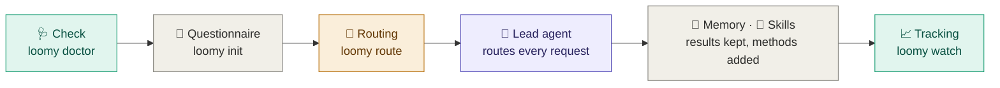
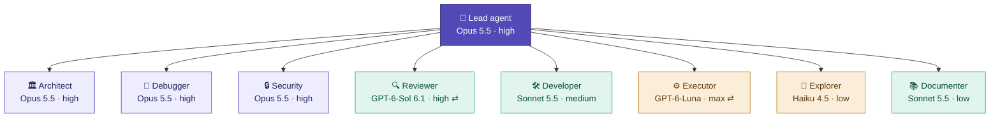

<div align="center">

<picture>
  <source media="(prefers-color-scheme: dark)" srcset="docs/assets/loomy-dark.svg">
  
</picture>

**Your AI development team, orchestrated: Claude Code and Codex working together on your projects.**
Loomy frames each project, then a lead agent on the best model routes every request to the role and the model that do it reliably for the least cost, with cross reviews between the two model families, official skills, a memory shared across sessions and tools, and the whole dispatch live in your terminal.


🇬🇧 English · [🇫🇷 Français](README.fr.md)

</div>

> [!NOTE]
> **Pre-release.** Loomy stays at 0.x until the whole flow has been validated in real conditions. The stable release comes after a release-candidate phase validated by testers.

---

## ✨ Why Loomy

| | |
|---|---|
| 🎯&nbsp;**Quality** | The best reasoning plans, decides and reviews; every change can be cross-reviewed by the other model family; the project's characteristics (accounts, payments, sensitive data…) set the checks the agents must do. |
| 💰&nbsp;**Cost** | Each piece of work goes to the cheapest role that does it reliably (GPT-6-Luna for bounded tasks, Sonnet 5.5 or GPT-6.1 Sol for everyday work, Opus 5.5 for architecture and security). Tokens, cost and subscription quotas are measured; work moves to the other tool before a quota runs out. |
| 🧠&nbsp;**Continuity** | Shared memory, durable documentation and one commit per finished request keep the thread across sessions, compactions, machines, and between Claude Code and Codex, for a few hundred tokens per session. |
| 🧩&nbsp;**Method** | A project type and its key characteristics set up the structure, the roles and the official skills (Anthropic and OpenAI) the agents need, added as the project evolves. |
| 👀&nbsp;**Visibility** | The lead agent on the left, the dispatch on the right: phases, delegations, agent tree and costs live, in the terminal or beside the desktop app. |

---

## ⚡ Quick start

**1. Install Loomy** (once; npm, bun or script: see "Installation")

```bash
HOMEBREW_GITHUB_API_TOKEN="$(gh auth token)" brew install eydenn/tap/loomy
```

**2. Check your machine** (once)

```bash
loomy doctor --fix --live
```

**3. Create the project and answer the questionnaire**, from any folder

```bash
loomy init
```

`loomy init` offers to create a folder named after the project (name editable), to use the current folder, or another location. `loomy init my-project` creates the folder directly. At the end, it offers to open the lead agent session.

**4. Reopen the lead agent session** later, from the project folder

```bash
loomy start
```

**5. Follow live**: `loomy start` already opens live tracking beside the session; `loomy watch` reopens it anywhere.

> [!TIP]
> From then on, just type **`loomy`** in the project folder: it shows where the project stands, what is expected from you, and offers to open or resume the session, follow live, or see the status.

---

## ✅ Prerequisites

| | 🟢 Minimum | ⭐ Ideal |
|---|---|---|
| **System** | macOS, bash ≥ 3.2 (the macOS one works), `git`; Linux: tested automatically (CI), not yet validated in real use | + `gh` logged in |
| **AI** | **one** CLI: Claude Code ≥ 2.1.280 **or** Codex ≥ 0.155, logged in | **both**, installed in the terminal and detected by `loomy doctor`: hybrid mode |
| **Models** | those of your tool | all answer `loomy doctor --live` |
| **Comfort** | none (built-in questionnaire, no dependency) | clipboard, to copy the start prompt |

**Install Claude Code and Codex in the terminal.** `loomy doctor` shows what it detects and prints these commands for a missing CLI; `loomy doctor --fix` offers to run them for you.

**Claude Code** (official installer)

```bash
curl -fsSL https://claude.ai/install.sh | bash
```

or with Homebrew

```bash
brew install --cask claude-code
```

**Codex** (official installer)

```bash
curl -fsSL https://chatgpt.com/codex/install.sh | sh
```

or with Homebrew

```bash
brew install --cask codex
```

Then run `claude`, then `codex`, once each to log in (Claude Pro, Max, Team plan or Console account; ChatGPT account for Codex), and check with `loomy doctor --live`.

> [!IMPORTANT]
> - **Codex shipped with the ChatGPT and Codex apps.** `loomy doctor --fix` makes it available as `codex` through a small script in `~/.local/bin`. A symbolic link would not work: the CLI looks for its helper programs next to the path it was called through.
> - **Claude Code too old.** Earlier versions refuse `claude-opus-5-5`. The diagnosis offers `claude update`.
> - **Sandboxed session.** If the Claude Code lead agent runs in a sandbox, allow `loomy-delegate-codex.sh` to run outside that sandbox when it asks.

---

## 📦 Installation

Every method installs the same `loomy` command. The repository is private, so they all use your GitHub credentials (`gh auth login`).

🍺 **Homebrew** (recommended on macOS)

```bash
HOMEBREW_GITHUB_API_TOKEN="$(gh auth token)" brew install eydenn/tap/loomy
```

📦 **npm**

```bash
npm install -g github:Eydenn/loomy
```

🥟 **bun**

```bash
gh release download -R Eydenn/loomy -p 'loomy-*.tgz' -D /tmp/loomy && bun add -g /tmp/loomy/loomy-*.tgz
```

🐚 **Shell script**

```bash
gh repo clone Eydenn/loomy ~/Tools/loomy && ~/Tools/loomy/install.sh
```

**Update**, whatever the method:

```bash
loomy update
```

Several installs on the same machine (for example Homebrew and npm)? To see which one is used and how to remove the others:

```bash
loomy version --all
```

> [!TIP]
> `loomy update` detects how Loomy was installed and runs the right command. Homebrew downloads inside a sandbox that cannot reach the macOS keychain, so the GitHub token is passed through `HOMEBREW_GITHUB_API_TOKEN` for the download only; `loomy update` does this for you. bun cannot read a private GitHub repository, so it installs the release archive, which `gh` downloads with your credentials. For npm, the update goes into the same folder as the original install, even if you switched Node versions (nvm) since.

---

## 🧭 How it works



1. **Check.** Verifies CLI versions, finds Codex even when it is bundled inside the ChatGPT app, checks model availability, and offers fixes.
2. **Questionnaire.** Ten questions grouped by theme, each showing the consequence of every option. One **project type** (web app / SaaS, showcase site, API, **data & analysis**, AI app, mobile, desktop, CLI, email templates, or **custom**) pre-fills the rest. Then the **key characteristics**, several at once and pre-checked by type: user accounts, payments, personal data, large data volumes, external feeds, public API, AI in the product, real time, production infra, multi-tenant; they set the risk and the checks given to the agents. The details follow from the type (for data: sources, volume, deliverables), then the stage and the **AI team**: one recommended line from the tools detected, or Customise (mode, lead tool, profile, delegation format). A recap shows **what Loomy will configure** and **recommendations** (effort, profile, models) that are indicative only. The first time, an eleventh question asks for your Claude and ChatGPT subscriptions. ← goes back to the previous question; in a text field, Tab turns the suggestion into editable text (project name, repository name…).
3. **Routing and skills.** Turns the brief and the installed tools into a role → model → effort matrix, with automatic fallback when a CLI is missing, and installs the official skills the project needs.
4. **Lead agent.** The main session follows `START.md`:

   <kbd>Discover</kbd> → <kbd>Interview</kbd> → <kbd>Propose</kbd> → <kbd>✋ Approve</kbd> → <kbd>Build</kbd> → <kbd>Verify</kbd> → <kbd>Document</kbd> → <kbd>Commit</kbd> → <kbd>Retire</kbd>

   It delegates the work to dedicated roles and never moves on without your approval.
5. **Day to day.** Every request, your feedback included, goes through the lead agent: the cheapest capable role does it, the other model family reviews it, the durable documentation is updated and the work committed.
6. **Memory and tracking.** Every delegation is recorded (model, effort, duration, tokens, cost) and its result kept in the shared memory, given back at the next session, Claude Code or Codex. You follow it all live.

---

## 🚀 Moving your project forward

Once `loomy init` is done, everything goes through the **lead agent**: a Claude Code or Codex session on the best model, which follows `START.md` and then the project rules. It delegates to the dedicated roles.

### 1. Open or resume its session

The simplest: **`loomy`** in the project folder, then "Open or resume the lead agent session".

| Where | How |
|---|---|
| 🖥️&nbsp;**Terminal,&nbsp;with&nbsp;Loomy** | `loomy start`: a menu to **resume** this folder's last session (with its history) or open a **new** one with the prompt that fits the project phase. `--resume` and `--new` go straight there. |
| ⌨️&nbsp;**Terminal,&nbsp;by&nbsp;hand** | Claude Code: `claude --continue` to resume; Codex: `codex resume --last`. For a new session, `loomy start --print` shows the exact command (model and effort) and copies the prompt. |
| 🪟&nbsp;**Desktop&nbsp;apps** | `loomy start --app` (or **Open in the app** in the menu; `loomy config set start_in app` to make it the default): the Claude app opens a Claude Code session **on the project folder** with the prompt filled in; the Codex app opens a conversation with the prompt filled in (choose the project folder in it). Live tracking opens in a Terminal window next to it (the apps don't let another program open their own terminal panel). Pick the model and effort shown. To resume, reopen the project conversation in the app. |

> [!NOTE]
> Sessions stay on the machine where they were opened. On another machine, `loomy start` opens a new session: the lead agent rereads `START.md`, the brief and the recorded phase, and picks up where the project is.
>
> In an app, allow the lead agent to run the `.loomy/scripts/` scripts: that is how it delegates to the other tool and records phases.

**Resuming is automatic.**
- **Claude Code:** every time a session opens in the project (terminal, app, `claude` typed by hand), a hook installed by `loomy init` hands it the context: phase, what you need to do, latest delegations. It starts by telling you where the project stands. When the session closes, it is noted; in private repository mode, the AI files are backed up.
- **Codex:** the same mechanism, through `.codex/hooks.json`. The first time it runs in the project, Codex asks you to trust the folder, then to approve the Loomy hooks: accept both, that is what turns on automatic resuming. Until then, `AGENTS.md` and the `loomy start` prompt ask it to read the context itself (`.loomy/scripts/loomy-context.sh`).
- **Tracking:** `loomy watch` and `loomy` show whether the lead agent session is open, and since when.

### 2. Follow the phases, and know when it is your turn

`loomy watch`, in a second terminal, shows the current phase, **what the agent is doing** and **what you need to do**.

| Phase | The lead agent… | Your turn |
|---|---|---|
| 1&nbsp;·&nbsp;Brief | waits to be started | `loomy start` |
| 2&nbsp;·&nbsp;Discovery | reads the brief and explores the folder | nothing, keep its session open |
| 3&nbsp;·&nbsp;Interview | asks the missing questions | answer in its session |
| 4&nbsp;·&nbsp;Proposal | presents stack, structure and plan | read, question |
| 5&nbsp;·&nbsp;Approval | waits for your go-ahead | **approve** or ask for changes |
| 6&nbsp;·&nbsp;Build | sets up the project and delegates | follow the delegations |
| 7&nbsp;·&nbsp;Verification | tests, cross review, security | look at the findings |
| 8&nbsp;·&nbsp;Documentation | writes PROJECT.md, ARCHITECTURE.md, `.loomy/docs/` | reread |
| 9&nbsp;·&nbsp;Commit | initial commit, if allowed | check the commit |
| 10&nbsp;·&nbsp;Wrap-up | archives or deletes START.md | nothing |

### 3. Then: day-to-day development

After the bootstrap, `START.md` is gone and the lead agent follows `AGENTS.md` and `CLAUDE.md`.

- **`loomy task "…"`**: a named task (a feature, a bug, a refactor).
  - Its phases are plan → approval → build → verification → commit, followed in `loomy watch` with duration, delegations and cost.
  - The lead agent keeps the plan and a progress checklist in `.loomy/tasks/<n>-<name>.md`, so a long task can be resumed with `loomy task --resume`.
  - `.loomy/TASKS.md` lists every task, and `loomy task` alone shows the list.
- **`loomy review`**: an on-demand cross review of the current branch, or of the uncommitted changes. In hybrid mode it is done by the other model family, read-only, and saved in `.loomy/reviews/`.
- **`loomy report`**: the project's figures (bootstrap, tasks, delegations by role and model, tokens, cost).
  - `--md` writes it as Markdown in `docs/reports/`, to keep in the repository.
  - `--all` compares every Loomy project on the machine.
- **`loomy models`**: the model chains in use and the new models to evaluate. You can put a new model at the head of its chain with up to two fallbacks, switch to low-cost mode (`--thrifty on`: the fallbacks first), or suggest it on GitHub (`--issue`, one issue per model, no duplicates).

`loomy start` still opens a free session.

> [!TIP]
> **Recommendations.** One clear request per session, with the expected result. Ask for a proposal before any large change. Review each diff before committing. On sensitive topics (authentication, payments, personal data), explicitly ask for a review by the security role.

### Kept up to date by itself

- **At launch.** `loomy`, `loomy start`, `loomy init`, `loomy task`, `loomy audit` and `loomy review` check the following, without slowing anything down (remote versions are cached once a day):
  - is there a newer Loomy?
  - is Claude Code or Codex too old for the routed models, or does it not start?
- **One question.** If something is needed, one question, then everything is done in one go and the command goes on. Loomy restarts itself after updating.
- **The model catalog** is updated silently.
- **Older projects** get the relays of new commands automatically.
- **Turning it off:** `loomy config set auto_update no`.

**Repair that insists.** `loomy doctor --fix` (and the question at launch) bring Claude Code and Codex to a working version, whatever the install method (official installer, npm, Homebrew, desktop app). Steps are tried in order, each one checked before going on:
1. update in place, with the install's own method;
2. reinstall with that method;
3. removal of an older copy that hides a recent one in the PATH (the classic "the update changed nothing");
4. clean reinstall: every removable copy, then the official installer.

Settings, logins and conversations (`~/.claude`, `~/.codex`) are never touched. Each step is logged in `~/.config/loomy/logs/repair-<tool>.log`. `loomy doctor` lists every copy found in the PATH, with its method and version.

### 4. Update, resume or reset

| Need | Command |
|---|---|
| Update&nbsp;Loomy | `loomy update`: every project benefits right away (its scripts are relays to the installed Loomy); `loomy init --update` is only for new document templates, and once for pre-0.3 projects (keeps brief, phase and journal) |
| Project&nbsp;already&nbsp;initialized | `loomy init` offers: resume, update, redo the questionnaire, reset |
| Redo&nbsp;the&nbsp;questionnaire | `loomy brief` |
| Restart&nbsp;the&nbsp;bootstrap | `loomy init --reset`: START.md copied again, phase reset, questionnaire rerun with your previous answers |

---

## 🔒 AI files: versioned, local or private

The files that guide the agents (`AGENTS.md`, `CLAUDE.md`, `.claude/`, `.codex/`, `.loomy/`, `START.md`) are your working rules. GitHub sets visibility **per repository**, not per file: a public repository shows everything in it. The questionnaire asks where to keep them, with a default based on your repository.

The questionnaire also offers to **create the project's GitHub repository**, private or public, with a name taken from the project name that you confirm or edit. In separate private repository mode, the AI files repository name (`<repo>-ai`) is confirmed too, both together. An existing repository with a different name is flagged, with the rename command; Loomy never renames anything itself.

| Mode | For | What happens |
|---|---|---|
| **Versioned** | private repository *(default)* | they live in the repository: available everywhere, read by online agents |
| **Local** | public repository, no backup | excluded through `.git/info/exclude` (invisible in the repository); lost if you change machines |
| **Separate private repository** | public repository *(recommended)* | excluded from the project and backed up in a private GitHub repository `<project>-ai` that tracks only these files |

See the mode and the backup state:

```bash
loomy privacy
```

Switch mode (one of the three):

```bash
loomy privacy versioned
```

```bash
loomy privacy local
```

```bash
loomy privacy private
```

Back up the AI files to the private repository (the lead agent also does it at the end of each step):

```bash
loomy privacy sync
```

On another machine, after cloning the project, get its AI files back:

```bash
loomy privacy restore <your-account>/<project>-ai
```

> [!WARNING]
> A file already pushed to a public repository stays in its history. When you switch to local or private, `loomy privacy` lists the files still tracked and gives the command to stop tracking them without deleting them from your disk. `--remote <URL>` lets you use another host than GitHub for the private repository.

---

## 📈 Live tracking

Everything happens in the terminal, with no dependency. **Nothing starts on its own**: you start tracking when you want, in a second terminal.

<details>
<summary><code>loomy&nbsp;status</code> · Snapshot of the project</summary>

```bash
loomy status
```

Snapshot: phases, running delegations, activity, cost per model, subscriptions, Git

</details>

<details>
<summary><code>loomy&nbsp;watch&nbsp;[N]</code> · Live tracking, refreshed every second</summary>

```bash
loomy watch [N]
```

🖥️ The same screen refreshed every second (or every N seconds): running delegation with spinner, timer and estimated progress, highlighted changes, notification (macOS) and bell on each phase, failure or end of bootstrap. A session log at the bottom scrolls as events arrive, the newest highlighted. Keys: `q` quit, `c` compact or full view (status screen: brief hidden, fewer delegations and log lines), `l` journal, `t` agent tree, `s` open the session. Compact view in a small terminal

</details>

<details>
<summary><code>loomy&nbsp;tree</code> · Agent tree: lead agent, advisor, roles live</summary>

```bash
loomy tree
```

🌳 Agent tree: the lead agent with its model, effort, session and phase; its advisor and its consultations; every role with its model, effort and live state (a pulse travels along the branch of a running role, then done, duration, tokens); the session log; a status line. Also key `t` of `loomy watch`. In a large window (124 × 57) it is drawn as a diagram (boxes and animated links; up to four role boxes, the other roles summed up beside the final check, grouped by model, with what each one does), otherwise as a list; `v` switches, `loomy config set tree_view auto|diagram|list` chooses

</details>

<details>
<summary><code>loomy&nbsp;start</code> · Session and tracking side by side</summary>

```bash
loomy start
loomy start --no-watch
```

🪟 The lead agent session on the left and live tracking on the right, by default (stacked in a narrow terminal), through tmux or iTerm2; tracking closes with the session. `--no-watch`, or `loomy config set start_watch no`, opens the session alone. In every session, Claude Code's status line shows the phase and the delegations running (⟳ n), also after your own status line; a session opened without tracking is told to mention `loomy watch`

</details>

<details>
<summary><code>loomy&nbsp;log&nbsp;[-n&nbsp;N]&nbsp;[-f]</code> · Readable log</summary>

```bash
loomy log [-n N] [-f]
loomy log --raw
loomy log --since YYYY-MM-DD
loomy log --csv
```

Readable journal in local time, optionally streamed (`--raw`: raw JSON); `--since YYYY-MM-DD` reaches into monthly archives; `--csv` exports costs

</details>

**What is live.** The screen rereads the project every 2 seconds:
- **delegations** to Claude or Codex appear as soon as they start, with their timer, then their cost at the end; an interrupted one disappears on its own;
- the **phase** changes when the lead agent records it (`START.md` asks it to at each step);
- work the lead agent does itself, in its session, is not journaled: you follow it in its session.

The journal (`.loomy/logs/events.jsonl`) stays on your machine and is excluded from Git automatically. `LOOMY_JOURNAL=0` disables it, `LOOMY_JOURNAL_TASKS=0` leaves task text out of it.

### 💳 Claude and ChatGPT subscriptions

Loomy knows whether you pay per use (API) or by subscription, tool by tool:

| Plan | What Loomy shows |
|---|---|
| API | the real **cost** (Claude) or an estimate from tokens (Codex), per task and per month |
| Claude&nbsp;Pro&nbsp;·&nbsp;Max&nbsp;5x&nbsp;·&nbsp;Max&nbsp;20x&nbsp;·&nbsp;Team | the **share of your quota in use**: 5-hour and weekly windows, with their reset time; **tokens** per task instead of dollars |
| ChatGPT&nbsp;Plus&nbsp;·&nbsp;Pro&nbsp;·&nbsp;Business | the same, from the windows Codex reports |

```text
◇  PLANS  quota for subscriptions, cost for the API
│  Claude          Claude Pro · 5 h 42 % (resets 12:57) · week 86 % (resets Thu 23:17)
│  Codex           ChatGPT Business · week 12 % (resets Wed 19:30)
```

`loomy watch` notifies you when a quota crosses 80 %, then 95 %.

**Automatic switch near the end of a quota.** From 95 % of a subscription quota (or when the tool reports its limit reached), the work moves to the other tool, if it is installed and has room left:
- a delegation to Codex (executor, reviewer…) is run by Claude, on the model and effort the routing gives that role on the Claude side, and vice versa;
- a role that writes, moved to Claude, gets accepted edits and shell commands only inside Claude Code's sandbox (the project folder, no network), like Codex's `workspace-write` sandbox; read-only roles stay read-only;
- the lead agent receives the same kind of answer as usual; the switch is announced, logged (⇄ in `status`, `log` and `stats`) and shown in the plans section;
- `loomy start` opens the lead agent session on the other tool when its own is nearly exhausted (`LOOMY_NO_SWITCH=1 loomy start` to keep it);
- no ping-pong: a switched delegation never switches back, and nothing moves when both tools are exhausted.

Threshold: `loomy config set quota_switch 90` (a percentage), or `off` to never switch.

Where the figures come from, without network or credentials:
- **Codex** writes its quota into its own session logs (`~/.codex/sessions`); Loomy reads the latest reading.
- **Claude Code** gives its status line command a documented `rate_limits` field. `loomy init` adds a small Loomy status line to the project (`.claude/settings.json`) that saves it, then shows **your own status line** if you have one (an existing project status line is never replaced). The Claude quota appears once a session has answered in a Loomy project.

Claude plan: `api`, `pro`, `max5`, `max20`, `team` or `enterprise`

```bash
loomy config set plan_claude max20
```

ChatGPT / Codex plan: `api`, `plus`, `pro100`, `pro200`, `business` or `enterprise`

```bash
loomy config set plan_codex pro200
```

Custom plan price ($ per month), used by `loomy stats` to compare with the API value of your work

```bash
loomy config set plan_claude_price 180
```

### 📊 Detailed statistics

```bash
loomy stats
```

Delegations and success rate, total and average durations, tokens (in, from cache, out), and Claude Code's own work (lead agent, sub-agents), then by role, by model (with the cache share) and by day, and your plans. With a subscription, amounts show as `≈$…`: what the work would cost through the API, covered by the plan, next to its monthly price. `--days 7` or `--since YYYY-MM-DD` for a period; `loomy log --csv` for the raw figures.

---

## 🎯 The lead agent and its roles

The main session, the **lead agent**, keeps the best reasoning to plan, delegate, decide and verify. The rest of the work goes to dedicated roles.



<sub>Hybrid mode with Claude Code as the lead, Balanced profile. ⇄ = role run by the other tool, through a bridge. 🟪 top · 🟩 standard · 🟧 fast.</sub>

### 🗺️ Full matrix (Balanced profile)

| Role | 🟠 Full Claude | 🔵 Full Codex | 🟣 Hybrid, Claude lead | 🟣 Hybrid, Codex lead |
|---|---|---|---|---|
| 🎯&nbsp;**Lead&nbsp;agent** | Opus 5.5 · high | Sol 6.1 · high | **Opus 5.5 · high** | Sol 6.1 · high |
| 🏛️&nbsp;Architect | Opus 5.5 · high | Sol 6.1 · high | Opus 5.5 · high | Opus 5.5 · high ⇄ |
| 🐞&nbsp;Debugger | Opus 5.5 · high | Sol 6.1 · xhigh | Opus 5.5 · high | Opus 5.5 · high ⇄ |
| 🔒&nbsp;Security | Opus 5.5 · high | Sol 6.1 · high | Opus 5.5 · high | Opus 5.5 · high ⇄ |
| 🔍&nbsp;Reviewer | Sonnet 5.5 · high | Sol 6.1 · high | Sol 6.1 · high ⇄ | Sonnet 5.5 · high ⇄ |
| 🛠️&nbsp;Developer | Sonnet 5.5 · medium | Sol 6.1 · high | Sonnet 5.5 · medium | Sol 6.1 · high |
| ⚙️&nbsp;Executor | Sonnet 5.5 · medium | **Luna · max** | **Luna · max** ⇄ | **Luna · max** |
| 🔎&nbsp;Explorer | Haiku 4.5 · low | Luna · low | Haiku 4.5 · low | Luna · low |
| 📚&nbsp;Documenter | Sonnet 5.5 · low | Sol 6.1 · low | Sonnet 5.5 · low | Sol 6.1 · low |

**Budget profiles.** The lead agent always stays on the top model; only role efforts and models change.

| Profile | Effect |
|---|---|
| 💚&nbsp;Thrifty | Claude lead on Sonnet 5.5 `medium` (Codex lead on Sol 6.1 `medium`), specialists at `medium`, execution on fast models |
| 💛&nbsp;Balanced&nbsp;*(default)* | the matrix above |
| ❤️&nbsp;Max&nbsp;quality | lead agent and specialists at `xhigh`, reviews on the top model, execution on Sol or Sonnet `high` |

> [!NOTE]
> **Automatic fallbacks.** If the mode asks for both tools and one CLI is missing, routing falls back to the full matrix of the available tool. If the lead tool is missing, the other one leads.
>
> **In hybrid mode:**
> - the review always comes from the other model family;
> - architecture, security and debugging always go through Opus 5.5;
> - execution always goes through GPT-6-Luna.
>
> Choose **Claude Code as the lead tool** to have Opus 5.5 as the lead agent. It is the questionnaire's default.

---

### 🧭 The advisor

Claude Code can give the session a stronger **advisor** ([Claude Code docs](https://code.claude.com/docs/en/advisor)). The advisor reads the whole session and is consulted at key moments: before a plan, when an error repeats, before declaring a task done. Loomy starts the Claude lead agent with it according to the profile:

| Profile | Lead agent | Advisor |
|---|---|---|
| Thrifty | Sonnet 5.5 medium | **Opus 5.5**: judgment at the key moments without paying Opus at every turn |
| Balanced | Opus 5.5 high | none (optional) |
| Max quality | Opus 5.5 | **a second Opus**, for an independent check |

- **Setting:** `loomy config set advisor auto|off|opus|sonnet|fable`. Fable needs Fable access and bills to usage credits on some plans.
- **Pairings:** only the ones Claude Code accepts are used; a Codex lead never gets an advisor.
- **Measured:** each consultation is logged with its model, tokens and cost, and shows in `status`, `report` and the agent tree. A consultation reads the whole session, about 35k tokens in our test.
- **Checks:** `loomy doctor` warns when a variable (`DISABLE_TELEMETRY`…) keeps the advisor off.
- **Requires Claude Code 2.1.286 or later**; Loomy brings it up to date at launch.

### 🧾 Structured delegations

Agents normally exchange tasks and results in prose. With **structured delegations** (a questionnaire choice, recommended), they use fixed fields instead: fewer tokens, nothing lost in the wording, and results the lead agent and the bridges can check.

```text
GOAL / SCOPE / FILES / ACCEPTANCE                          ← the lead agent's task
STATUS: done | partial | blocked                           ← every role's answer
SUMMARY · FINDINGS (path:line, evidence) · FILES · CHECKS · RISKS · NEXT
```

The bridges add this contract to their prompt, generated Claude subagents carry it, and the lead agent is told to act on `STATUS`. The log records the outcome: `loomy status` and `loomy log` mark ◐ partial and ■ blocked results, `loomy stats` shows how many answers followed the format. Projects set up before this option keep free text; switch any project with `loomy brief` (questionnaire again) or for all of them with `loomy config set delegation_format structured` (`auto`: each project's choice).

This is a text protocol that works with Claude and Codex as they are. Exchanging internal model states ("latent communication") is still research: it needs access to the models' internals, which the Claude and Codex products don't offer.


### 🧠 Shared memory

Each agent starts from zero by design; the thread of the work is kept in `.loomy/memory/`, so that it survives a new session, a compaction, another machine, or a switch between Claude Code and Codex.

| What | Where | Written by |
|---|---|---|
| The task and the full result of every delegation | `.loomy/memory/delegations/` (kept out of Git: findings can be sensitive) | the bridges and the Claude subagents' hook, automatically |
| The work state: done, in progress, decisions, next | `.loomy/memory/STATE.md` (versioned with the AI files) | the lead agent, after each important step |

- **Given back at the start of a session**, Claude Code or Codex, and after a compaction: the work state, then the results the lead agent hasn't taken into it yet. When the previous session ran in the other tool, the lead agent is told to pick up from there.
- **Built for cost.** Nothing is added at each message, nor when a session is resumed (the conversation already holds it). The block is capped (40 lines of state, 4 results in one line each) and cached by the tool afterwards: a few hundred tokens per new session, instead of tens of thousands to explore again. `STATE.md` is written in English and in telegraphic style, whatever the documentation language: the fewest tokens for every model. To hand findings to a role, the lead agent points it to the file instead of copying it.
- **Given back as data, not instructions**: the lead agent checks a result before acting on it.
- `loomy memory` shows the work state and the latest results, `loomy memory show [N]` the full text of one; `loomy config set memory off` stops giving it back.


### 🧩 Official skills

Skills give the agents a proven method for a kind of work (browser tests, deployment, threat modelling, spreadsheets…). Loomy only takes them from the two official sources, [anthropics/skills](https://github.com/anthropics/skills) and [openai/skills](https://github.com/openai/skills), through its catalog (`catalog/skills.conf`, 24 selected skills, each at a pinned commit).

- **At init**: the project type and its key characteristics choose them (for example a web app with payments on Vercel: browser tests, front-end design, security best practices, threat model, Vercel deployment). The recap lists them, the setup installs them.
- **At each task**: `loomy task` compares the task with the catalog (whole words) and adds the skills that help, each one announced, in `loomy watch` too, and given to the lead agent.
- **Transparent**: every skill is analysed before installation (scripts, network, deletions, commands run, credentials asked), recorded with why it was added in `.loomy/skills.lock`, logged. `loomy skills` lists them.
- **Safe**: a skill that asks for credentials, or under a proprietary licence (Anthropic's docx, pdf, pptx, xlsx), is only installed when you ask (`loomy skills add`), the proprietary ones for Claude only. Skill folders stay out of Git; the lock brings them back on another machine, at the same commit. Once a week, the launch says when updates exist (`loomy skills update`).
- `loomy config set skills auto|ask|off`: installed on their own (default), only suggested, or never.

---

## 📊 Why this split

<sub>Analysis of 2026-09-23. "AA" = independent measurements by Artificial Analysis. Details, caveats and sources: <a href="docs/MODEL_CATALOG.md">docs/MODEL_CATALOG.md</a>.</sub>

| Model | 💵 Price ($ per million tokens, in / out) | Cost per AA task | AA Coding Agent Index | Terminal-Bench 4.0 | 🏷️ Role |
|---|---|---|---|---|---|
| GPT&#8209;6&#8209;Luna | **0.10 / 0.50** | **$0.07** | 41 | 🔻 13 % | executor, explorer |
| GPT&#8209;6.1&#8209;Sol | 2 / 10 | about $1.50 per DeepSWE task | — | DeepSWE 75.2 % (vendor) | every Codex role except execution, from 0.7.2 |
| GPT&#8209;6&#8209;Sol | 2 / 10 | $0.13 → $1.06 | 57 | 43 % | fallback for GPT-6.1 Sol |
| GPT&#8209;6&#8209;Astra | 10 / 50 | $0.82 → $3.26 | **62** | 59 % | fallback at the top tier, or forced: `loomy config set model.codex.top gpt-6-astra` |
| Claude&nbsp;Sonnet&nbsp;5.5 | 2 / 10 | $0.41 → $7.60 | — | 70.6 % (vendor) | developer, reviewer (Claude), Thrifty lead agent |
| Claude&nbsp;Opus&nbsp;5.5 | 4 / 20 | $0.55 → $5.98 | not published | **59.6 %** | 🏆 lead agent and specialists |
| Claude&nbsp;Fable&nbsp;5.1 | 10 / 50 | $7.63 | 62 | 55.8 % | ❌ superseded by Opus 5.5 |

- 🥇 **Opus 5.5 is the best lead agent.** It ranks first on the AA Intelligence Index and leads agentic work. At high effort it costs less per task than Astra at max, for a better score.
- ⚙️ **GPT-6-Luna max is the best-value executor, not an autonomous agent.**
  - It scores 66.6 % on bounded fixes for $0.22, against $2.74 for Sol.
  - On long autonomous terminal work it drops to 13 %.
  - So it executes precise tickets under the lead agent, nothing more.
- 🐎 **GPT-6.1 Sol runs the Codex side.** It matches Astra on DeepSWE (75.2 % against 74.8 %) for about a fifth of the cost, and Astra was found less reliable lately in real use: Astra stays as its fallback, and can be forced with `loomy config set model.codex.top gpt-6-astra` (`auto` to go back).

---

## 🛠️ Commands

### 🚀 Project

<details>
<summary>🏠&nbsp;<code>loomy</code> · Home: where the project stands and the next step</summary>

```bash
loomy
```

Home: where the project stands, what is expected, and the next step in one choice (outside a project: create one)

</details>

<details>
<summary>📦&nbsp;<code>loomy&nbsp;init&nbsp;[dir]</code> · Create or adopt a project</summary>

```bash
loomy init [dir]
loomy init --update
loomy init --reset
loomy init --no-wizard
loomy init --yes
loomy init --answers <file>
loomy init --no-branch
```

Creates the folder if needed (or offers to create it from the project name), then initializes the project, new or existing: questionnaire, then structure set up by the lead agent; on an initialized project: resume, `--update`, `--reset` (`--no-wizard`, `--yes`, `--answers`; existing Git project: `--no-branch` to stay on the current branch)

</details>

<details>
<summary>📝&nbsp;<code>loomy&nbsp;brief</code> · Redo the questionnaire</summary>

```bash
loomy brief
```

Reruns the questionnaire for the current project

</details>

<details>
<summary>🔬&nbsp;<code>loomy&nbsp;assess</code> · Assess an existing project, without AI</summary>

```bash
loomy assess
loomy assess --print
```

Assessment of an existing project, without AI: stack, commands, tests, CI, conventions, Git history, sensitive areas, debt (`.loomy/assessment.md`; `--print` to only show it)

</details>

<details>
<summary>🔒&nbsp;<code>loomy&nbsp;privacy</code> · Where the AI files live</summary>

```bash
loomy privacy
loomy privacy versioned
loomy privacy local
loomy privacy private
loomy privacy sync
loomy privacy restore
```

AI files visibility: `versioned`, `local`, `private`; `sync`, `restore` for the private repository

</details>

### 💬 Sessions and work

<details>
<summary>▶️&nbsp;<code>loomy&nbsp;start</code> · Open or resume the lead agent session</summary>

```bash
loomy start
loomy start --resume
loomy start --new
loomy start --print
loomy start --watch
```

Starts or resumes the lead agent session (`--resume`, `--new`, `--print`, `--watch`)

</details>

<details>
<summary>✅&nbsp;<code>loomy&nbsp;task&nbsp;"…"</code> · A named task, from plan to commit</summary>

```bash
loomy task "…"
loomy task --resume
loomy task --print
```

A named task for the lead agent: plan, approval, build, verification, commit, followed in `watch`; without argument, the list; `--resume`, `--print`

</details>

<details>
<summary>🔍&nbsp;<code>loomy&nbsp;review</code> · Independent cross review</summary>

```bash
loomy review
loomy review --working
loomy review --staged
```

On-demand cross review of the current branch (`[base]`) or of uncommitted changes (`--working`, `--staged`), read-only, saved in `.loomy/reviews/`

</details>

<details>
<summary>🎚️&nbsp;<code>loomy&nbsp;effort</code> · Reasoning effort of the lead agent</summary>

```bash
loomy effort
loomy effort --list
loomy effort --reset
```

Reasoning effort of the lead agent for this project (`loomy effort low`, menu without argument), or of a role (`loomy effort executor high`); `--list`, `--reset`; applied at the next `loomy start`

</details>

<details>
<summary>🐚&nbsp;<code>loomy&nbsp;shell-hook&nbsp;[install\|remove]</code> · Always go through Loomy when typing claude or codex</summary>

```bash
loomy shell-hook
loomy shell-hook install
loomy shell-hook remove
```

Optional: in a Loomy project, `claude` or `codex` typed alone (the project's lead tool) goes through `loomy start`, so the session always opens with live tracking and the context; anything else runs the real command. Offered once by `loomy doctor --fix`, never installed silently

</details>

<details>
<summary>🌳&nbsp;<code>loomy&nbsp;worktrees&nbsp;&lt;task&gt;</code> · Two worktrees for parallel mode</summary>

```bash
loomy worktrees <task>
```

Two separate worktrees for parallel mode

</details>

### 📈 Tracking and figures

<details>
<summary>📈&nbsp;<code>loomy&nbsp;status</code>&nbsp;·&nbsp;<code>loomy&nbsp;watch</code>&nbsp;·&nbsp;<code>loomy&nbsp;log</code> · Status, live tracking, log</summary>

```bash
loomy status
loomy watch
loomy log
```

Tracking (see above)

</details>

<details>
<summary>📊&nbsp;<code>loomy&nbsp;stats</code> · Tokens, cost and quotas in detail</summary>

```bash
loomy stats
loomy stats --days N
loomy stats --since YYYY-MM-DD
```

Detailed statistics: by role, model and day, durations, tokens, cost or quota (`--days N`, `--since YYYY-MM-DD`)

</details>

<details>
<summary>🧾&nbsp;<code>loomy&nbsp;report</code> · Project figures, Markdown export</summary>

```bash
loomy report
loomy report --md [dir]
loomy report --all
```

Project figures: bootstrap, tasks, delegations by role and model, tokens, cost; `--md [dir]` Markdown in `docs/reports/`; `--all` every project

</details>

<details>
<summary>🧠&nbsp;<code>loomy&nbsp;memory&nbsp;[show&nbsp;[N]]</code> · Work state and latest results</summary>

```bash
loomy memory [show [N]]
loomy memory show [N]
```

Shared memory: the work state kept by the lead agent and the latest delegation results in short; `show [N]` the full text of one

</details>

### 🤖 Agents, models and skills

<details>
<summary>🧭&nbsp;<code>loomy&nbsp;route</code> · Role → model → effort matrix</summary>

```bash
loomy route
loomy route lead
loomy route get <role>
loomy route markdown
loomy route claude-agents
```

Role → model → effort matrix · `lead` · `get <role>` · `markdown` · `all` · `claude-agents` · `codex-profiles`

</details>

<details>
<summary>🔀&nbsp;<code>loomy&nbsp;delegate&nbsp;codex&nbsp;&lt;role&gt;&nbsp;"…"</code> · Hand a role to Codex</summary>

```bash
loomy delegate codex <role> "…"
```

Hands a role to Codex (executor, developer, documenter can write; the others are read-only)

</details>

<details>
<summary>🔀&nbsp;<code>loomy&nbsp;delegate&nbsp;claude&nbsp;&lt;role&gt;&nbsp;"…"</code> · Hand a role to Claude (read-only)</summary>

```bash
loomy delegate claude <role> "…"
```

Hands a role to Claude, read-only (architect, debugger, security, reviewer, explorer)

</details>

<details>
<summary>🧬&nbsp;<code>loomy&nbsp;models</code> · Model chains and new models</summary>

```bash
loomy models
loomy models --thrifty on|off
loomy models --issue
```

Model chains and new models to evaluate; head of a chain with two fallbacks (this machine), `--thrifty on|off`, `--issue` (GitHub suggestion)

</details>

<details>
<summary>🧩&nbsp;<code>loomy&nbsp;skills&nbsp;[suggest\|add\|remove\|update\|catalog]</code> · Official skills of the project</summary>

```bash
loomy skills [suggest|add|remove|update|catalog]
loomy skills suggest "…"
loomy skills add <name>
loomy skills remove <name>
loomy skills update
loomy skills catalog
```

Official agent skills of the project: installed, why, analysis; `suggest "…"` for a task, `add`/`remove`, `update`, `catalog`

</details>

<details>
<summary>🛡️&nbsp;<code>loomy&nbsp;audit</code> · Security audit of a repository</summary>

```bash
loomy audit
loomy audit --resume
loomy audit --print
loomy audit --yes
loomy audit --scope <folders>
loomy audit --depth quick|standard|deep
loomy audit --fixes report|plan|branch
```

Security audit of an existing Git repository, a mission rather than a project (see below): `--resume`, `--print`, `--yes`, `--scope`, `--depth quick|standard|deep`, `--fixes report|plan|branch`

</details>

### 🔧 Maintenance and help

<details>
<summary>🩺&nbsp;<code>loomy&nbsp;doctor</code> · Check and repair the machine and the project</summary>

```bash
loomy doctor
loomy doctor --fix
loomy doctor --live
```

Checks prerequisites (`--fix` fixes, GitHub included: installs `gh`, logs in, checks git access to the Loomy repository; `--live` tests every model)

</details>

<details>
<summary>⚙️&nbsp;<code>loomy&nbsp;config</code> · Preferences</summary>

```bash
loomy config
loomy config list
loomy config get <key>
loomy config set <key> <value>
```

Preferences (`list`, `get`, `set`): `plan_claude`, `plan_codex`, `plan_claude_price`, `plan_codex_price`, `start_watch` (`no`: `loomy start` no longer opens tracking alongside), `start_in` (`app`: `loomy start` opens the desktop app), `memory` (`off`: the shared memory is no longer given back), `skills` (`auto`, `ask` or `off`), `notify` (`no`: no notifications in `loomy watch`), `quota_switch` (95 by default: from this share of a subscription quota, work moves to the other tool; `off`: never), `delegation_format` (`structured`, `free` or `auto`: each project's choice), `lang` (`fr`, `en` or `auto`: interface language, detected by default)

</details>

<details>
<summary>🔄&nbsp;<code>loomy&nbsp;update</code>&nbsp;·&nbsp;<code>loomy&nbsp;version</code> · Update Loomy</summary>

```bash
loomy update
loomy update --catalog
loomy version
loomy version --all
```

Updates Loomy, for every project at once; `update --catalog`: only the model and price catalog; `version --all` lists every install

</details>

<details>
<summary>🗑️&nbsp;<code>loomy&nbsp;uninstall</code> · Uninstall Loomy</summary>

```bash
loomy uninstall
```

Shows how to uninstall Loomy for your install method, and how to remove it from a project

</details>

<details>
<summary>💬&nbsp;<code>loomy&nbsp;feedback</code> · Report a bug or an idea</summary>

```bash
loomy feedback
loomy feedback --print
```

Reports a bug or an idea: prefilled GitHub issue (versions, anonymized project state, no name, goal or task text), sent only after your approval; `--print` shows the text

</details>

<details>
<summary>📬&nbsp;<code>loomy&nbsp;feedback&nbsp;list</code> · Follow your feedback; maintainer triage</summary>

```bash
loomy feedback list
loomy feedback triage
loomy feedback mark <n> <version>
loomy feedback close <version>
```

Your feedback and where it stands: received, being handled, fixed in X.Y.Z (the launch says once when one of yours is fixed in the installed version). Maintainers: `triage` groups the open feedback by cause with a priority and a proposed reply (fast model), each reply posted only after approval; `mark <n> <version>` then `close <version>` at release

</details>

<details>
<summary>❓&nbsp;<code>loomy&nbsp;help&nbsp;[command]</code> · Help</summary>

```bash
loomy help [command]
```

General help, or help for one command

</details>

<sub>Commands find the project from any of its subfolders, including when the Loomy project lives in a subfolder of a larger Git repository. In a project, the lead agent calls the scripts in <code>.loomy/scripts/</code>: small relays to the Loomy installed on the machine (found through <code>$LOOMY_HOME</code>, the <code>loomy</code> command or its usual locations). <code>LOOMY_NO_CLEAR=1</code> keeps the terminal history instead of clearing the screen.</sub>

---

## 🤝 Collaboration modes

| Mode | Principle | When |
|---|---|---|
| 🧍&nbsp;**SOLO** | a single tool does everything | small projects, tight budget |
| 👀&nbsp;**REVIEW** | one implements, the other reviews the diff | substantial changes |
| 🔁&nbsp;**HANDOFF** | clean checkpoint + `.loomy/docs/HANDOFF.md`, the other takes over | switching tools midway |
| 🌳&nbsp;**PARALLEL** | two worktrees, disjoint scopes | truly independent work |
| 🎯&nbsp;**ORCHESTRATED** | the lead agent delegates each role to the best model of both families | **recommended** when both tools are installed |

---

## 📚 Going further

<details>
<summary><b>📁 What the bootstrap generates in your project</b></summary>

```text
my-project/
├── AGENTS.md                  # Codex entry point (short)
├── CLAUDE.md                  # Claude Code entry point (short)
├── PROJECT.md                 # product intent, scope, constraints
├── ARCHITECTURE.md            # when useful
├── .loomy/docs/
│   ├── AI_WORKFLOW.md         # shared collaboration contract
│   ├── AI_ORCHESTRATION.md    # cross-model delegation rules
│   ├── AI_MODEL_ROUTING.md    # role → model → effort matrix
│   └── HANDOFF.md             # temporary, during a handoff
├── .claude/agents/            # generated subagents (model + effort)
├── .loomy/                    # relays, templates, brief, state and log (logs/ ignored by Git)
└── docs/decisions/            # ADRs, only for important decisions
```

</details>

<details>
<summary><b>🌐 Languages</b></summary>

<br>

Loomy speaks English, and French when your system language is French (`LC_ALL`, `LC_MESSAGES`, `LANG`, then the macOS system language). Force it with `loomy config set lang fr|en|auto` or `LOOMY_LANG`.

The language also picks the documents the agents read (`START.md`, templates, roles, skills: French copies live in `fr/`), the startup brief and the delegation prompts. The project documentation language is a separate questionnaire answer.

For contributors: interface strings are written in English in the code (`t "English sentence"`); the French translations live in `scripts/lib/i18n/fr.tsv`, compiled by `tools/i18n-build.sh`. `tools/i18n-missing.sh` lists the sentences not translated yet, and the tests fail while any is missing.

</details>

<details>
<summary><b>🏗️ Existing project, security audit, end of the bootstrap</b></summary>

<br>

- **Existing project.** Run `loomy init` in the repository. Loomy switches to a dedicated `loomy/adopt` branch (the current one stays untouched, uncommitted work stays as it is), writes an assessment without AI (`.loomy/assessment.md`: stack, real commands, tests, CI, conventions, Git history, sensitive areas, debt), and the lead agent proposes an adoption plan: `PROJECT.md` and `ARCHITECTURE.md` rebuilt from the code, `AGENTS.md` and `CLAUDE.md` aligned with the repository's commands, roles sized to its risk. Nothing existing is overwritten, no application code changes without your approval, and merging back goes through a pull request you accept.
- **Security audit.** It runs on demand, with the official Cloudflare skill. Install it with `.loomy/scripts/loomy-install-security-audit.sh --global`, then ask for a full audit without code changes.
- **End of the bootstrap.** `START.md` is archived in `.loomy/docs/bootstrap/` or deleted, as you chose. It has no authority afterwards.
- **A setup never stays half done.** What Loomy can set up without the agent (the routing, workflow and orchestration documents, the role subagents, the orchestration rule in `AGENTS.md` and `CLAUDE.md`) is created at `loomy init`, then checked again by every `loomy` command and at the start of every Claude Code session: whatever is missing is completed, existing files are never overwritten. While `START.md` is still there, every message reminds the lead agent to finish the setup first. `loomy doctor` reports the gaps, `--fix` completes them.
- **Every request goes through the lead agent.** The orchestration rule (a block kept up to date by Loomy between its markers) tells the lead agent that every request, the user's feedback and fixes included, is routed: the cheapest role that does it reliably, its own model kept for planning, decisions and review.
- **Older projects.** Projects set up before 0.9 kept their documents in `.ai/`: Loomy moves them to `.loomy/docs/` (with `git mv` when they are versioned) and updates the references.

</details>

<details>
<summary><b>🔄 Updating the model catalog</b></summary>

<br>

The catalog lives in `catalog/models.conf` (published, fetched by `loomy update --catalog`) and `scripts/lib/models.sh` (built-in values): model chains per tier, prices, minimum CLI versions. The update protocol is in `docs/MODEL_CATALOG.md`.

To try another model on a single machine without changing anything: `AI_MODEL_CODEX_FAST=gpt-6-sol loomy route`, or pin it with `loomy config set model.codex.fast gpt-6-sol`. If the Codex CLI is installed somewhere unusual, give its path with `LOOMY_CODEX_BIN`.

</details>

<details>
<summary><b>🧪 Tests</b></summary>

<br>

```bash
tests/run.sh
```

With `-v`, the output of failing tests is shown.

The suite exercises every command in real conditions (bash, git, a pseudo-terminal for the questionnaire), with no network and no tokens: `claude` and `codex` are replaced by stand-ins (`tests/stubs/`). It covers installation, the interactive and non-interactive questionnaire, routing for the 4 environments × 3 profiles, both bridges, the journal in every state, live tracking, the diagnosis with or without CLIs, worktrees and `install.sh`. `shellcheck` and `expect` are used when installed.

</details>

<details>
<summary><b>📦 Repository content</b></summary>

```text
loomy/
├── bin/loomy                  # single command
├── install.sh · package.json  # shell, npm and bun install
├── START.md · VERSION · CHANGELOG.md · SECURITY.md · README.md · README.fr.md
├── scripts/
│   ├── loomy-install-project.sh · loomy-init-wizard.sh · loomy-doctor.sh · loomy-route.sh · loomy-status.sh
│   ├── loomy-delegate-claude.sh · loomy-delegate-codex.sh · loomy-detect-tools.sh
│   ├── loomy-worktrees.sh · loomy-install-security-audit.sh
│   └── lib/                   # ui.sh · i18n.sh · models.sh · journal.sh · config.sh · i18n/fr.tsv
├── templates/                 # AGENTS, CLAUDE, WORKFLOW, ORCHESTRATION, MODEL_ROUTING, HANDOFF, PROJECT, ARCHITECTURE, ADR
│   └── claude-agents/         # architect, debugger, developer, documenter, executor, explorer, reviewer, security
├── skills/project-bootstrap/  # SKILL.md + references
├── agents/ROLE-CATALOG.md · external-skills/security-audit.md
├── fr/                        # French copies of START.md, templates, agents and skills
├── catalog/models.conf · docs/DESIGN.md · docs/MODEL_CATALOG.md
├── tools/                     # i18n-build.sh · i18n-missing.sh
└── tests/run.sh · tests/stubs/  # test suite without network
```

</details>

---

## 🛡️ Security audit

`loomy audit` audits an existing Git repository, Loomy project or not. It is a mission with a report as its deliverable, not a project to build.
- **Questions**: scope, depth (quick, standard, deep), and deliverables: report only, report and fix plan, or fixes as well on a `loomy/audit-fixes` branch.
- **Method**: [Cloudflare's official security-audit skill](https://github.com/cloudflare/security-audit-skill) (MIT), installed for this repository only when you agree.
- **Team**, through Loomy's bridges, every delegation logged:
  - the auditor (security role: Opus 5.5, or GPT-6.1 Sol with a Codex lead) leads;
  - an explorer maps the attack surface, on a rigorous model (Sonnet 5.5 medium, or GPT-6-Sol): a missed entry point is never analysed;
  - Claude Sonnet 5.5 at high effort, rigorous, re-checks every finding independently;
  - the other model family (GPT-6-Sol) gives a second opinion on Critical and High findings;
  - a fast writer (GPT-6-Luna) drafts the report and the fix plan as findings get validated, from validated facts only; the auditor reviews every draft. Without Codex, a local model served by [LM Studio](https://lmstudio.ai) takes this role when one answers (text only, nothing leaves the machine, logged at no cost).
- **Phases**, followed in `loomy watch` like a bootstrap: scope → analysis → validation of findings → report → fix plan → fixes.
- **Report**: `REPORT.md` and `FIX_PLAN.md` go to `.loomy/audits/<date>-security/`, kept out of Git, because they can describe exploitable weaknesses. Your branches are never touched and nothing is pushed.

---

## 🔐 Security

What Loomy guarantees (your project never pushed or deleted without you, existing projects untouched, catalog read as data, untrusted project files sanitised, private temporary files) and how to report a vulnerability: [SECURITY.md](SECURITY.md).

---

## 🔮 Roadmap

| Status | Planned |
|---|---|
| 🔜 | **Claude Haiku 5.5**: once released, a measured test decides its roles (already used as soon as it answers) |
| 🎯&nbsp;RC | **Release candidate: validation in real conditions** |
| | Questionnaire and UI split into smaller modules, tests grouped by topic |
| | Configurable colour theme, for terminals that don't render bold |
| | Public repository and token-free Homebrew, when decided |
| 💡 | **3D game project type (Three.js)**, validated by a test ([notes](docs/THREEJS_GAME_TEST.md)) |
| 💡 | [Jev](https://github.com/WXK-AI/jev-opus): Opus effort readjusted at each step of Claude delegations |
| 💡 | A role on a local model (LM Studio) for confidential code or mechanical tasks ([notes](docs/LOCAL_MODEL_TEST.md)); first use shipped: the audit writer |

Everything already shipped, version by version: [CHANGELOG.md](CHANGELOG.md).
