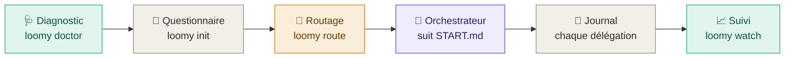
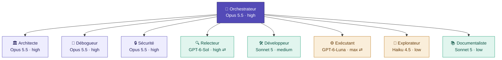

<div align="center">

# 🧶 Loomy

**Tisse Codex et Claude Code en une seule équipe de développement.**
Un orchestrateur sur le meilleur modèle, des rôles dédiés sur le modèle juste nécessaire, et un suivi en direct dans le terminal.


🇫🇷 Français · [🇬🇧 English](README.en.md)

</div>

> [!NOTE]
> **Pré-version.** Loomy reste en 0.x tant que l'ensemble n'a pas été validé en conditions réelles. La 1.0.0 viendra après cette validation.

---

## ⚡ Démarrage rapide

```bash
HOMEBREW_GITHUB_API_TOKEN="$(gh auth token)" brew install eydenn/tap/loomy   # ou npm / bun / install.sh
loomy doctor --fix --live            # une fois : vérifie la machine

mkdir mon-projet && cd mon-projet
loomy init                           # questionnaire interactif
```

Le questionnaire se termine en affichant :
1. la **commande de lancement de l'orchestrateur**, par exemple `claude --model claude-opus-5-5 --effort high` ;
2. le **prompt de démarrage**, déjà copié dans le presse-papiers ;
3. la **commande de suivi** à lancer dans un autre terminal : `loomy watch`.

---

## 📦 Installation

Toutes les méthodes installent la même commande `loomy`. Le dépôt étant privé, elles utilisent tes identifiants GitHub (`gh auth login`).

| Méthode | Installer | Mettre à jour |
|---|---|---|
| 🍺 **Homebrew** | `HOMEBREW_GITHUB_API_TOKEN="$(gh auth token)" brew install eydenn/tap/loomy` | `loomy update` |
| 📦 **npm** | `npm install -g github:Eydenn/loomy` | `loomy update` |
| 🥟 **bun** | `gh release download -R Eydenn/loomy -p 'loomy-*.tgz' -D /tmp/loomy && bun add -g /tmp/loomy/loomy-*.tgz` | `loomy update` |
| 🐚 **Script shell** | `gh repo clone Eydenn/loomy ~/Tools/loomy && ~/Tools/loomy/install.sh` | `loomy update` |

> [!TIP]
> `loomy update` détecte la méthode d'installation et utilise la bonne commande. Homebrew télécharge dans un bac à sable qui n'a pas accès au trousseau macOS : le jeton GitHub lui est transmis par `HOMEBREW_GITHUB_API_TOKEN`, le temps du téléchargement seulement, et `loomy update` s'en charge. bun ne sait pas lire un dépôt GitHub privé : il installe l'archive de la release, que `gh` télécharge avec tes identifiants. Avec nvm, une installation npm est liée à la version de Node active : si tu changes souvent de version, préfère Homebrew ou le script shell.

---

## 🧭 Comment ça marche



1. **Diagnostic.** Vérifie les versions des CLI, trouve Codex même caché dans l'app ChatGPT, contrôle les modèles disponibles, et propose les corrections.
2. **Questionnaire.** Douze questions en français, chacune avec la conséquence de chaque choix : type de projet, stade, risque, mode IA, outil principal, budget, autorisations Git. La première fois, une treizième demande tes forfaits Claude et ChatGPT.
3. **Routage.** Transforme le brief et les outils installés en une matrice rôle → modèle → effort, avec repli automatique si une CLI manque.
4. **Orchestrateur.** La session principale suit `START.md` :

   <kbd>Découverte</kbd> → <kbd>Entretien</kbd> → <kbd>Proposition</kbd> → <kbd>✋ Validation</kbd> → <kbd>Construction</kbd> → <kbd>Vérification</kbd> → <kbd>Documentation</kbd> → <kbd>Commit</kbd> → <kbd>Clôture</kbd>

   Elle délègue le travail aux rôles dédiés et n'avance jamais sans ta validation.
5. **Journal et suivi.** Chaque délégation est enregistrée (modèle, effort, durée, tokens, coût) dès son lancement. Tu la suis en direct dans le terminal.

---

## 📈 Suivi en direct

Tout se passe dans le terminal, sans dépendance. **Rien ne démarre tout seul** : tu lances le suivi quand tu veux, dans un second terminal.

| Commande | Vue |
|---|---|
| `loomy status` | Instantané : phases, délégations en cours, activité, coûts par modèle, forfaits, Git |
| `loomy watch [N]` | 🖥️ Le même écran rafraîchi toutes les N secondes (2 par défaut), Ctrl-C pour quitter |
| `loomy log [-n N] [-f]` | Journal brut, éventuellement en continu |

Une délégation apparaît « en cours », avec son chrono, dès son lancement. Si elle est interrompue, elle disparaît d'elle-même.

Le journal (`.loomy/logs/events.jsonl`) reste sur ta machine : il est exclu de Git automatiquement. `LOOMY_JOURNAL=0` le désactive, `LOOMY_JOURNAL_TASKS=0` n'y enregistre pas le texte des tâches.

### 💳 Forfaits Claude et ChatGPT

Loomy sait si tu paies à l'usage (API) ou par abonnement :

| Forfait | Ce que Loomy affiche |
|---|---|
| API | le **coût** réel (Claude) ou estimé à partir des tokens (Codex) |
| Claude Pro · Max 5x · Max 20x | la **valeur API consommée ce mois**, face à 20 $, 100 $ ou 200 $ par mois |
| ChatGPT Plus · Pro · Business | idem, face à 20 $, 100 $, 200 $ ou 25 $ par mois |

```bash
loomy config set plan_claude max20      # api, pro, max5, max20, team, enterprise
loomy config set plan_codex pro200      # api, plus, pro100, pro200, business, enterprise
loomy config set plan_claude_price 180  # prix personnalisé, si besoin
```

> [!NOTE]
> Anthropic et OpenAI ne publient pas les quotas exacts de leurs forfaits : Loomy ne prétend donc pas afficher un pourcentage de quota. Il indique si ton abonnement est rentabilisé. Seules les délégations journalisées sont comptées, pas le travail que l'orchestrateur fait lui-même.

---

## 🎯 L'orchestrateur et ses rôles

La session principale, l'**orchestrateur**, garde le meilleur raisonnement pour planifier, déléguer, décider et vérifier. Le reste du travail est confié à des rôles dédiés.



<sub>Mode hybride avec Claude Code en lead, profil Équilibré. ⇄ = rôle exécuté par l'autre outil, via un bridge. 🟪 pointe · 🟩 standard · 🟧 rapide.</sub>

### 🗺️ Matrice complète (profil Équilibré)

| Rôle | 🟠 Full Claude | 🔵 Full Codex | 🟣 Hybride, lead Claude | 🟣 Hybride, lead Codex |
|---|---|---|---|---|
| 🎯 **Orchestrateur** | Opus 5.5 · high | Astra · high | **Opus 5.5 · high** | Astra · high |
| 🏛️ Architecte | Opus 5.5 · high | Astra · high | Opus 5.5 · high | Opus 5.5 · high ⇄ |
| 🐞 Débogueur | Opus 5.5 · high | Sol · xhigh | Opus 5.5 · high | Opus 5.5 · high ⇄ |
| 🔒 Sécurité | Opus 5.5 · high | Astra · high | Opus 5.5 · high | Opus 5.5 · high ⇄ |
| 🔍 Relecteur | Sonnet 5 · high | Sol · high | Sol · high ⇄ | Sonnet 5 · high ⇄ |
| 🛠️ Développeur | Sonnet 5 · medium | Sol · high | Sonnet 5 · medium | Sol · high |
| ⚙️ Exécutant | Sonnet 5 · medium | **Luna · max** | **Luna · max** ⇄ | **Luna · max** |
| 🔎 Explorateur | Haiku 4.5 · low | Luna · low | Haiku 4.5 · low | Luna · low |
| 📚 Documentaliste | Sonnet 5 · low | Sol · low | Sonnet 5 · low | Sol · low |

**Profils de budget.** L'orchestrateur reste toujours sur le meilleur modèle ; seuls les efforts et les modèles des rôles changent.

| 💚 Économe | 💛 Équilibré *(défaut)* | ❤️ Qualité max |
|---|---|---|
| orchestrateur et spécialistes en `medium`, exécution sur les modèles rapides | la matrice ci-dessus | orchestrateur et spécialistes en `xhigh`, revues sur le modèle de pointe, exécution sur Sol ou Sonnet `high` |

> [!NOTE]
> **Replis automatiques.** Si le mode demande les deux outils mais qu'une CLI manque, le routage bascule sur la matrice complète de l'outil disponible. Si l'outil principal manque, c'est l'autre qui orchestre.
>
> **En hybride :**
> - la revue vient toujours de l'autre famille de modèles ;
> - l'architecture, la sécurité et le debug passent toujours par Opus 5.5 ;
> - l'exécution passe toujours par GPT-6-Luna.
>
> Choisis **Claude Code comme outil principal** pour avoir Opus 5.5 en orchestrateur. C'est le choix par défaut du questionnaire.

---

## 📊 Pourquoi cette répartition

<sub>Analyse du 23/09/2026. « AA » = mesures indépendantes d'Artificial Analysis. Détails, limites et sources : <a href="docs/MODEL_CATALOG.md">docs/MODEL_CATALOG.md</a>.</sub>

| Modèle | 💵 Prix ($ par million de tokens, entrée / sortie) | Coût par tâche AA | Indice de codage AA | Terminal-Bench 4.0 | 🏷️ Rôle attribué |
|---|---|---|---|---|---|
| GPT-6-Luna | **0,10 / 0,50** | **0,07 $** | 41 | 🔻 13 % | exécutant, explorateur |
| GPT-6-Sol | 2 / 10 | 0,13 → 1,06 $ | 57 | 43 % | développeur, relecteur (Codex) |
| GPT-6-Astra | 10 / 50 | 0,82 → 3,26 $ | **62** | 59 % | orchestrateur en full Codex |
| Claude Sonnet 5 | 2 / 10 | — | — | — | développeur, relecteur (Claude) |
| Claude Opus 5.5 | 4 / 20 | 0,55 → 5,98 $ | non publié | **59,6 %** | 🏆 orchestrateur et spécialistes |
| Claude Fable 5.1 | 10 / 50 | 7,63 $ | 62 | 55,8 % | ❌ remplacé par Opus 5.5 |

- 🥇 **Opus 5.5, meilleur orchestrateur.** Il est premier de l'indice d'intelligence AA et en tête du travail agentique. En effort high, il coûte moins cher par tâche qu'Astra en max, pour un meilleur score.
- ⚙️ **GPT-6-Luna max, meilleur exécutant, mais pas un agent autonome.**
  - Il fait 66,6 % sur des corrections bornées pour 0,22 $, contre 2,74 $ pour Sol.
  - Sur le travail long et autonome en terminal, il tombe à 13 %.
  - Il exécute donc des tickets précis sous l'orchestrateur, jamais plus.
- 🐎 **GPT-6-Sol, cheval de trait de Codex.** Il égale Opus 5.5 medium sur l'automatisation de workflows pour environ 40 % du coût.

---

## ✅ Prérequis

| | 🟢 Minimum | ⭐ Idéal |
|---|---|---|
| **Système** | macOS ou Linux, bash ≥ 3.2 (celui de macOS convient), `git` | + `gh` connecté |
| **IA** | **une** CLI : Claude Code ≥ 2.1.280 **ou** Codex ≥ 0.155, connectée | **les deux**, pour le mode hybride |
| **Modèles** | ceux de ton outil | tous répondent à `loomy doctor --live` |
| **Confort** | menus simples intégrés | [`gum`](https://github.com/charmbracelet/gum) (installé par le diagnostic), presse-papiers |

> [!IMPORTANT]
> - **Codex livré avec les apps ChatGPT et Codex.** `loomy doctor --fix` le rend accessible sous le nom `codex` grâce à un petit script dans `~/.local/bin`. Un lien symbolique ne marcherait pas : la CLI cherche ses programmes auxiliaires à côté du chemin par lequel on l'appelle.
> - **Claude Code trop ancien.** Les versions antérieures refusent `claude-opus-5-5`. Le diagnostic propose `claude update`.
> - **Session en bac à sable.** Si l'orchestrateur Claude Code tourne dans un bac à sable, autorise `delegate-to-codex.sh` à s'exécuter hors de ce bac à sable quand il le demande.

---

## 🛠️ Commandes

| Commande | Rôle |
|---|---|
| 📦 `loomy init [dossier]` | installe Loomy dans un projet et lance le questionnaire (`--no-wizard`, `--yes`, `--answers`, `--no-gum`) |
| 📝 `loomy brief` | relance le questionnaire du projet courant |
| 🩺 `loomy doctor` | vérifie les prérequis (`--fix` corrige, `--live` teste chaque modèle) |
| 🧭 `loomy route` | matrice du projet · `lead` · `get <rôle>` · `markdown` · `all` · `claude-agents` · `codex-profiles` |
| 🔀 `loomy delegate codex <rôle> "…"` | confie un rôle à Codex (exécutant, développeur, documentaliste en écriture ; les autres en lecture seule) |
| 🔀 `loomy delegate claude <rôle> "…"` | confie un rôle à Claude en lecture seule (architecte, débogueur, sécurité, relecteur, explorateur) |
| 📈 `loomy status` · `loomy watch` · `loomy log` | suivi (voir ci-dessus) |
| ⚙️ `loomy config` | préférences : `plan_claude`, `plan_codex`, `plan_claude_price`, `plan_codex_price` |
| 🌳 `loomy worktrees <tâche>` | deux worktrees séparés pour le mode parallèle |
| 🔄 `loomy update` · `loomy version` | mise à jour et version |

<sub>Dans un projet, l'orchestrateur appelle directement les scripts de <code>.loomy/scripts/</code>, sans avoir besoin de la commande <code>loomy</code>.</sub>

---

## 🤝 Modes de collaboration

| Mode | Principe | Quand |
|---|---|---|
| 🧍 **SOLO** | un seul outil fait tout | petits projets, budget serré |
| 👀 **REVIEW** | l'un implémente, l'autre relit le diff | changements substantiels |
| 🔁 **HANDOFF** | point d'arrêt propre + `.ai/HANDOFF.md`, l'autre reprend | changement d'outil en cours de route |
| 🌳 **PARALLEL** | deux worktrees, périmètres disjoints | chantiers vraiment indépendants |
| 🎯 **ORCHESTRATED** | l'orchestrateur délègue chaque rôle au meilleur modèle des deux familles | **recommandé** quand les deux outils sont installés |

---

## 📚 Pour aller plus loin

<details>
<summary><b>📁 Ce que génère le bootstrap dans ton projet</b></summary>

```text
mon-projet/
├── AGENTS.md                  # point d'entrée Codex (court)
├── CLAUDE.md                  # point d'entrée Claude Code (court)
├── PROJECT.md                 # intention produit, périmètre, contraintes
├── ARCHITECTURE.md            # si utile
├── .ai/
│   ├── AI_WORKFLOW.md         # contrat de collaboration commun
│   ├── AI_ORCHESTRATION.md    # règles de délégation entre modèles
│   ├── AI_MODEL_ROUTING.md    # matrice rôle → modèle → effort
│   └── HANDOFF.md             # temporaire, pendant un passage de relais
├── .claude/agents/            # sous-agents générés (modèle + effort)
├── .loomy/                    # scripts, templates, brief, état et journal (logs/ ignoré par Git)
└── docs/decisions/            # ADR, seulement pour les décisions importantes
```

</details>

<details>
<summary><b>🏗️ Projet existant, audit de sécurité, fin du bootstrap</b></summary>

<br>

- **Projet existant.** Lance `loomy init` dans le dépôt, puis demande :
  > Analyse ce projet existant et applique START.md sans casser l'architecture actuelle. Propose d'abord les changements de standardisation avant toute modification.
- **Audit de sécurité.** Il se lance à la demande, avec le skill officiel Cloudflare. Installe-le avec `.loomy/scripts/install-security-audit.sh --global`, puis demande un audit complet sans modification du code.
- **Fin du bootstrap.** `START.md` est archivé dans `.ai/bootstrap/` ou supprimé, selon ton choix. Il n'a plus aucune autorité ensuite.

</details>

<details>
<summary><b>🔄 Mettre à jour le catalogue de modèles</b></summary>

<br>

Tout le catalogue tient dans `scripts/lib/models.sh` : six variables `AI_MODEL_*`, les prix, et les versions minimales des CLI. Quand de nouveaux modèles sortent :

1. mets à jour ces valeurs, et le classement dans `_ai_base` si nécessaire ;
2. lance `loomy doctor --live` ;
3. mets à jour `docs/MODEL_CATALOG.md` et `CHANGELOG.md`.

Pour essayer un autre modèle sur une seule machine, sans rien modifier : `AI_MODEL_CODEX_FAST=gpt-6-sol loomy route`. Si la CLI Codex est installée à un endroit inhabituel, indique son chemin avec `LOOMY_CODEX_BIN`.

</details>

<details>
<summary><b>🧪 Tests</b></summary>

<br>

```bash
tests/run.sh        # ajoute -v pour voir la sortie des tests en échec
```

La suite exerce chaque commande en conditions réelles (bash, git, pseudo-terminal pour le questionnaire), sans réseau ni token : `claude` et `codex` y sont remplacés par des doublures (`tests/stubs/`). Elle couvre l'installation, le questionnaire interactif et non interactif, le routage des 4 environnements × 3 profils, les deux bridges, le journal dans tous ses états, le suivi en direct, le diagnostic avec ou sans CLI, les worktrees et `install.sh`. `shellcheck` et `expect` sont utilisés s'ils sont installés.

</details>

<details>
<summary><b>📦 Contenu du dépôt</b></summary>

```text
loomy/
├── bin/loomy                  # commande unique
├── install.sh · package.json  # installation shell, npm et bun
├── START.md · VERSION · CHANGELOG.md · README.md · README.en.md
├── scripts/
│   ├── install-into-project.sh · init-wizard.sh · ai-doctor.sh · ai-route.sh · ai-status.sh
│   ├── delegate-to-claude.sh · delegate-to-codex.sh · detect-ai-tools.sh
│   ├── create-hybrid-worktrees.sh · install-security-audit.sh
│   └── lib/                   # ui.sh · models.sh · journal.sh · config.sh
├── templates/                 # AGENTS, CLAUDE, WORKFLOW, ORCHESTRATION, MODEL_ROUTING, HANDOFF, PROJECT, ARCHITECTURE, ADR
│   └── claude-agents/         # architect, debugger, developer, documenter, executor, explorer, reviewer, security
├── skills/project-bootstrap/  # SKILL.md + références
├── agents/ROLE-CATALOG.md · external-skills/security-audit.md
├── docs/DESIGN.md · docs/MODEL_CATALOG.md
└── tests/run.sh · tests/stubs/  # suite de tests sans réseau
```

</details>

---

## 🔮 Feuille de route

| Statut | Fonctionnalité |
|---|---|
| ✅ 0.1 | Commande `loomy`, questionnaire, diagnostic, routage orchestrateur + rôles, bridges, journal, suivi terminal en direct, forfaits, installation Homebrew, npm, bun et shell, suite de tests |
| 🎯 1.0 | Validation complète en conditions réelles |
| 🔜 | Journalisation des sous-agents Claude natifs (hook `SubagentStop`) et des tours Codex (notification de fin de tour) |
| 🔜 | Comparaison entre projets et export CSV des coûts |
| 💡 | Suivi du quota réel des forfaits, dès que Claude Code ou Codex l'exposeront |
