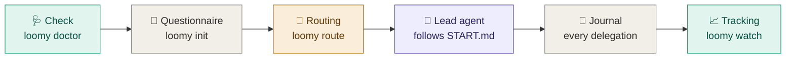

<div align="center">

<picture>
  <source media="(prefers-color-scheme: dark)" srcset="docs/assets/loomy-dark.svg">
  
</picture>

**Start and structure your projects with Codex and Claude Code.**
A questionnaire to frame the project, a repository structure ready for agents, a lead agent on the best model that delegates to dedicated roles, and live tracking in your terminal.


🇬🇧 English · [🇫🇷 Français](README.fr.md)

</div>

> [!NOTE]
> Loomy's interface, questionnaire and generated project files are in French. This page is an English overview.
>
> **Pre-release.** Loomy stays at 0.x until the whole flow has been validated in real conditions. The stable release comes after a release-candidate phase validated by testers.

---

## ⚡ Quick start

**1. Install Loomy** (once; npm, bun or script: see "Installation")

```bash
HOMEBREW_GITHUB_API_TOKEN="$(gh auth token)" brew install eydenn/tap/loomy
```

**2. Check your machine** (once)

```bash
loomy doctor --fix --live
```

**3. Create the project and answer the questionnaire**, from any folder

```bash
loomy init
```

`loomy init` offers to create a folder named after the project (name editable), to use the current folder, or another location. `loomy init my-project` creates the folder directly. At the end, it offers to open the lead agent session.

**4. Reopen the lead agent session** later, from the project folder

```bash
loomy start
```

**5. Follow live**, in a second terminal

```bash
loomy watch
```

> [!TIP]
> From then on, just type **`loomy`** in the project folder: it shows where the project stands, what is expected from you, and offers to open or resume the session, follow live, or see the status.

---

## 📦 Installation

Every method installs the same `loomy` command. The repository is private, so they all use your GitHub credentials (`gh auth login`).

🍺 **Homebrew** (recommended on macOS)

```bash
HOMEBREW_GITHUB_API_TOKEN="$(gh auth token)" brew install eydenn/tap/loomy
```

📦 **npm**

```bash
npm install -g github:Eydenn/loomy
```

🥟 **bun**

```bash
gh release download -R Eydenn/loomy -p 'loomy-*.tgz' -D /tmp/loomy && bun add -g /tmp/loomy/loomy-*.tgz
```

🐚 **Shell script**

```bash
gh repo clone Eydenn/loomy ~/Tools/loomy && ~/Tools/loomy/install.sh
```

**Update**, whatever the method:

```bash
loomy update
```

Several installs on the same machine (for example Homebrew and npm)? To see which one is used and how to remove the others:

```bash
loomy version --all
```

> [!TIP]
> `loomy update` detects how Loomy was installed and runs the right command. Homebrew downloads inside a sandbox that cannot reach the macOS keychain, so the GitHub token is passed through `HOMEBREW_GITHUB_API_TOKEN` for the download only; `loomy update` does this for you. bun cannot read a private GitHub repository, so it installs the release archive, which `gh` downloads with your credentials. For npm, the update goes into the same folder as the original install, even if you switched Node versions (nvm) since.

---

## 🧭 How it works



1. **Check.** Verifies CLI versions, finds Codex even when it is bundled inside the ChatGPT app, checks model availability, and offers fixes.
2. **Questionnaire.** Twelve questions grouped by theme, each showing the consequence of every option: project type, stage, risk, AI mode, lead tool, budget, Git permissions. The first time, a thirteenth asks for your Claude and ChatGPT subscriptions. ← goes back to the previous question.
3. **Routing.** Turns the brief and the installed tools into a role → model → effort matrix, with automatic fallback when a CLI is missing.
4. **Lead agent.** The main session follows `START.md`:

   <kbd>Discover</kbd> → <kbd>Interview</kbd> → <kbd>Propose</kbd> → <kbd>✋ Approve</kbd> → <kbd>Build</kbd> → <kbd>Verify</kbd> → <kbd>Document</kbd> → <kbd>Commit</kbd> → <kbd>Retire</kbd>

   It delegates the work to dedicated roles and never moves on without your approval.
5. **Journal and tracking.** Every delegation is recorded (model, effort, duration, tokens, cost) as soon as it starts. You follow it live in the terminal.

---

## 🚀 Moving your project forward

Once `loomy init` is done, everything goes through the **lead agent**: a Claude Code or Codex session on the best model, which follows `START.md` and then the project rules. It delegates to the dedicated roles.

### 1. Open or resume its session

The simplest: **`loomy`** in the project folder, then "Ouvrir ou reprendre la session".

| Where | How |
|---|---|
| 🖥️&nbsp;**Terminal,&nbsp;with&nbsp;Loomy** | `loomy start`: a menu to **resume** this folder's last session (with its history) or open a **new** one with the prompt that fits the project phase. `--resume` and `--new` go straight there. |
| ⌨️&nbsp;**Terminal,&nbsp;by&nbsp;hand** | Claude Code: `claude --continue` to resume; Codex: `codex resume --last`. For a new session, `loomy start --print` shows the exact command (model and effort) and copies the prompt. |
| 🪟&nbsp;**Desktop&nbsp;apps** | In the Claude app (Code tab) or the Codex app: open the **project folder**, pick the model and effort shown by `loomy start --print`, paste the prompt it copied. To resume, reopen the project conversation in the app. |

> [!NOTE]
> Resuming is automatic. With Claude Code, a hook installed by `loomy init` hands the context (phase, what you need to do, latest delegations) to every session opened in the project, and notes when it closes; in private mode, it also backs up the AI files. Codex gets the same hooks through `.codex/hooks.json`: the first time it runs in the project, it asks you to trust the folder and then to approve the Loomy hooks; accept both to turn on automatic resuming. Until then, `AGENTS.md` and the `loomy start` prompt ask it to read the context itself.
>
> Sessions stay on the machine where they were opened. On another machine, `loomy start` opens a new session: the lead agent rereads `START.md`, the brief and the recorded phase, and picks up where the project is. In an app, allow the lead agent to run the `.loomy/scripts/` scripts: that is how it delegates to the other tool and records phases.

### 2. Follow the phases, and know when it is your turn

`loomy watch`, in a second terminal, shows the current phase, **what the agent is doing** and **what you need to do**: answer its questions (Interview), approve its proposal (Approval), review the diffs and the commit.

### 3. Then: day-to-day development

After the bootstrap, `START.md` is gone and the lead agent follows `AGENTS.md` and `CLAUDE.md`. For each change: `loomy start`, describe the request, let it propose and delegate, follow with `loomy watch`, review the diff, approve the commit. One clear request per session; ask for a proposal before any large change; ask for a security review on sensitive topics.

### 4. Update, resume or reset

| Need | Command |
|---|---|
| Update&nbsp;Loomy | `loomy update`: every project benefits right away (its scripts are relays to the installed Loomy); `loomy init --update` is only for new document templates, and once for pre-0.3 projects (keeps brief, phase and journal) |
| Project&nbsp;already&nbsp;initialized | `loomy init` offers: resume, update, redo the questionnaire, reset |
| Redo&nbsp;the&nbsp;questionnaire | `loomy brief` |
| Restart&nbsp;the&nbsp;bootstrap | `loomy init --reset`: START.md copied again, phase reset, questionnaire rerun with your previous answers |

---

## 🔒 AI files: versioned, local or private

The files that guide the agents (`AGENTS.md`, `CLAUDE.md`, `.ai/`, `.claude/`, `.codex/`, `.loomy/`, `START.md`) are your working rules. GitHub sets visibility **per repository**, not per file: a public repository shows everything in it. The questionnaire asks where to keep them, with a default based on your repository.

The questionnaire also offers to **create the project's GitHub repository**, private or public, with a name taken from the project name that you confirm or edit. In separate private repository mode, the AI files repository name (`<repo>-ai`) is confirmed too, both together. An existing repository with a different name is flagged, with the rename command; Loomy never renames anything itself.

| Mode | For | What happens |
|---|---|---|
| **Versioned** | private repository *(default)* | they live in the repository: available everywhere, read by online agents |
| **Local** | public repository, no backup | excluded through `.git/info/exclude` (invisible in the repository); lost if you change machines |
| **Separate private repository** | public repository *(recommended)* | excluded from the project and backed up in a private GitHub repository `<project>-ai` that tracks only these files |

See the mode and the backup state:

```bash
loomy privacy
```

Switch mode (one of the three):

```bash
loomy privacy versioned
```

```bash
loomy privacy local
```

```bash
loomy privacy private
```

Back up the AI files to the private repository (the lead agent also does it at the end of each step):

```bash
loomy privacy sync
```

On another machine, after cloning the project, get its AI files back:

```bash
loomy privacy restore <your-account>/<project>-ai
```

> [!WARNING]
> A file already pushed to a public repository stays in its history. When you switch to local or private, `loomy privacy` lists the files still tracked and gives the command to stop tracking them without deleting them from your disk. `--remote <URL>` lets you use another host than GitHub for the private repository.

---

## 📈 Live tracking

Everything happens in the terminal, with no dependency. **Nothing starts on its own**: you start tracking when you want, in a second terminal.

| Command | View |
|---|---|
| <code>loomy&nbsp;status</code> | Snapshot: phases, running delegations, activity, cost per model, subscriptions, Git |
| <code>loomy&nbsp;watch&nbsp;[N]</code> | 🖥️ The same screen refreshed every second (or every N seconds): running delegation with spinner, timer and estimated progress, highlighted changes, notification (macOS) and bell on each phase, failure or end of bootstrap. Keys: `q` quit, `c` compact or full view, `l` journal, `s` open the session. Compact view in a small terminal |
| <code>loomy&nbsp;start&nbsp;--watch</code> | 🪟 The lead agent session and live tracking side by side (or stacked in a narrow terminal), through tmux or iTerm2; tracking closes with the session |
| <code>loomy&nbsp;log&nbsp;[-n&nbsp;N]&nbsp;[-f]</code> | Readable journal in local time, optionally streamed (`--raw`: raw JSON); `--since YYYY-MM-DD` reaches into monthly archives; `--csv` exports costs |

**What is live.** The screen rereads the project every 2 seconds. Delegations to Claude or Codex appear as soon as they start, with their timer, then their cost; an interrupted one disappears on its own. The phase changes when the lead agent records it (`START.md` asks it to at each step). Work the lead agent does itself, in its session, is not journaled: you follow it in its session.

The journal (`.loomy/logs/events.jsonl`) stays on your machine and is excluded from Git automatically. `LOOMY_JOURNAL=0` disables it, `LOOMY_JOURNAL_TASKS=0` leaves task text out of it.

### 💳 Claude and ChatGPT subscriptions

Loomy knows whether you pay per use (API) or by subscription, tool by tool:

| Plan | What Loomy shows |
|---|---|
| API | the real **cost** (Claude) or an estimate from tokens (Codex), per task and per month |
| Claude&nbsp;Pro&nbsp;·&nbsp;Max&nbsp;5x&nbsp;·&nbsp;Max&nbsp;20x&nbsp;·&nbsp;Team | the **share of your quota in use**: 5-hour and weekly windows, with their reset time; **tokens** per task instead of dollars |
| ChatGPT&nbsp;Plus&nbsp;·&nbsp;Pro&nbsp;·&nbsp;Business | the same, from the windows Codex reports |

```text
◇  PLANS  quota for subscriptions, cost for the API
│  Claude          Claude Pro · 5 h 42 % (resets 12:57) · week 86 % (resets Thu 23:17)
│  Codex           ChatGPT Business · week 12 % (resets Wed 19:30)
```

`loomy watch` notifies you when a quota crosses 80 %, then 95 %.

Where the figures come from, without network or credentials:
- **Codex** writes its quota into its own session logs (`~/.codex/sessions`); Loomy reads the latest reading.
- **Claude Code** gives its status line command a documented `rate_limits` field. `loomy init` adds a small Loomy status line to the project (`.claude/settings.json`) that saves it, then shows **your own status line** if you have one (an existing project status line is never replaced). The Claude quota appears once a session has answered in a Loomy project.

Claude plan: `api`, `pro`, `max5`, `max20`, `team` or `enterprise`

```bash
loomy config set plan_claude max20
```

ChatGPT / Codex plan: `api`, `plus`, `pro100`, `pro200`, `business` or `enterprise`

```bash
loomy config set plan_codex pro200
```

Custom plan price ($ per month), used by `loomy stats` to compare with the API value of your work

```bash
loomy config set plan_claude_price 180
```

### 📊 Detailed statistics

```bash
loomy stats
```

Delegations and success rate, total and average durations, tokens (in, from cache, out), and Claude Code's own work (lead agent, sub-agents), then by role, by model (with the cache share) and by day, and your plans. With a subscription, amounts show as `≈$…`: what the work would cost through the API, covered by the plan, next to its monthly price. `--days 7` or `--since YYYY-MM-DD` for a period; `loomy log --csv` for the raw figures.

---

## 🎯 The lead agent and its roles

The main session, the **lead agent**, keeps the best reasoning to plan, delegate, decide and verify. The rest of the work goes to dedicated roles.

| Role | 🟠 Full Claude | 🔵 Full Codex | 🟣 Hybrid, Claude lead | 🟣 Hybrid, Codex lead |
|---|---|---|---|---|
| 🎯&nbsp;**Lead&nbsp;agent** | Opus 5.5 · high | Astra · high | **Opus 5.5 · high** | Astra · high |
| 🏛️&nbsp;Architect | Opus 5.5 · high | Astra · high | Opus 5.5 · high | Opus 5.5 · high ⇄ |
| 🐞&nbsp;Debugger | Opus 5.5 · high | Sol · xhigh | Opus 5.5 · high | Opus 5.5 · high ⇄ |
| 🔒&nbsp;Security | Opus 5.5 · high | Astra · high | Opus 5.5 · high | Opus 5.5 · high ⇄ |
| 🔍&nbsp;Reviewer | Sonnet 5 · high | Sol · high | Sol · high ⇄ | Sonnet 5 · high ⇄ |
| 🛠️&nbsp;Developer | Sonnet 5 · medium | Sol · high | Sonnet 5 · medium | Sol · high |
| ⚙️&nbsp;Executor | Sonnet 5 · medium | **Luna · max** | **Luna · max** ⇄ | **Luna · max** |
| 🔎&nbsp;Explorer | Haiku 4.5 · low | Luna · low | Haiku 4.5 · low | Luna · low |
| 📚&nbsp;Documenter | Sonnet 5 · low | Sol · low | Sonnet 5 · low | Sol · low |

<sub>Balanced profile. ⇄ = role run by the other tool, through a bridge.</sub>

**Budget profiles.** The lead agent always stays on the top model; only role efforts and models change:
- **Thrifty:** lead agent and specialists at `medium`, execution on fast models;
- **Balanced (default):** the matrix above;
- **Max quality:** lead agent and specialists at `xhigh`, reviews on the top model, execution on Sol or Sonnet `high`.

**Fallbacks.** If the mode asks for both tools and one CLI is missing, routing falls back to the full matrix of the available tool. If the lead tool is missing, the other one leads.

---

## 📊 Why this split

<sub>Analysis of 2026-09-23. "AA" = independent measurements by Artificial Analysis. Details, caveats and sources (in French): <a href="docs/MODEL_CATALOG.md">docs/MODEL_CATALOG.md</a>.</sub>

| Model | 💵 Price ($ per million tokens, in / out) | Cost per AA task | AA Coding Agent Index | Terminal-Bench 4.0 | 🏷️ Role |
|---|---|---|---|---|---|
| GPT&#8209;6&#8209;Luna | **0.10 / 0.50** | **$0.07** | 41 | 🔻 13 % | executor, explorer |
| GPT&#8209;6&#8209;Sol | 2 / 10 | $0.13 → $1.06 | 57 | 43 % | developer, reviewer (Codex) |
| GPT&#8209;6&#8209;Astra | 10 / 50 | $0.82 → $3.26 | **62** | 59 % | lead agent when Codex only |
| Claude&nbsp;Sonnet&nbsp;5 | 2 / 10 | — | — | — | developer, reviewer (Claude) |
| Claude&nbsp;Opus&nbsp;5.5 | 4 / 20 | $0.55 → $5.98 | not published | **59.6 %** | 🏆 lead agent and specialists |
| Claude&nbsp;Fable&nbsp;5.1 | 10 / 50 | $7.63 | 62 | 55.8 % | ❌ superseded by Opus 5.5 |

- 🥇 **Opus 5.5 is the best lead agent.** It ranks first on the AA Intelligence Index and leads agentic work. At high effort it costs less per task than Astra at max, for a better score.
- ⚙️ **GPT-6-Luna max is the best-value executor, not an autonomous agent.**
  - It scores 66.6 % on bounded fixes for $0.22, against $2.74 for Sol.
  - On long autonomous terminal work it drops to 13 %.
  - So it executes precise tickets under the lead agent, nothing more.
- 🐎 **GPT-6-Sol is the Codex workhorse.** It matches Opus 5.5 medium on workflow automation for about 40 % of the cost.

---

## ✅ Prerequisites

| | 🟢 Minimum | ⭐ Ideal |
|---|---|---|
| **System** | macOS, bash ≥ 3.2 (the macOS one works), `git`; Linux: tested automatically (CI), not yet validated in real use | + `gh` logged in |
| **AI** | **one** CLI: Claude Code ≥ 2.1.280 **or** Codex ≥ 0.155, logged in | **both**, installed in the terminal and detected by `loomy doctor`: hybrid mode |
| **Models** | those of your tool | all answer `loomy doctor --live` |
| **Comfort** | none (built-in questionnaire, no dependency) | clipboard, to copy the start prompt |

**Install Claude Code and Codex in the terminal.** `loomy doctor` shows what it detects and prints these commands for a missing CLI; `loomy doctor --fix` offers to run them for you.

**Claude Code** (official installer)

```bash
curl -fsSL https://claude.ai/install.sh | bash
```

or with Homebrew

```bash
brew install --cask claude-code
```

**Codex** (official installer)

```bash
curl -fsSL https://chatgpt.com/codex/install.sh | sh
```

or with Homebrew

```bash
brew install --cask codex
```

Then run `claude`, then `codex`, once each to log in (Claude Pro, Max, Team plan or Console account; ChatGPT account for Codex), and check with `loomy doctor --live`.

---

## 🛠️ Commands

| Command | Purpose |
|---|---|
| 🏠&nbsp;<code>loomy</code> | home: where the project stands, what is expected, and the next step in one choice (outside a project: create one) |
| 📦&nbsp;<code>loomy&nbsp;init&nbsp;[dir]</code> | creates the folder if needed (or offers to create it from the project name), then initializes the project, new or existing: questionnaire, then structure set up by the lead agent; on an initialized project: resume, `--update`, `--reset` (`--no-wizard`, `--yes`, `--answers`; existing Git project: `--no-branch` to stay on the current branch) |
| 📝&nbsp;<code>loomy&nbsp;brief</code> | reruns the questionnaire for the current project |
| 🔒&nbsp;<code>loomy&nbsp;privacy</code> | AI files visibility: `versioned`, `local`, `private`; `sync`, `restore` for the private repository |
| ▶️&nbsp;<code>loomy&nbsp;start</code> | starts or resumes the lead agent session (`--resume`, `--new`, `--print`, `--watch`) |
| 🩺&nbsp;<code>loomy&nbsp;doctor</code> | checks prerequisites (`--fix` fixes, GitHub included: installs `gh`, logs in, checks git access to the Loomy repository; `--live` tests every model) |
| 💬&nbsp;<code>loomy&nbsp;feedback</code> | reports a bug or an idea: prefilled GitHub issue (versions, anonymized project state, no name, goal or task text), sent only after your approval; `--print` shows the text |
| 🧭&nbsp;<code>loomy&nbsp;route</code> | role → model → effort matrix · `lead` · `get <role>` · `markdown` · `all` · `claude-agents` · `codex-profiles` |
| 🔀&nbsp;<code>loomy&nbsp;delegate&nbsp;codex&nbsp;&lt;role&gt;&nbsp;"…"</code> | hands a role to Codex (executor, developer, documenter can write; the others are read-only) |
| 🔀&nbsp;<code>loomy&nbsp;delegate&nbsp;claude&nbsp;&lt;role&gt;&nbsp;"…"</code> | hands a role to Claude, read-only (architect, debugger, security, reviewer, explorer) |
| 🔬&nbsp;<code>loomy&nbsp;assess</code> | assessment of an existing project, without AI: stack, commands, tests, CI, conventions, Git history, sensitive areas, debt (`.loomy/assessment.md`; `--print` to only show it) |
| 📈&nbsp;<code>loomy&nbsp;status</code>&nbsp;·&nbsp;<code>loomy&nbsp;watch</code>&nbsp;·&nbsp;<code>loomy&nbsp;log</code> | tracking (see above) |
| 📊&nbsp;<code>loomy&nbsp;stats</code> | detailed statistics: by role, model and day, durations, tokens, cost or quota (`--days N`, `--since YYYY-MM-DD`) |
| 🎚️&nbsp;<code>loomy&nbsp;effort</code> | reasoning effort of the lead agent for this project (`loomy effort low`, menu without argument), or of a role (`loomy effort executor high`); `--list`, `--reset`; applied at the next `loomy start` |
| ⚙️&nbsp;<code>loomy&nbsp;config</code> | preferences (`list`, `get`, `set`): `plan_claude`, `plan_codex`, `plan_claude_price`, `plan_codex_price`, `start_watch` (`yes`: `loomy start` always opens tracking alongside), `notify` (`no`: no notifications in `loomy watch`), `lang` (`fr`, `en` or `auto`: interface language, detected by default) |
| 🌳&nbsp;<code>loomy&nbsp;worktrees&nbsp;&lt;task&gt;</code> | two separate worktrees for parallel mode |
| 🔄&nbsp;<code>loomy&nbsp;update</code>&nbsp;·&nbsp;<code>loomy&nbsp;version</code> | updates Loomy, for every project at once; `update --catalog`: only the model and price catalog; `version --all` lists every install |
| 🗑️&nbsp;<code>loomy&nbsp;uninstall</code> | shows how to uninstall Loomy for your install method, and how to remove it from a project |
| ❓&nbsp;<code>loomy&nbsp;help&nbsp;[command]</code> | general help, or help for one command |

Tests: `tests/run.sh` runs every command in real conditions (bash, git, a pseudo-terminal for the questionnaire) with stubbed `claude` and `codex` CLIs, so no network and no tokens.

---

## 🤝 Collaboration modes

| Mode | Principle | When |
|---|---|---|
| 🧍&nbsp;**SOLO** | a single tool does everything | small projects, tight budget |
| 👀&nbsp;**REVIEW** | one implements, the other reviews the diff | substantial changes |
| 🔁&nbsp;**HANDOFF** | clean checkpoint + `.ai/HANDOFF.md`, the other takes over | switching tools midway |
| 🌳&nbsp;**PARALLEL** | two worktrees, disjoint scopes | truly independent work |
| 🎯&nbsp;**ORCHESTRATED** | the lead agent delegates each role to the best model of both families | **recommended** when both tools are installed |

---

## 📚 Going further

<details>
<summary><b>📁 What the bootstrap generates in your project</b></summary>

```text
my-project/
├── AGENTS.md                  # Codex entry point (short)
├── CLAUDE.md                  # Claude Code entry point (short)
├── PROJECT.md                 # product intent, scope, constraints
├── ARCHITECTURE.md            # when useful
├── .ai/
│   ├── AI_WORKFLOW.md         # shared collaboration contract
│   ├── AI_ORCHESTRATION.md    # cross-model delegation rules
│   ├── AI_MODEL_ROUTING.md    # role → model → effort matrix
│   └── HANDOFF.md             # temporary, during a handoff
├── .claude/agents/            # generated subagents (model + effort)
├── .loomy/                    # relays, templates, brief, state and log (logs/ ignored by Git)
└── docs/decisions/            # ADRs, only for important decisions
```

</details>

<details>
<summary><b>🌐 Languages</b></summary>

<br>

Loomy speaks English, and French when your system language is French (`LC_ALL`, `LC_MESSAGES`, `LANG`, then the macOS system language). Force it with `loomy config set lang fr|en|auto` or `LOOMY_LANG`.

The language also picks the documents the agents read (`START.md`, templates, roles, skills: French copies live in `fr/`), the startup brief and the delegation prompts. The project documentation language is a separate questionnaire answer.

For contributors: interface strings are written in English in the code (`t "English sentence"`); the French translations live in `scripts/lib/i18n/fr.tsv`, compiled by `tools/i18n-build.sh`. `tools/i18n-missing.sh` lists the sentences not translated yet, and the tests fail while any is missing.

</details>

<details>
<summary><b>🏗️ Existing project, security audit, end of the bootstrap</b></summary>

<br>

- **Existing project.** Run `loomy init` in the repository. Loomy switches to a dedicated `loomy/adopt` branch (the current one stays untouched, uncommitted work stays as it is), writes an assessment without AI (`.loomy/assessment.md`: stack, real commands, tests, CI, conventions, Git history, sensitive areas, debt), and the lead agent proposes an adoption plan: `PROJECT.md` and `ARCHITECTURE.md` rebuilt from the code, `AGENTS.md` and `CLAUDE.md` aligned with the repository's commands, roles sized to its risk. Nothing existing is overwritten, no application code changes without your approval, and merging back goes through a pull request you accept.
- **Security audit.** It runs on demand, with the official Cloudflare skill. Install it with `.loomy/scripts/install-security-audit.sh --global`, then ask for a full audit without code changes.
- **End of the bootstrap.** `START.md` is archived in `.ai/bootstrap/` or deleted, as you chose. It has no authority afterwards.

</details>

<details>
<summary><b>🔄 Updating the model catalog</b></summary>

<br>

The catalog lives in `catalog/models.conf` (published, fetched by `loomy update --catalog`) and `scripts/lib/models.sh` (built-in values): model chains per tier, prices, minimum CLI versions. The update protocol is in `docs/MODEL_CATALOG.md`.

To try another model on a single machine without changing anything: `AI_MODEL_CODEX_FAST=gpt-6-sol loomy route`, or pin it with `loomy config set model.codex.fast gpt-6-sol`. If the Codex CLI is installed somewhere unusual, give its path with `LOOMY_CODEX_BIN`.

</details>

<details>
<summary><b>📦 Repository content</b></summary>

```text
loomy/
├── bin/loomy                  # single command
├── install.sh · package.json  # shell, npm and bun install
├── START.md · VERSION · CHANGELOG.md · SECURITY.md · README.md · README.fr.md
├── scripts/
│   ├── install-into-project.sh · init-wizard.sh · ai-doctor.sh · ai-route.sh · ai-status.sh
│   ├── delegate-to-claude.sh · delegate-to-codex.sh · detect-ai-tools.sh
│   ├── create-hybrid-worktrees.sh · install-security-audit.sh
│   └── lib/                   # ui.sh · i18n.sh · models.sh · journal.sh · config.sh · i18n/fr.tsv
├── templates/                 # AGENTS, CLAUDE, WORKFLOW, ORCHESTRATION, MODEL_ROUTING, HANDOFF, PROJECT, ARCHITECTURE, ADR
│   └── claude-agents/         # architect, debugger, developer, documenter, executor, explorer, reviewer, security
├── skills/project-bootstrap/  # SKILL.md + references
├── agents/ROLE-CATALOG.md · external-skills/security-audit.md
├── fr/                        # French copies of START.md, templates, agents and skills
├── catalog/models.conf · docs/DESIGN.md · docs/MODEL_CATALOG.md
├── tools/                     # i18n-build.sh · i18n-missing.sh
└── tests/run.sh · tests/stubs/  # test suite without network
```

</details>

---

## 🔐 Security

What Loomy guarantees (your project never pushed or deleted without you, existing projects untouched, catalog read as data, untrusted project files sanitised, private temporary files) and how to report a vulnerability: [SECURITY.md](SECURITY.md).

---

## 🔮 Roadmap

| Status | Feature |
|---|---|
| ✅&nbsp;0.1 | `loomy` command, questionnaire, doctor, lead + roles routing, bridges, journal, live terminal tracking (full screen, `start --watch`, notifications), per-project effort, subscriptions, Homebrew, npm, bun and shell installs, test suite |
| ✅&nbsp;0.2 | **Consolidate, before testers arrive**: done |
| ✅ | `loomy start --watch` joins an open session instead of closing it; temporary scripts cleaned up; platforms stated accurately (macOS, Linux tested automatically) |
| ✅ | macOS and Linux tests on every push (GitHub Actions) |
| ✅ | `loomy feedback`: prefilled GitHub issue (version, doctor, end of journal, anonymized brief) |
| ✅ | Simpler tester install: `loomy doctor --fix` chains the `gh` steps |
| ✅&nbsp;0.3 | **Harden**: done |
| ✅ | No more script copies in each project: a link to the installed Loomy; `loomy init --update` only for template changes |
| ✅ | Model and price catalog updated without a new release (`loomy update --catalog`), warning when a routed model disappears |
| ✅ | Real costs: Claude Code lead (`Stop` hook) and sub-agents (`SubagentStop` hook), measured from the transcript at list price; CSV export |
| ✅ | Monthly journal archive, `loomy log --since` |
| ✅&nbsp;0.3.5 | **Fixed-frame interface**: header (logo, project, context), a body that alone changes, footer (keys, version); the home screen opens status, journal, visibility and help inside the frame; nothing piles up in the terminal |
| ✅&nbsp;0.3.7 | **Autonomy and stop points** in generated instructions (`AGENTS.md`, `CLAUDE.md`): the agent moves on alone within a bounded task and stops before anything destructive, following Anthropic's Opus 5.5 guidance |
| ✅&nbsp;0.3.8 | **Fast-changing models**: per-tier fallback chains in the catalog (newest first, automatic fallback for those without access), availability learned on each machine (`doctor --live`, a refused delegation), pinnable model (`loomy config set model.claude.mid …`), role balance editable from the catalog, new catalog announced; protocol in `docs/MODEL_CATALOG.md` |
| ✅&nbsp;0.4 | **English and French interface** |
| ✅ | Language detected automatically (`LC_ALL`, `LC_MESSAGES`, `LANG`, then the system language on macOS): French when it starts with `fr`, **English by default** otherwise or when nothing is detectable (macOS and Linux); setting `loomy config set lang fr\|en\|auto` |
| ✅ | Every interface text goes through a dictionary, migrated screen by screen: frame and home, `watch` and `status`, `start` and `effort`, questionnaire and setup, doctor, help and messages |
| ✅ | Project document language suggested from the detected language; test covering both languages |
| ✅&nbsp;0.4.1 | **English first**: code, help, agent documents (`START.md`, templates, roles, skills), startup brief, delegation prompts, README and changelog in English; French is a translation (`scripts/lib/i18n/fr.tsv`, `fr/`) used when French is detected |
| ✅&nbsp;0.5 | **Adopting an existing project** |
| ✅ | `loomy init` on an already developed, versioned project (Git, remote, branches): nothing is overwritten, everything goes through a dedicated branch and an approval |
| ✅ | Initial assessment (`loomy assess`): languages, frameworks, structure, dependencies, tests, CI, code conventions, existing docs, Git history (activity, sensitive areas, authors), debt and risks spotted |
| ✅ | Initial adaptation from that assessment: `PROJECT.md`, `ARCHITECTURE.md` and decisions rebuilt from the code, `AGENTS.md` and `CLAUDE.md` aligned with the repository's conventions (test, lint, build commands), roles, routing and effort tuned to the project's size and risk |
| ✅ | Adoption plan reviewed before any commit: what was understood, what remains to confirm, prioritized recommendations |
| ✅&nbsp;0.5.1 | Screen-by-screen check of every command, in English and French |
| ✅&nbsp;0.5.2 | Security and robustness review ([SECURITY.md](SECURITY.md)) |
| ✅&nbsp;0.5.3 | **Current version** · **real subscription quotas**: share of the Claude and Codex quotas in use (5-hour and weekly windows) instead of dollars with a subscription, tokens per task, alerts at 80 % and 95 %; `loomy stats` for detailed statistics |
| 🔜 | **Day-to-day work after bootstrap** |
| | `loomy task "…"`: a named task handed to the lead, tracked in `watch` (phases, cost, duration), through approval and commit; a progress file (`TASKS.md`) kept by the agent during long tasks |
| | `loomy models`: spots new models to evaluate (Codex model list, vendor APIs when a key is set, published catalog), offers to put them at the head of a chain with up to two fallbacks (e.g. Opus 6 → Opus 5.5 → Opus 5), and a low-cost mode that prefers fallbacks; opens a GitHub suggestion issue per new model (`models` label, no duplicates: an existing issue is found and updated instead of recreated), for evaluation before the catalog is published |
| | `loomy review`: on-demand cross review of the current branch or diff |
| | Project templates (web, API, CLI, emails…) that prefill the brief and structure |
| | `loomy report`: project summary (tasks, costs, delegations), cross-project comparison, shareable HTML page |
| 🎯&nbsp;RC | **Release candidate: validation in real conditions** |
| | Tester feedback (`loomy feedback`) processed |
| | Questionnaire and UI split into smaller modules, tests grouped by topic |
| | Configurable color theme (`loomy config`) for terminals that don't render bold |
| | Short README ("5 minutes to start"), full reference separately |
| | Public repository and token-free Homebrew, when decided |
| 💡 | [Jev](https://github.com/WXK-AI/jev-opus) integration: Opus 5.5 effort readjusted at every step during Claude delegations, when Jev is installed |
